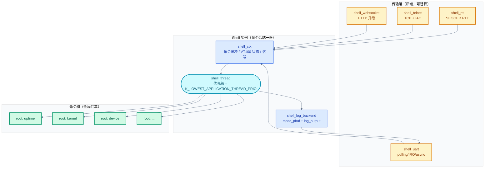
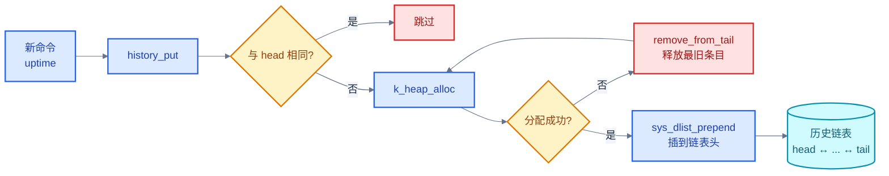
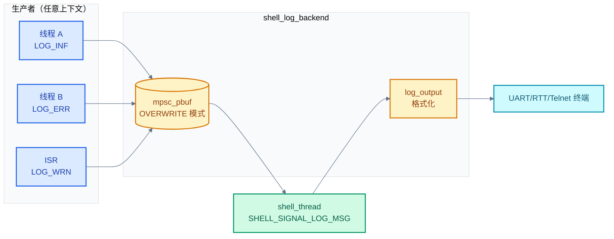
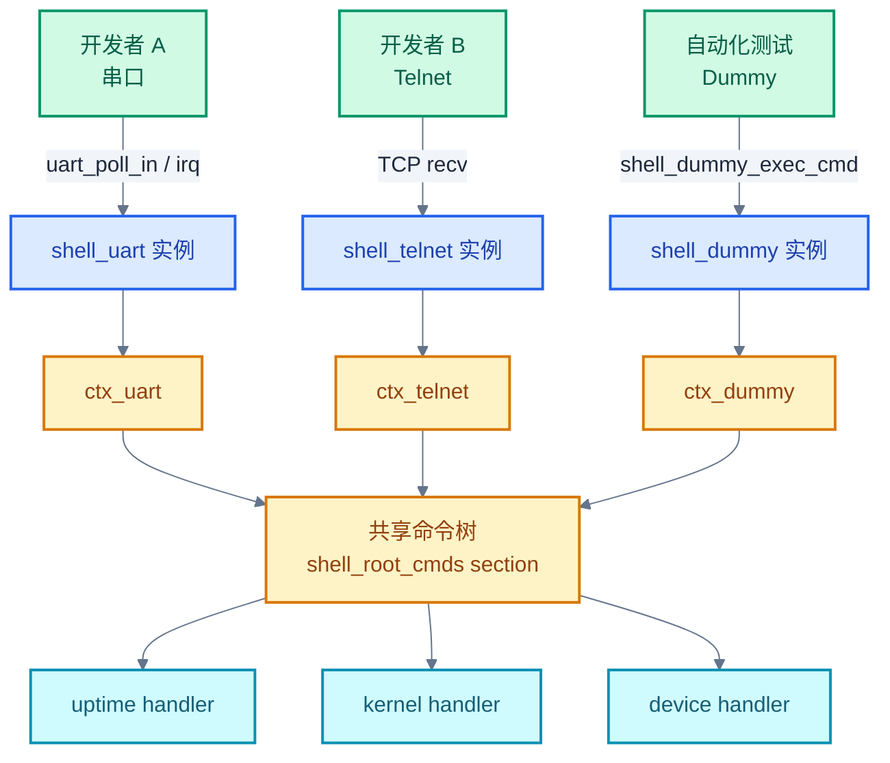

# 24. Shell 命令行框架

> 一句话概括：本文剖析 Zephyr 的 Shell 子系统——每个 shell 实例有自己的上下文与后端（UART/RTT/Telnet/Websocket/MQTT/RPMsg），命令通过 `SHELL_CMD_REGISTER`/`SHELL_DYNAMIC_CMD_CREATE` 用 iterable section 自注册，VT100 终端控制、命令历史（环形缓冲）、通配符匹配、Tab 补全均内置，`shell_log_backend` 让 `LOG_xxx()` 直接打印到 shell 而非默认后端。
> **工程师视角**：读完后应能回答"shell 实例为什么需要独立上下文与线程""iterable section 如何让命令自注册""动态命令与静态命令的内存布局差异在哪""shell_log_backend 为什么复用 `mpsc_pbuf` 而非 `k_msgq`"这四个问题，并能仿照 `devmem`/`device` 写出自己的 shell 命令。

### 关键术语

| 缩写 | 全称 | 含义 |
|------|------|------|
| RTOS | Real-Time Operating System | 实时操作系统 |
| UART | Universal Asynchronous Receiver-Transmitter | 通用异步收发器 |
| RTT | Real-Time Transfer | SEGGER 实时传输调试接口 |
| VT100 | Video Terminal 100 | DEC 终端控制码标准 |
| ISR | Interrupt Service Routine | 中断服务例程 |
| MPSC | Multi-Producer Single-Consumer | 多生产者单消费者 |
| PBUF | Packet Buffer | 包缓冲 |
| API | Application Programming Interface | 应用编程接口 |
| MQTT | Message Queuing Telemetry Transport | 消息队列遥测传输协议 |
| RPMsg | Remote Processor Messaging | OpenAMP 远程处理器消息框架 |
| IPC | Inter-Process Communication | 进程间/核间通信 |
| RAM | Random Access Memory | 随机存取存储器 |
| flash | Flash Memory | 闪存（嵌入式非易失存储） |
| DT | Devicetree | 设备树 |
| DTR | Data Terminal Ready | RS-232 数据终端就绪信号 |
| IAC | Interpret As Command | Telnet 协议命令前缀字节 0xFF |
| TLS | Transport Layer Security | 传输层安全协议 |
| FIFO | First In First Out | 先进先出队列 |

---

### 前置阅读

| 需要了解 | 参考文档 |
|----------|----------|
| iterable sections 与链接器 section | [20-Iterable Sections链接器魔法](./20-Iterable%20Sections链接器魔法.md) |
| Object Core 与线程枚举 | [21-Object Cores对象元数据](./21-Object%20Cores对象元数据.md) |
| 日志后端与 `mpsc_pbuf` | [23-Logging日志系统](./23-Logging日志系统.md) |
| cbprintf 与 `shell_fprintf` | [22-cbprintf打包格式化](./22-cbprintf打包格式化.md) |

---

## 1. 概述：RTOS 中的命令行

> [23 章日志系统](./23-Logging日志系统.md) 解决了"内核如何把消息吐到外部"——但日志是单向的，开发者只能被动看。调试一个 RTOS 还需要"反向通道"：从外部输入命令、查看内核对象状态、运行时改内存与配置。本章就讲 Zephyr 的 Shell 子系统如何用"上下文 + 后端 + 命令树"三层架构，把嵌入式 shell 做到能与 Linux readline 媲美的体验，并顺带把日志后端嵌进 shell 视图里。

### 1.1 为什么 RTOS 需要 shell

裸机开发常见的"调试手段"是 JTAG 单步、串口 `printf`、IDE watch 变量——这些都依赖外部工具链，且无法在生产设备上运行。RTOS 设备一旦部署，开发者常常只有一条串口或一根网线，需要回答这些问题：

- 系统里有哪些线程？哪个线程占用 CPU 最多？
- 某个外设寄存器现在的值是多少？能不能直接写一个值验证？
- 某个设备的运行时状态是 ACTIVE 还是 SUSPENDED？
- 内核堆还剩多少？某线程栈用了多少？
- 日志等级能不能在线调整，而不用重新编译？

这些问题如果每次都改代码、重新烧录，调试效率极低。**Shell 提供了一条命令交互通道**——开发者通过终端输入文本命令，shell 线程解析命令、调用注册的 handler、把结果写回终端。这相当于在 RTOS 内核里嵌入了一个微型"运维 shell"。

> **核心要点**：Shell 不是简单的"printf + scanf"——它是一个有独立线程、独立栈、独立后端的子系统，承担三件事：解析输入、调度命令、聚合输出。这三件事的解耦让同一个命令可以从 UART 触发，也可以从 Telnet 触发，命令代码完全不变。

### 1.2 Zephyr shell 的设计目标

| 目标 | 含义 | 对应机制 |
|------|------|---------|
| **多后端共存** | 同一时刻可有 UART + RTT + Telnet 三个 shell 实例 | 每后端独立 `struct shell` + 独立线程 |
| **命令自注册** | 命令在编译期分布在各模块，链接器自动汇总 | `SHELL_CMD_REGISTER` → `shell_root_cmds` section |
| **ISR 安全** | 日志可在 ISR 里 `LOG_xxx`，shell_log_backend 必须无锁串行化 | `mpsc_pbuf`（见 [23 章](./23-Logging日志系统.md) §3） |
| **低 flash 占用** | 资源紧张设备能裁掉历史/通配符/帮助 | `CONFIG_SHELL_MINIMAL` + 大量 `SHELL_COND_CMD_*` |
| **行编辑体验** | 上下方向键翻历史、Ctrl+A/E 跳首尾、Ctrl+K 删到行尾、Ctrl+W 删一个词 | VT100 命令 + meta keys 状态机 |
| **可观测整合** | `LOG_xxx` 直接进 shell 而非独占 UART | `shell_log_backend` + Ctrl+T 切换 |

> **如何读这张表**：左列是目标，中列是"为什么需要"，右列是"怎么做"。本章后续章节基本围绕右列展开——后端、注册、ISR 安全、行编辑、日志整合各占一节。

### 1.3 一个最小使用例子

先用 30 行代码感受 shell 的"自注册"特性：

```c
#include <zephyr/kernel.h>
#include <zephyr/shell/shell.h>

/* 自定义命令：打印当前 tick 与 uptime */
static int cmd_uptime_show(const struct shell *sh, size_t argc, char **argv)
{
    ARG_UNUSED(argc);
    ARG_UNUSED(argv);

    shell_print(sh, "ticks=%u  uptime_ms=%llu",
                k_uptime_ticks32(), k_uptime_get());
    return 0;
}

/* 编译期注册到 root command section */
SHELL_CMD_REGISTER(uptime, NULL,
                   "Show system uptime.", cmd_uptime_show);
```

烧录后串口里就能：

```
uart:~$ uptime
ticks=123456  uptime_ms=1234560
```

这里没有任何"调用 `shell_register()`"的运行时代码——`SHELL_CMD_REGISTER` 是一个宏，在文件作用域展开为一个静态变量 + 一个链接器 section 条目。链接器把所有 `shell_root_cmds` section 合并，shell 初始化时遍历这个 section 就拿到全部 root 命令。这就是 [20 章 iterable sections](./20-Iterable%20Sections链接器魔法.md) 的典型用法。

---

## 2. Shell 架构：上下文与后端

> 第 1 章用一个最小例子展示了"命令自注册"的体验。但 `SHELL_CMD_REGISTER` 只解释了"命令从哪来"，没解释"谁在跑命令、谁在收字符、谁在输出"。本章把 shell 拆成上下文 + 后端 + 命令树三层，看每层各管什么、彼此如何协作。

### 2.1 三层架构



> **如何读这张图**：上半部分是"每个后端独有一份"的实例数据（上下文 + 线程 + 日志后端），下半部分是"全系统共享"的命令树。传输层是可替换的——选 UART、RTT 还是 Telnet 只影响最左侧的输入输出通道，shell 主体逻辑不变。一个 shell 实例 = 一个 `struct shell` + 一个 `shell_thread` + 一份命令树视图。

### 2.2 shell 实例：`struct shell`

shell 实例的核心数据结构在 [include/zephyr/shell/shell.h](file:///home/pbw/rtos/cs-learning-notes/zephyr-project/zephyr/include/zephyr/shell/shell.h) 中定义，简化后如下（去掉日志与统计字段）：

```c
struct shell {
    const char *default_prompt;             /* "uart:~$ " 等 */
    const struct shell_transport *iface;    /* 传输后端接口 */
    struct shell_ctx *ctx;                  /* 上下文（RW 数据） */
    struct shell_history *history;          /* 命令历史 */
    const enum shell_flag shell_flag;       /* LF→CRLF 映射等 */
    const struct shell_fprintf *fprintf_ctx;/* 格式化输出 */
    struct shell_stats *stats;              /* 丢日志计数 */
    const struct shell_log_backend *log_backend;
    const char *name;                       /* "uart"/"rtt"/... */
    struct k_thread *thread;                /* 该实例的线程 */
    k_thread_stack_t *stack;
};
```

每个 UART/RTT/Telnet/Websocket 后端都用 `SHELL_DEFINE` 宏定义一个 `struct shell` 实例（如 `shell_uart`、`shell_rtt`、`shell_telnet`、`shell_websocket`），各自有独立的线程、栈、上下文。这意味着同一时刻系统里可能有 3~4 个 shell 线程并发存在，每个线程都阻塞在 `k_event_wait` 等待信号。

### 2.3 上下文：`struct shell_ctx`

上下文是 shell 线程的"工作内存"，每个实例一份：

```c
struct shell_ctx {
    char prompt[CONFIG_SHELL_PROMPT_BUFF_SIZE];  /* 当前 prompt */
    enum shell_state state;                       /* UNINIT/INIT/ACTIVE/PANIC */
    enum shell_receive_state receive_state;       /* DEFAULT/ESC/ESC_SEQ/TILDE_EXP */
    enum shell_readline_state readline_state;     /* 用户输入捕获状态 */
    struct shell_static_entry active_cmd;         /* 当前在执行的命令 */
    const struct shell_static_entry *selected_cmd;/* select 模式的根 */
    struct shell_vt100_ctx vt100_ctx;             /* 光标 / 终端宽高 / 颜色 */
    uint16_t cmd_buff_len, cmd_buff_pos;
    char cmd_buff[CONFIG_SHELL_CMD_BUFF_SIZE];    /* 命令缓冲 */
    char temp_buff[CONFIG_SHELL_CMD_BUFF_SIZE];   /* 临时缓冲（通配符展开） */
    char printf_buff[CONFIG_SHELL_PRINTF_BUFF_SIZE];
    volatile union shell_backend_cfg cfg;         /* echo/colors/vt100/insert 开关 */
    volatile union shell_backend_ctx ctx;         /* processing/cmd_ctx/... 标志 */
    struct k_event signal_event;                  /* RXRDY/LOG_MSG/KILL/TXDONE */
    struct k_sem lock_sem;                        /* shell 线程互斥 */
    k_tid_t tid;
    int ret_val;                                  /* 最近一条命令的返回值 */
};
```

**为什么 shell 需要独立上下文，不能共用一份？** 因为多后端可能同时被使用——例如开发者一边在串口里敲命令，一边 Telnet 连进来读日志。如果上下文共享，命令缓冲、光标位置、历史指针会互相覆盖，输出会串到错误的终端。每实例独立上下文让多后端真正并发，互不干扰。

> **核心要点**：`struct shell` 是只读配置（prompt、iface、name 等），`struct shell_ctx` 是可写状态（缓冲、光标、标志）。这种 RO/RW 分离让 shell 实例可以放在 flash，只有上下文占 RAM——在 RAM 紧张的设备上每省 1 KB 都有意义。

### 2.4 传输后端：`struct shell_transport_api`

后端只需实现 6 个函数就能接入 shell：

```c
struct shell_transport_api {
    int  (*init)(const struct shell_transport *transport,
                 const void *config,
                 shell_transport_handler_t evt_handler,
                 void *context);
    int  (*uninit)(const struct shell_transport *transport);
    int  (*enable)(const struct shell_transport *transport,
                   bool blocking_tx);
    int  (*write)(const struct shell_transport *transport,
                  const void *data, size_t length, size_t *cnt);
    int  (*read)(const struct shell_transport *transport,
                 void *data, size_t length, size_t *cnt);
    void (*update)(const struct shell_transport *transport);
};
```

后端通过 `evt_handler` 回调通知 shell 收到数据或发送完成：

- `SHELL_TRANSPORT_EVT_RX_RDY` → 投递 `SHELL_SIGNAL_RXRDY` 信号
- `SHELL_TRANSPORT_EVT_TX_RDY` → 投递 `SHELL_SIGNAL_TXDONE` 信号

shell 主线程阻塞在 `k_event_wait`，一旦有信号就进入对应处理路径。这种"事件驱动 + 单线程消费"模型避免了 shell 内部的并发问题——所有命令解析、执行、输出都在 shell 线程里串行发生，只有 `lock_sem` 一个互斥量保护跨线程访问。

---

## 3. 命令注册：SHELL_CMD_REGISTER 与 iterable sections

> 第 2 章把 shell 拆成了上下文 + 后端 + 命令树三层，但"命令树"还是个黑盒——`SHELL_CMD_REGISTER` 到底把命令注册到哪？shell 又是怎么找到它们的？本章用 [20 章 iterable sections](./20-Iterable%20Sections链接器魔法.md) 的视角，把命令注册拆到链接器 section 级别。

### 3.1 命令数据结构

每条命令在内存里是一个 `struct shell_static_entry`（[include/zephyr/shell/shell.h](file:///home/pbw/rtos/cs-learning-notes/zephyr-project/zephyr/include/zephyr/shell/shell.h#L283)）：

```c
struct shell_static_entry {
    const char *syntax;                       /* 命令名，如 "uptime" */
    const char *help;                         /* 帮助文本或结构化帮助 */
    const union shell_cmd_entry *subcmd;      /* 子命令：静态数组 or 动态函数 */
    shell_cmd_handler handler;                /* 命令处理函数 */
    struct shell_static_args args;            /* mandatory / optional 参数计数 */
    uint8_t padding[Z_SHELL_STATIC_ENTRY_PADDING]; /* 64 bit 对齐填充 */
};

union shell_cmd_entry {
    shell_dynamic_get dynamic_get;            /* 动态命令：函数指针 */
    const struct shell_static_entry *entry;   /* 静态命令：数组指针 */
};
```

> **逐符号解释**：
> - `syntax`：命令字符串，shell 用 `strcmp` 匹配用户输入。重复的 root syntax 会被覆盖（后注册者胜出）。
> - `help`：自由文本或 `SHELL_HELP(...)` 生成的结构化帮助（见第 6 章）。`NULL` 表示无帮助。
> - `subcmd`：指向子命令集合。如果是静态数组，指向数组首元素；如果是动态生成，指向一个 `dynamic_get` 函数；如果为 `NULL`，这是叶子命令。
> - `handler`：`int handler(const struct shell *sh, size_t argc, char **argv)`。返回 0 成功，1 表示"已打印帮助未执行"，负值是 errno。
> - `args.mandatory` / `args.optional`：参数个数约束，shell 在调用 handler 前会检查 `argc ∈ [mandatory, mandatory + optional]`，不满足直接报错并打印帮助。

### 3.2 `SHELL_CMD_REGISTER` 的展开

以第 1 章的 `SHELL_CMD_REGISTER(uptime, NULL, "Show system uptime.", cmd_uptime_show)` 为例，宏展开后（[include/zephyr/shell/shell.h](file:///home/pbw/rtos/cs-learning-notes/zephyr-project/zephyr/include/zephyr/shell/shell.h#L447)的 `SHELL_CMD_REGISTER` 调用`SHELL_CMD_ARG_REGISTER`）：

```c
/* 1. 定义命令静态条目 */
static const struct shell_static_entry _shell_uptime = {
    .syntax  = "uptime",
    .help    = "Show system uptime.",
    .subcmd  = NULL,
    .handler = cmd_uptime_show,
    .args    = { .mandatory = 0, .optional = 0 },
};

/* 2. 把条目地址放进 shell_root_cmds section */
static const TYPE_SECTION_ITERABLE(union shell_cmd_entry,
        shell_cmd_uptime, shell_root_cmds, shell_cmd_uptime) = {
    .entry = &_shell_uptime,
};
```

`TYPE_SECTION_ITERABLE` 是 [20 章](./20-Iterable%20Sections链接器魔法.md) 讲过的链接器 section 宏，它把 `shell_cmd_uptime` 这个变量放进名为 `shell_root_cmds` 的 section。链接时所有用 `SHELL_CMD_REGISTER` 注册的命令条目都会进同一个 section，shell 初始化时只需 `TYPE_SECTION_FOREACH(union shell_cmd_entry, shell_root_cmds, ...)` 就能遍历所有 root 命令。

**为什么用 section 而不是运行时注册？** 因为运行时注册需要"中央注册函数"，所有模块都要在 `main()` 里调用它——这破坏了模块的独立性，且容易漏注册。Section 机制让命令注册完全分散在各模块，编译期就完成，零运行时开销，零忘记注册风险。

### 3.3 三个 section：root / subcmd / dynamic

shell 实际上用了三个 section 来分别存放三类命令入口：

| Section 名 | 存放内容 | 注册宏 | 遍历方式 |
|------------|----------|--------|----------|
| `shell_root_cmds` | root 命令入口（`union shell_cmd_entry`） | `SHELL_CMD_REGISTER` / `SHELL_COND_CMD_ARG_REGISTER` | `TYPE_SECTION_FOREACH` |
| `shell_subcmds` | 子命令条目（`struct shell_static_entry`） | `SHELL_SUBCMD_SET_CREATE` / `SHELL_SUBCMD_ADD` | section 起止指针比较 |
| `shell_dynamic_subcmds` | 动态命令入口（`union shell_cmd_entry`） | `SHELL_DYNAMIC_CMD_CREATE` | section 起止指针比较 |

`shell_subcmds` 与 `shell_dynamic_subcmds` 用 section 而非静态数组的好处是**跨文件追加**——`SHELL_SUBCMD_ADD((kernel), thread, ...)` 可以从任何文件往 `kernel` 命令的子命令集合里追加条目。`subsys/shell/modules/kernel_service/` 目录下每个 `.c` 文件都往 `kernel thread` 子命令集合里加一个命令（list/stacks/suspend/resume/kill/pin/...），最终链接器把它们拼成完整子命令树。

> **如何读这张表**：root 命令是用户输入的第一个词（`uart:~$ kernel threads` 里的 `kernel`），subcmd 是后续词（`thread`、`list`）。dynamic 与 subcmd 的区别是前者调用函数动态生成、后者是编译期静态数组——下一章详述。

### 3.4 命令查找：从字符串到 handler

用户敲下 `kernel thread list` 后，shell 用 `z_shell_get_last_command` 逐级查找（[subsys/shell/shell_utils.c](file:///home/pbw/rtos/cs-learning-notes/zephyr-project/zephyr/subsys/shell/shell_utils.c#L366)）：

1. 在 `shell_root_cmds` section 里 `strcmp` 找 `kernel` → 返回 root entry
2. 沿 root entry 的 `subcmd` 指针，找子命令 `thread`
3. 沿 `thread` 的 `subcmd`，找子命令 `list`
4. `list` 的 `handler` 非空，调用 `cmd_kernel_thread_list(sh, argc, argv)`

`z_shell_cmd_get` 是底层"取第 idx 个子命令"的函数，它会判断 `subcmd` 指针落在哪个 section：如果是 `shell_dynamic_subcmds` 区间就调 `dynamic_get(idx, entry)`，如果是 `shell_subcmds` 区间就按 section 数组取，否则按普通静态数组取（[subsys/shell/shell_utils.c](file:///home/pbw/rtos/cs-learning-notes/zephyr-project/zephyr/subsys/shell/shell_utils.c#L285-L325)）。

---

## 4. 静态命令与动态命令

> 第 3 章讲了命令注册的"地址布局"，但还没讲"命令内容怎么生成"。Zephyr shell 提供四种命令构造方式：静态数组、动态函数、跨文件追加、字典命令。本章逐一拆解，重点对比静态与动态的内存模型。

### 4.1 静态命令：`SHELL_STATIC_SUBCMD_SET_CREATE`

最常见的形式，把子命令组成一个静态数组：

```c
SHELL_STATIC_SUBCMD_SET_CREATE(
    sub_shell,
    SHELL_CMD_ARG(backends, NULL, "List backends", cmd_backends, 1, 0),
    SHELL_CMD(colors, &m_sub_colors, "Toggle colors", NULL),
    SHELL_CMD(prompt, &m_sub_prompt, "Toggle prompt", NULL),
    SHELL_SUBCMD_SET_END
);
SHELL_CMD_REGISTER(shell, &sub_shell, "Useful shell commands", NULL);
```

宏展开后是一个 `struct shell_static_entry[]` 数组 + 一个 `union shell_cmd_entry` 包装器。所有子命令字符串、handler 指针都进 flash，零 RAM 开销。缺点是子命令列表在编译期固定——无法在运行时根据系统状态增减。

### 4.2 动态命令：`SHELL_DYNAMIC_CMD_CREATE`

当子命令列表在运行时才知道时（比如"枚举所有 device 名"），用动态命令：

```c
/* 设备名动态生成函数：每次调用填一个 entry */
static void device_name_lookup(size_t idx,
                               struct shell_static_entry *entry)
{
    const struct device *dev = shell_device_lookup_all(idx, NULL);
    entry->syntax = dev != NULL ? dev->name : NULL;  /* NULL 表示枚举结束 */
    entry->handler = NULL;
    entry->help = "device";
    entry->subcmd = NULL;
}

SHELL_DYNAMIC_CMD_CREATE(dsub_device_name_lookup, device_name_lookup);

SHELL_STATIC_SUBCMD_SET_CREATE(
    sub_device,
    SHELL_CMD_ARG(list, &dsub_device_name_lookup,
                  "List devices", cmd_device_list, 1, 1),
    SHELL_SUBCMD_SET_END
);
SHELL_CMD_REGISTER(device, &sub_device, "Device commands", NULL);
```

当用户敲 `device list <TAB>` 时，shell 反复调用 `device_name_lookup(0, &entry)`、`device_name_lookup(1, &entry)`、... 直到 `entry->syntax == NULL`，把所有 device 名作为 Tab 补全候选。这样**Tab 补全的候选列表完全由运行时设备注册情况决定**——编译期一个名字都不写死。

> **核心要点**：静态命令的 `subcmd` 指向 flash 里的数组，零 RAM、不可变；动态命令的 `subcmd` 指向一个函数，每次访问都重新计算、可变。`z_shell_cmd_get` 通过判断 `subcmd` 指针落在哪个 section 来区分二者——动态命令在 `shell_dynamic_subcmds` section 里，静态命令在 `shell_subcmds` section 或直接是静态数组。

### 4.3 子命令集：`SHELL_SUBCMD_SET_CREATE`（跨文件扩展）

老式 `SHELL_STATIC_SUBCMD_SET_CREATE` 必须在一个文件里写完所有子命令。新式 `SHELL_SUBCMD_SET_CREATE` 把子命令放进 section，允许跨文件追加：

```c
/* kernel_shell.h 提供的便利宏 */
#define KERNEL_THREAD_CMD_ADD(_syntax, _subcmd, _help, _handler) \
    SHELL_SUBCMD_ADD((thread), _syntax, _subcmd, _help, _handler, 0, 0);
```

`subsys/shell/modules/kernel_service/thread/list.c` 里：

```c
KERNEL_THREAD_CMD_ADD(list, NULL, "List kernel threads.", cmd_kernel_thread_list);
```

`subsys/shell/modules/kernel_service/thread/stacks.c` 里：

```c
KERNEL_THREAD_CMD_ADD(stacks, NULL, "List threads stack usage.", cmd_kernel_thread_stacks);
```

两个文件各自往 `(kernel, thread)` 子命令集合里追加 `list` 和 `stacks`，链接器把它们拼到同一 section。`SHELL_SUBCMD_SET_CREATE((thread))` 在 `thread.c` 里创建空集合，附加的命令通过 section 自动汇入。这与 [21 章 obj_core](./21-Object%20Cores对象元数据.md) 的"按类型串成全局链表"思路一致——都是用链接器把分散的元数据汇成全局视图。

### 4.4 字典命令：`SHELL_SUBCMD_DICT_SET_CREATE`

当子命令是一组"字符串 ↔ 数据"映射时（如 `on`/`off` 对应 `1`/`0`），用字典命令自动生成 handler：

```c
static int my_handler(const struct shell *sh, size_t argc,
                      char **argv, void *data)
{
    int val = (int)(intptr_t)data;
    shell_print(sh, "(syntax, value) : (%s, %d)", argv[0], val);
    return 0;
}

SHELL_SUBCMD_DICT_SET_CREATE(sub_dict, my_handler,
    (value_0, 0, "value 0"),
    (value_1, 1, "value 1"),
    (value_2, 2, "value 2"),
);
SHELL_CMD_REGISTER(dictionary, &sub_dict, NULL, NULL);
```

宏为每个 triplet 生成一个独立的 handler 函数，把 `data` 作为第三个参数传给统一的 `my_handler`。这样用一行宏就完成了"多字符串 → 多 handler → 共用逻辑"的样板代码。

---

## 5. 命令历史与通配符

> 第 4 章讲完了"命令怎么注册和查找"。本章转向"输入便捷性"——上下方向键翻历史、`*`/`?` 通配符一次匹配多个命令。这两个功能都不是必需，但缺了 shell 体验会差一截。

### 5.1 命令历史：`k_heap` + `sys_dlist`

命令历史用 `K_HEAP_DEFINE` 分配一个固定大小堆（默认 512 字节，`CONFIG_SHELL_HISTORY_BUFFER`），每个历史条目是 `sys_dnode_t` 节点 + 长度 + 数据（[subsys/shell/shell_history.c](file:///home/pbw/rtos/cs-learning-notes/zephyr-project/zephyr/subsys/shell/shell_history.c#L17)）：

```c
struct shell_history_item {
    sys_dnode_t dnode;
    uint16_t len;
    char data[];
};
```

历史操作有三个核心函数：

| 函数 | 行为 |
|------|------|
| `z_shell_history_put(line, len)` | 把命令塞到链表头。如果与最近一条相同则跳过；如果堆满则从尾部回收，直到能分配 |
| `z_shell_history_get(up, dst, &len)` | 沿链表向前/向后遍历，复制到 `dst`。返回 `false` 表示到边界 |
| `z_shell_history_purge()` | 清空全部历史，释放所有堆块 |



> **如何读这张图**：新命令先与链表头比较（避免重复存最近一条），再尝试在堆里分配空间。分配失败时不会立即丢弃新命令——而是回收最旧的历史条目（尾部），直到腾出空间。这是一个"LRU-like"的策略：新命令总是优先，旧命令必要时让位。

**为什么用堆而不是环形缓冲？** 因为命令长度可变（短的 4 字节，长的可能 200 字节），环形缓冲要按最大长度切槽，浪费严重。堆分配让短命令只占短空间，整体利用率高。代价是分配/释放有 `k_heap` 锁开销，但 shell 是单线程消费，实际无竞争。

按上方向键的流程：
1. shell 收到 ESC[A 序列，进入 `history_handle(sh, up=true)`
2. 第一次按：备份当前未完成命令到 `temp_buff`，取链表 head
3. 后续按：取 `current->next`
4. 按 down 到链表尾：恢复 `temp_buff` 里备份的命令

### 5.2 通配符：`fnmatch` + buffer 改写

`CONFIG_SHELL_WILDCARD=y` 时（依赖 `POSIX_C_LIB_EXT`），shell 支持 `*` 与 `?` 通配符。例如 `kernel t*` 会展开为 `kernel thread`，`kernel thread l*` 展开为 `kernel thread list`。

通配符算法在 [subsys/shell/shell_wildcard.c](file:///home/pbw/rtos/cs-learning-notes/zephyr-project/zephyr/subsys/shell/shell_wildcard.c) 中，分四步：

1. **prepare**：把 `cmd_buff` 复制到 `temp_buff`，去多余空格
2. **process**：发现 `*` 或 `?` 时，遍历当前命令的所有兄弟命令，用 `fnmatch(pattern, candidate, 0)` 匹配
3. **expand**：匹配到的命令依次写入 `temp_buff`，覆盖原 pattern
4. **finalize**：把 `temp_buff` 拷回 `cmd_buff`，重新 `make_argv` 拆参数

例如用户输入 `kernel t*`，`temp_buff` 最终变成 `kernel thread`，然后像普通命令一样执行。如果 `t*` 匹配多个命令（如 `thread`、`ticks`），shell 会把所有匹配命令依次拼到 buffer 里——但这只在通配符处于"非最深层"时才合理。源码注释明确要求：**通配符所在层级的所有兄弟命令都不能有 handler**（否则会触发"multiple function executions"错误）。

> **核心要点**：通配符不是"匹配后调用 handler"——它是"匹配后改写命令缓冲，再走正常执行路径"。这样设计让通配符逻辑与命令执行逻辑解耦，代价是必须限制通配符只能用在"非叶子命令"层。

---

## 6. Tab 补全与帮助系统

> 第 5 章讲了历史与通配符两个"输入加速"功能。本章讲另外两个：Tab 补全（减少打字量）与帮助系统（命令自解释）。这两个功能看似独立，实际上共享同一套"命令枚举"机制——`z_shell_cmd_get` 既能给 Tab 用，也能给 help 用。

### 6.1 Tab 补全算法

按 Tab 时 shell 调用 `tab_handle`（[subsys/shell/shell.c](file:///home/pbw/rtos/cs-learning-notes/zephyr-project/zephyr/subsys/shell/shell.c#L829)），流程如下：

1. `tab_prepare`：把光标位置之前的命令复制到 `temp_buff`，按空格拆成 `argv`，找到当前正在补全的"父命令"
2. `find_completion_candidates`：遍历父命令的所有子命令，用 `strncmp(candidate, prefix, len) == 0` 找出所有以已输入前缀开头的候选
3. 分三种情况处理：
   - **0 个候选**：什么都不做
   - **1 个候选**：`autocomplete` 直接补全剩余字符 + 加一个空格
   - **多个候选**：先 `tab_options_print` 列出所有候选，再 `partial_autocomplete` 补全到公共前缀

例如用户输入 `kernel t<TAB>`，shell 找到 `thread` 与 `ticks` 两个候选，会先打印：

```
thread  ticks
```

然后把 `t` 补全为 `t`（公共前缀只有 `t`，因为 `thread` 与 `ticks` 第二个字符不同）。

如果输入 `kernel th<TAB>`，只有一个候选 `thread`，直接补全为 `kernel thread `（带空格），光标移到下一参数位置。

### 6.2 帮助系统：自由文本 vs 结构化

每个命令的 `help` 字段可以是两种形式之一，`shell_help_is_structured` 用一个 magic number 区分（[include/zephyr/shell/shell.h](file:///home/pbw/rtos/cs-learning-notes/zephyr-project/zephyr/include/zephyr/shell/shell.h#L327)）：

**自由文本**（老式）：

```c
SHELL_CMD_REGISTER(history, NULL,
    "Command history.", cmd_history);
```

**结构化帮助**（新式，推荐）：

```c
SHELL_CMD_ARG_REGISTER(devmem, &sub_devmem,
    SHELL_HELP("Read/write physical memory",
               "<address> [<width>] [<value>]\n"
               "width: 8/16/32/64"),
    cmd_devmem, 2, 2);
```

`SHELL_HELP` 宏把 description 与 usage 打包成带 magic 的结构体，shell 打印时分别渲染——description 用整段文字，usage 用"Usage: devmem ..."格式。结构化帮助的好处是终端能自动对齐、换行不切词（[subsys/shell/shell_help.c](file:///home/pbw/rtos/cs-learning-notes/zephyr-project/zephyr/subsys/shell/shell_help.c#L116)的 `formatted_structured_help_print`）。

按 `-h` 或 `--help` 会自动触发帮助打印（`CONFIG_SHELL_HELP_OPT_PARSE=y` 时），shell 在 `execute` 路径里检查 `argv` 是否含帮助标志，是则不调用 handler 直接打印帮助。

`history` 命令可以查看过去输入过的命令，`retval` 命令查询最近一条命令的返回值——这两个内置命令组合起来，相当于"命令审计"。

---

## 7. Shell 日志后端

> 第 6 章讲完了输入侧的便捷功能。本章回到"输出侧"——shell 不只是命令通道，还是日志通道。`shell_log_backend` 让 `LOG_xxx()` 直接打印到 shell，而非独占 UART。这是 [23 章日志系统](./23-Logging日志系统.md) 的"后端"概念在 shell 里的具体实现。

### 7.1 `mpsc_pbuf` 复用

[23 章 §3](./23-Logging日志系统.md) 讲过 `mpsc_pbuf` 是多生产者单消费者的无锁环形缓冲。shell 日志后端复用它做"日志暂存"——任何线程、任何 ISR 都可以 `LOG_xxx`，shell 线程在空闲时统一取出格式化输出。



**为什么复用 `mpsc_pbuf` 而不是 `k_msgq`？** 因为 ISR 也要打日志——`k_msgq` 在 ISR 里不能用（它内部有锁），而 `mpsc_pbuf` 是无锁原子操作，ISR 安全。同时 `mpsc_pbuf` 支持变长包，日志消息长度差异极大（短到 16 字节、长到 200+ 字节），定长 `k_msgq` 会浪费。这与 [23 章 logging 主路径](./23-Logging日志系统.md) 选 `mpsc_pbuf` 的理由完全一致——shell_log_backend 只是日志后端的一种，必须遵守相同的并发约束。

### 7.2 三态：ENABLED / DISABLED / PANIC

shell_log_backend 有三种状态（[include/zephyr/shell/shell_log_backend.h](file:///home/pbw/rtos/cs-learning-notes/zephyr-project/zephyr/include/zephyr/shell/shell_log_backend.h#L22)）：

| 状态 | 含义 | 进入条件 |
|------|------|----------|
| `SHELL_LOG_BACKEND_UNINIT` | 未初始化 | 启动初期 |
| `SHELL_LOG_BACKEND_ENABLED` | 正常工作，日志暂存到 mpsc_pbuf，shell 线程异步消费 | `shell_init` 后默认 |
| `SHELL_LOG_BACKEND_DISABLED` | 暂停，日志直接丢弃 | Ctrl+T 切换或 `log_backend_disable` |
| `SHELL_LOG_BACKEND_PANIC` | panic 模式，同步直接打印（绕过 mpsc_pbuf） | `log_panic` 触发 |

panic 模式的存在是因为系统崩溃后不能再依赖线程调度——shell 线程可能再也跑不起来了。此时 shell_log_backend 切到同步模式：每条日志立即调 `process_log_msg` 直接打印到后端（[subsys/shell/shell_log_backend.c](file:///home/pbw/rtos/cs-learning-notes/zephyr-project/zephyr/subsys/shell/shell_log_backend.c#L83)的 `panic` 函数）。同时后端的 `enable(blocking_tx=true)` 让 UART 切到轮询模式，不再依赖中断。

### 7.3 Ctrl+T 切换

按下 Ctrl+T 触发 `toggle_logs_output`（[subsys/shell/shell.c](file:///home/pbw/rtos/cs-learning-notes/zephyr-project/zephyr/subsys/shell/shell.c#L814)）：

```c
if (backend->control_block->state == SHELL_LOG_BACKEND_ENABLED) {
    z_shell_log_backend_disable(backend);
} else if (backend->control_block->state == SHELL_LOG_BACKEND_DISABLED) {
    z_shell_log_backend_enable(backend, (void *)sh, sh->ctx->log_level);
}
```

这是"shell 与日志抢占同一终端"的解决方案——调试时关掉日志，看清楚命令输出；调试完再开日志继续观察。每个 shell 实例独立切换，UART 上的日志可以关掉，Telnet 上的日志保留。

> **核心要点**：shell_log_backend 是"日志后端"的一种，复用 [23 章](./23-Logging日志系统.md) 的 `mpsc_pbuf` 实现 ISR 安全、多生产者并发。三态机让 shell 能在"日志→命令→日志"之间切换，panic 模式保证系统崩溃时仍能输出最后的信息。

---

## 8. 多后端：UART/RTT/Telnet/Websocket

> 第 7 章把日志后端讲完，本章把"传输后端"展开。Zephyr shell 内置 7 种后端，每种各有适用场景。重点不是逐行讲代码，而是看后端如何"屏蔽传输差异"，让 shell 主体逻辑不变。

### 8.1 后端一览

| 后端 | Kconfig | 默认 prompt | 适用场景 | 依赖 |
|------|---------|------------|----------|------|
| **UART** | `SHELL_BACKEND_SERIAL` | `uart:~$ ` | 串口调试、生产设备 | `dt-chosen: zephyr,shell-uart` |
| **RTT** | `SHELL_BACKEND_RTT` | `rtt:~$ ` | JTAG 调试器、无串口引脚 | SEGGER RTT |
| **Telnet** | `SHELL_BACKEND_TELNET` | `~$ ` | 局域网远程调试 | TCP/IPv4/IPv6 |
| **Websocket** | `SHELL_BACKEND_WEBSOCKET` | (空) | 浏览器内嵌 webconsole | HTTP server + WS |
| **MQTT** | `SHELL_BACKEND_MQTT` | — | 物联网远程运维 | MQTT_LIB + 网络 |
| **RPMsg** | `SHELL_BACKEND_RPMSG` | `ipc:~$ ` | 多核间 shell 透传 | OpenAMP |
| **Dummy** | `SHELL_BACKEND_DUMMY` | `~$ ` | 测试、无 I/O | 无 |
| **ADSP memwin** | `SHELL_BACKEND_ADSP_MEMORY_WINDOW` | `~$ ` | Intel ADSP 跨核共享内存 | SOC_FAMILY_INTEL_ADSP |

> **如何读这张表**：前两个（UART/RTT）是"调试器场景"，开发者直接操作；中间三个（Telnet/Websocket/MQTT）是"网络场景"，远程访问；RPMsg/ADSP 是"多核场景"，把 shell 透传到另一个核；Dummy 是测试用。同一时刻可以同时启用多个后端，每个后端一个独立 shell 实例。

### 8.2 UART 后端：三种 API

UART 后端最复杂——同一份代码支持三种 UART API（[subsys/shell/backends/Kconfig.backends](file:///home/pbw/rtos/cs-learning-notes/zephyr-project/zephyr/subsys/shell/backends/Kconfig.backends#L54)的 `choice SHELL_BACKEND_SERIAL_API`）：

| API 模式 | Kconfig | 工作方式 | 适用 |
|----------|---------|----------|------|
| **Polling** | `SHELL_BACKEND_SERIAL_API_POLLING` | shell 线程每 10ms 主动 `uart_poll_in` | 不支持中断的 UART |
| **Interrupt driven** | `SHELL_BACKEND_SERIAL_API_INTERRUPT_DRIVEN` | UART IRQ 把字节塞进 ring buffer，触发 RX_RDY 事件 | 大多数嵌入式 UART |
| **Async** | `SHELL_BACKEND_SERIAL_API_ASYNC` | DMA 接收，`UART_RX_RDY` 回调通知 | 高带宽 UART、DMA 控制器 |

三种 API 共用 `shell_uart_transport_api`，只是 `init`/`write`/`read` 内部实现不同。Interrupt driven 模式还支持 DTR 检测（`CONFIG_SHELL_BACKEND_SERIAL_CHECK_DTR`）——只有 DTR 信号有效（终端真连着）才发数据，避免无终端时空发字符。SMP 转义字节（mcumgr 用）也在这一层过滤。

UART 后端的初始化是 `SYS_INIT` 自动触发的（[subsys/shell/backends/shell_uart.c](file:///home/pbw/rtos/cs-learning-notes/zephyr-project/zephyr/subsys/shell/backends/shell_uart.c#L564)）：

```c
static int enable_shell_uart(void)
{
    const struct device *const dev = DEVICE_DT_GET(DT_CHOSEN(zephyr_shell_uart));
    /* ... */
    shell_init(&shell_uart, dev, cfg_flags, log_backend, level);
    return 0;
}
SYS_INIT(enable_shell_uart, POST_KERNEL, CONFIG_SHELL_BACKEND_SERIAL_INIT_PRIORITY);
```

`DT_CHOSEN(zephyr_shell_uart)` 从设备树读出"哪个 UART 是 shell 用的"，开发者只要在 overlay 里写 `chosen { zephyr,shell-uart = &uart0; };` 就完成绑定。

### 8.3 RTT 后端：定时轮询 + 主机在线检测

RTT 后端没有"中断"——SEGGER RTT 是主机主动轮询的共享内存协议。shell RTT 后端用 `k_timer` 每 10ms 检查下行缓冲是否有数据（[subsys/shell/backends/shell_rtt.c](file:///home/pbw/rtos/cs-learning-notes/zephyr-project/zephyr/subsys/shell/backends/shell_rtt.c#L37)的 `timer_handler`）。

写数据时用 `SEGGER_RTT_WriteSkipNoLock`，如果主机没及时读走（`SEGGER_RTT_HasDataUp` 一直为真），retry 计数耗尽就认为"主机不在"，丢弃后续数据。`host_present` 标志避免无主机时反复阻塞。

panic 模式下 RTT 后端切到阻塞写——每写一行就等主机读走，保证系统崩溃前的日志不会因为缓冲满而被丢。

### 8.4 Telnet 后端：IAC 协议

Telnet 后端监听 TCP 23 端口（`CONFIG_SHELL_TELNET_PORT`），用 `net_socket_service` 管理监听 socket 与客户端 socket（[subsys/shell/backends/shell_telnet.c](file:///home/pbw/rtos/cs-learning-notes/zephyr-project/zephyr/subsys/shell/backends/shell_telnet.c)）。同时支持 `SHELL_TELNET_SUPPORT_COMMAND` 时，处理 Telnet IAC 协议——`0xFF` 后跟命令字节（WILL/WONT/DO/DONT）协商选项，比如"是否由服务端 echo"。

Telnet 后端的输出经过行缓冲（`CONFIG_SHELL_TELNET_LINE_BUF_SIZE` 默认 80）+ 定时刷新（`CONFIG_SHELL_TELNET_SEND_TIMEOUT` 默认 100ms），避免每打印一个字符就发一个 TCP 包。

### 8.5 Websocket 后端：多会话

Websocket 后端挂在 HTTP server 上（`CONFIG_SHELL_WEBSOCKET_ENDPOINT_URL` 默认 `/console`），支持多个并发会话（`CONFIG_SHELL_WEBSOCKET_BACKEND_COUNT` 默认 2）——后者连接会"踢掉"前者。每个会话有独立的 line buffer 与 send work。

Websocket 后端还可以与 `LOG_BACKEND_WS` 联动——日志通过独立的 websocket 通道输出，与 shell 命令输出分开，避免互相干扰。

### 8.6 多后端共存的命令分发



> **如何读这张图**：三个开发者通过三种不同后端连进同一台设备，每个后端有自己的 ctx（命令缓冲、光标、历史互不干扰），但共享同一份命令树。`uptime` handler 被调用时收到的 `sh` 参数指向调用它的实例——handler 内部用 `shell_print(sh, ...)` 输出会自动回到正确的终端。

`backends` 内置命令（[subsys/shell/shell_cmds.c](file:///home/pbw/rtos/cs-learning-notes/zephyr-project/zephyr/subsys/shell/shell_cmds.c#L222)）用 `STRUCT_SECTION_FOREACH(shell, obj)` 遍历所有 shell 实例，列出当前活跃的后端：

```
uart:~$ shell backends
Active shell backends:
   0. :uart:~$  (shell_uart)
   1. :rtt:~$   (shell_rtt)
```

---

## 9. 实战：编写自定义 Shell 命令

> 第 8 章把后端全景讲完。本章落到工程实践——怎么写一个"够用"的 shell 命令。从最简单的 30 行例子开始，逐步加子命令、加动态补全、加结构化帮助。

### 9.1 最简单的命令

```c
#include <zephyr/kernel.h>
#include <zephyr/shell/shell.h>

static int cmd_hello(const struct shell *sh, size_t argc, char **argv)
{
    shell_print(sh, "Hello, %s!", argc > 1 ? argv[1] : "world");
    return 0;
}

SHELL_CMD_ARG_REGISTER(hello, NULL,
    SHELL_HELP("Say hello",
               "[name]\n"
               "name: optional name to greet"),
    cmd_hello, 1, 1);
```

`SHELL_CMD_ARG_REGISTER` 与 `SHELL_CMD_REGISTER` 的区别是前者显式声明参数个数（mandatory=1 表示至少 1 个参数即命令名本身，optional=1 表示最多 1 个可选参数）。`SHELL_HELP` 是结构化帮助，Tab 补全与 `-h` 都会用到。

烧录后：

```
uart:~$ hello
Hello, world!
uart:~$ hello Zephyr
Hello, Zephyr!
uart:~$ hello -h
hello - Say hello
Usage: hello [name]
name: optional name to greet
```

### 9.2 带子命令：devmem 风格

`subsys/shell/modules/devmem_service.c` 是个完整范例（[源码](file:///home/pbw/rtos/cs-learning-notes/zephyr-project/zephyr/subsys/shell/modules/devmem_service.c)）。它有 `devmem <addr>`、`devmem <addr> <width> <value>`、`devmem dump`、`devmem load` 多种用法，用子命令集组织：

```c
SHELL_STATIC_SUBCMD_SET_CREATE(sub_devmem,
    SHELL_CMD_ARG(dump, NULL,
        "Usage:\n"
        "devmem dump -a <address> -s <size> [-w <width>]\n",
        cmd_dump, 5, 2),
    SHELL_CMD_ARG(load, NULL,
        "Usage:\n"
        "devmem load [options] [address]\n",
        cmd_load, 2, 1),
    SHELL_SUBCMD_SET_END
);

SHELL_CMD_ARG_REGISTER(devmem, &sub_devmem,
    "Read/write physical memory\n"
    "Usage:\n"
    "devmem <address> [<width>]\n"
    "devmem <address> <width> <value>\n",
    cmd_devmem, 2, 2);
```

注意 `devmem` 本身也有 handler（`cmd_devmem`，处理"读/写内存"主路径），同时它有 `dump`/`load` 两个子命令。shell 解析时会先看第二个参数是不是 `dump`/`load`，是则进入子命令；否则把后续参数都传给 `cmd_devmem`。

### 9.3 动态命令：枚举设备

`device list` 命令的 Tab 补全能列出所有 device 名（[subsys/shell/modules/device_service.c](file:///home/pbw/rtos/cs-learning-notes/zephyr-project/zephyr/subsys/shell/modules/device_service.c#L123)）：

```c
static void device_name_lookup(size_t idx,
                               struct shell_static_entry *entry)
{
    const struct device *dev = shell_device_lookup_all(idx, NULL);
    entry->syntax = dev != NULL ? dev->name : NULL;
    entry->handler = NULL;
    entry->help = "device";
    entry->subcmd = NULL;
}

SHELL_DYNAMIC_CMD_CREATE(dsub_device_name_lookup, device_name_lookup);

SHELL_STATIC_SUBCMD_SET_CREATE(sub_device,
    SHELL_CMD_ARG(list, &dsub_device_name_lookup,
                  "List devices", cmd_device_list, 1, 1),
    SHELL_SUBCMD_SET_END
);
SHELL_CMD_REGISTER(device, &sub_device, "Device commands", NULL);
```

用户敲 `device list <TAB>` 时，shell 调用 `device_name_lookup(0, ...)`、`device_name_lookup(1, ...)`、... 把所有 device 名作为补全候选。如果设备在运行时被动态添加（如 hotplug），Tab 候选也会随之更新——这是动态命令的最大价值。

### 9.4 命令执行的完整编号步骤

用户敲下回车到 handler 执行完毕，shell 走完以下步骤（[subsys/shell/shell.c](file:///home/pbw/rtos/cs-learning-notes/zephyr-project/zephyr/subsys/shell/shell.c#L631)的 `execute` 函数）：

1. **光标移到行尾**：`z_shell_op_cursor_end_move` + 换行，让 prompt 与命令历史整洁
2. **历史保存**：`history_put` 把当前命令塞进历史链表（与最近一条相同则跳过）
3. **通配符预处理**：`z_shell_wildcard_prepare` 把 `cmd_buff` 复制到 `temp_buff`
4. **逐级解析**：循环 `z_shell_make_argv` 拆参数 → `z_shell_find_cmd` 在父命令的子命令里 `strcmp` 查找 → 找到则下钻，找不到则把剩余参数当作 handler 的 argv
5. **通配符展开**：如果某层参数含 `*`/`?`，`z_shell_wildcard_process` 用 `fnmatch` 匹配兄弟命令，展开后 `z_shell_wildcard_finalize` 拷回 `cmd_buff`，重新 `make_argv`
6. **帮助检查**：如果 argv 含 `-h`/`--help`，打印帮助并返回 `SHELL_CMD_HELP_PRINTED`
7. **参数计数检查**：`cmd_precheck` 验证 `argc ∈ [mandatory, mandatory + optional]`，不满足报错并打印帮助
8. **解锁**：`z_shell_unlock` 释放 `lock_sem`——这样 handler 内部可以调用 `shell_print` 而不会死锁
9. **调用 handler**：`active_cmd.handler(sh, argc, argv)`，handler 用 `sh` 输出结果
10. **重新加锁**：`z_shell_lock` 取回互斥量
11. **保存返回值**：`sh->ctx->ret_val = ret_val`，供 `retval` 命令查询

> **核心要点**：第 8、10 步的"临时解锁/重新加锁"是 shell 设计的关键——handler 通常是长操作（如 devmem 写一大块内存），如果一直持锁，其他线程想用 `shell_print` 就会阻塞。临时解锁让 handler 能像普通线程一样使用 shell API，代价是 handler 期间 shell 上下文不稳定（cmd_buff 可能被改）——所以 handler 不应该假设缓冲内容不变。

---

## 10. 与 RT-Thread msh/FinSH 对比

> 第 9 章展示了 Zephyr shell 的实战写法。本章对比 RT-Thread 的 msh/FinSH，看两种 RTOS 在 shell 设计上的取舍。

### 10.1 架构对比

| 维度 | Zephyr Shell | RT-Thread FinSH / msh |
|------|--------------|----------------------|
| **命令注册** | `SHELL_CMD_REGISTER` → iterable section | `MSH_CMD_EXPORT` → 链接器 section `FSymTab` |
| **命令树** | 多级子命令（root → sub → subsub） | 旧 FinSH 是 C 表达式树；msh 是单级命令 + argv |
| **动态命令** | `SHELL_DYNAMIC_CMD_CREATE` 函数指针 | 不直接支持，需自定义 `MSH_CMD_EXPORT` |
| **行编辑** | VT100 + meta keys 状态机 | msh 提供基本行编辑 |
| **历史** | `k_heap` + `sys_dlist`，变长条目 | 静态数组，定长 |
| **通配符** | `fnmatch` 展开 | 无原生支持 |
| **Tab 补全** | 多级补全 + 公共前缀 | msh 单级补全 |
| **多后端** | UART/RTT/Telnet/WS/MQTT/RPMsg/Dummy 同时 | 通常一个 UART，Telnet 单独组件 |
| **日志整合** | `shell_log_backend` 内嵌 mpsc_pbuf | `rt_kprintf` 独立，与 shell 解耦 |
| **panic 模式** | 三态机 + 同步打印 | `rt_hw_console_output` 直接写 |
| **优先级** | `K_LOWEST_APPLICATION_THREAD_PRIO` | FINSH 线程优先级 20（默认） |

> **如何读这张表**：Zephyr shell 的"重"体现在多级子命令、多后端、日志整合——它把 shell 当成一个子系统来设计，目标是"一个 shell 解决所有交互需求"。RT-Thread msh 的"轻"体现在单级命令、单后端——它把 shell 当成"调试辅助工具"，主路径仍是 C API。两者没有绝对优劣，是不同工程取舍。

### 10.2 注册宏对比

Zephyr：

```c
SHELL_CMD_REGISTER(uptime, NULL, "Show uptime", cmd_uptime);
```

RT-Thread：

```c
MSH_CMD_EXPORT(uptime, show system uptime);
```

两者都用链接器 section 自注册，但 Zephyr 的 `SHELL_CMD_REGISTER` 多了 `subcmd` 参数（支持子命令树）、`SHELL_CMD_ARG_REGISTER` 多了 `mandatory`/`optional` 参数计数。RT-Thread 的 `MSH_CMD_EXPORT` 更简洁，但不支持参数计数自动校验。

### 10.3 设计哲学差异

> **核心要点**：Zephyr shell 把"Linux readline 体验"作为目标——多级子命令、通配符、Tab 补全、多后端、日志整合都向 bash/zsh 看齐。RT-Thread msh 把"嵌入式最小 shell"作为目标——单级命令、单后端、轻量。前者适合复杂设备（网关、IPC），后者适合资源紧张设备（传感器节点）。

---

## 11. 总结

> 本文从 [23 章日志系统](./23-Logging日志系统.md) 的"单向输出"出发，讲了 Zephyr shell 如何用"上下文 + 后端 + 命令树"三层架构提供双向交互能力。结论可归纳为五点。

**第一，每实例独立上下文是多后端的前提。** `struct shell` 是 RO 配置，`struct shell_ctx` 是 RW 状态，二者分离让多个后端（UART/RTT/Telnet/Websocket）可以同时活跃而不互相干扰。命令树全局共享，但每个 shell 实例有自己的命令缓冲、光标、历史——这与"一个进程多个终端"的 Linux 模型一致。

**第二，iterable section 是命令自注册的基石。** `SHELL_CMD_REGISTER` 把命令条目放进 `shell_root_cmds` section，链接器自动汇总，shell 初始化时 `TYPE_SECTION_FOREACH` 遍历。这与 [20 章](./20-Iterable%20Sections链接器魔法.md) 讲的链接器魔法、[21 章 obj_core](./21-Object%20Cores对象元数据.md) 的类型链表是同一思路——用链接器把分散的元数据汇成全局视图。

**第三，动态命令让 Tab 补全反映运行时状态。** `SHELL_DYNAMIC_CMD_CREATE` 注册一个函数指针，shell 调用它逐个枚举子命令。这让 `device list <TAB>` 能列出当前实际存在的设备，`kernel thread <TAB>` 能列出当前线程——这是静态命令做不到的。

**第四，shell_log_backend 复用 mpsc_pbuf 实现 ISR 安全的日志整合。** [23 章](./23-Logging日志系统.md) 讲过 `mpsc_pbuf` 是多生产者单消费者的无锁环形缓冲，shell_log_backend 直接复用它做日志暂存。三态机（ENABLED/DISABLED/PANIC）让 shell 能在"日志→命令→日志"间切换，panic 模式保证系统崩溃时仍能输出最后信息。

**第五，多后端共存让"调试通道"多样化。** 同一份命令代码可以从 UART、RTT、Telnet、Websocket、MQTT、RPMsg 任意触发，shell 通过 `sh` 参数把输出路由回正确的终端。这是"命令代码与传输解耦"的工程范例——handler 不关心字符从哪来、到哪去，只关心业务逻辑。

这五点合起来回答了开篇的四个问题：shell 实例需要独立上下文是因为多后端并发；iterable section 让命令编译期自注册、零运行时开销；动态命令与静态命令的内存差异在 `subcmd` 指针指向 section 还是函数；shell_log_backend 复用 `mpsc_pbuf` 是因为同样的"ISR 安全 + 多生产者 + 变长包"约束。

理解这五点后，再读 [subsys/shell/shell.c](file:///home/pbw/rtos/cs-learning-notes/zephyr-project/zephyr/subsys/shell/shell.c) 与 [subsys/shell/shell_cmds.c](file:///home/pbw/rtos/cs-learning-notes/zephyr-project/zephyr/subsys/shell/shell_cmds.c) 应该不再困难。

---

## 参考资料

- [Shell 官方文档](file:///home/pbw/rtos/cs-learning-notes/zephyr-project/zephyr/doc/services/shell/index.rst) — Zephyr shell 子系统官方说明
- 源码 [subsys/shell/shell.c](file:///home/pbw/rtos/cs-learning-notes/zephyr-project/zephyr/subsys/shell/shell.c) — Shell 核心：状态机、命令执行、Tab 补全、行编辑
- 源码 [subsys/shell/shell_cmds.c](file:///home/pbw/rtos/cs-learning-notes/zephyr-project/zephyr/subsys/shell/shell_cmds.c) — 内置命令：clear/history/resize/shell/retval
- 源码 [subsys/shell/shell_history.c](file:///home/pbw/rtos/cs-learning-notes/zephyr-project/zephyr/subsys/shell/shell_history.c) — 命令历史：k_heap + sys_dlist 实现
- 源码 [subsys/shell/shell_wildcard.c](file:///home/pbw/rtos/cs-learning-notes/zephyr-project/zephyr/subsys/shell/shell_wildcard.c) — 通配符：fnmatch + buffer 改写
- 源码 [subsys/shell/shell_help.c](file:///home/pbw/rtos/cs-learning-notes/zephyr-project/zephyr/subsys/shell/shell_help.c) — 帮助系统：自由文本与结构化帮助
- 源码 [subsys/shell/shell_utils.c](file:///home/pbw/rtos/cs-learning-notes/zephyr-project/zephyr/subsys/shell/shell_utils.c) — 命令查找：z_shell_find_cmd / z_shell_get_last_command / z_shell_cmd_get
- 源码 [subsys/shell/shell_ops.c](file:///home/pbw/rtos/cs-learning-notes/zephyr-project/zephyr/subsys/shell/shell_ops.c) — VT100 光标操作与行编辑原语
- 源码 [subsys/shell/shell_log_backend.c](file:///home/pbw/rtos/cs-learning-notes/zephyr-project/zephyr/subsys/shell/shell_log_backend.c) — Shell 日志后端：mpsc_pbuf + 三态机
- 源码 [subsys/shell/Kconfig](file:///home/pbw/rtos/cs-learning-notes/zephyr-project/zephyr/subsys/shell/Kconfig) — Shell 顶层 Kconfig
- 源码 [subsys/shell/backends/Kconfig.backends](file:///home/pbw/rtos/cs-learning-notes/zephyr-project/zephyr/subsys/shell/backends/Kconfig.backends) — 后端选择与配置
- 源码 [subsys/shell/backends/shell_uart.c](file:///home/pbw/rtos/cs-learning-notes/zephyr-project/zephyr/subsys/shell/backends/shell_uart.c) — UART 后端（polling/IRQ/async 三种 API）
- 源码 [subsys/shell/backends/shell_rtt.c](file:///home/pbw/rtos/cs-learning-notes/zephyr-project/zephyr/subsys/shell/backends/shell_rtt.c) — RTT 后端（定时轮询 + 主机在线检测）
- 源码 [subsys/shell/backends/shell_telnet.c](file:///home/pbw/rtos/cs-learning-notes/zephyr-project/zephyr/subsys/shell/backends/shell_telnet.c) — Telnet 后端（IAC 协议 + 行缓冲）
- 源码 [subsys/shell/backends/shell_websocket.c](file:///home/pbw/rtos/cs-learning-notes/zephyr-project/zephyr/subsys/shell/backends/shell_websocket.c) — Websocket 后端（多会话）
- 源码 [subsys/shell/modules/devmem_service.c](file:///home/pbw/rtos/cs-learning-notes/zephyr-project/zephyr/subsys/shell/modules/devmem_service.c) — devmem 命令范例（子命令 + getopt）
- 源码 [subsys/shell/modules/device_service.c](file:///home/pbw/rtos/cs-learning-notes/zephyr-project/zephyr/subsys/shell/modules/device_service.c) — device 命令范例（动态命令枚举设备）
- 源码 [subsys/shell/modules/kernel_service/thread/list.c](file:///home/pbw/rtos/cs-learning-notes/zephyr-project/zephyr/subsys/shell/modules/kernel_service/thread/list.c) — kernel thread list 命令（k_thread_foreach_unlocked 枚举线程）
- 源码 [subsys/shell/modules/kernel_service/kernel_shell.h](file:///home/pbw/rtos/cs-learning-notes/zephyr-project/zephyr/subsys/shell/modules/kernel_service/kernel_shell.h) — 跨文件子命令追加宏
- 源码 [include/zephyr/shell/shell.h](file:///home/pbw/rtos/cs-learning-notes/zephyr-project/zephyr/include/zephyr/shell/shell.h) — Shell API 与注册宏
- 源码 [include/zephyr/shell/shell_history.h](file:///home/pbw/rtos/cs-learning-notes/zephyr-project/zephyr/include/zephyr/shell/shell_history.h) — 历史接口与 Z_SHELL_HISTORY_DEFINE
- 源码 [include/zephyr/shell/shell_log_backend.h](file:///home/pbw/rtos/cs-learning-notes/zephyr-project/zephyr/include/zephyr/shell/shell_log_backend.h) — Shell 日志后端接口与 Z_SHELL_LOG_BACKEND_DEFINE
- [20-Iterable Sections链接器魔法](./20-Iterable%20Sections链接器魔法.md) — TYPE_SECTION_ITERABLE 原理
- [21-Object Cores对象元数据](./21-Object%20Cores对象元数据.md) — 内核对象枚举与 shell kernel 命令的关系
- [23-Logging日志系统](./23-Logging日志系统.md) — mpsc_pbuf 与日志后端复用

---

## 下一篇

[25-Settings键值持久化](./25-Settings键值持久化.md) — 从交互输入转向配置持久化：Zephyr settings 子系统如何把键值对存到 flash、如何在启动时异步加载、如何与 shell 联动实现运行时改配置。
