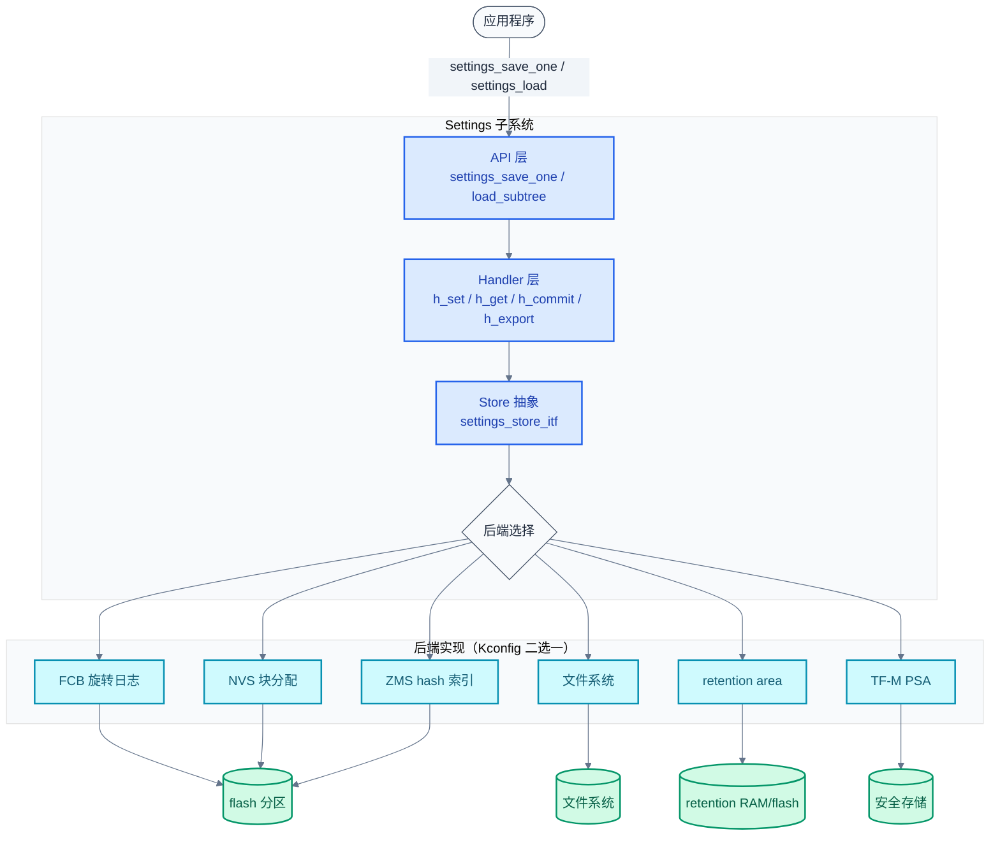
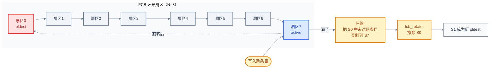
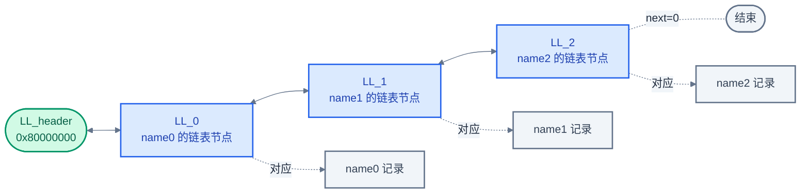

# 25. Settings 键值持久化

> 一句话概括：本文把 [20 章 iterable sections](./20-Iterable%20Sections链接器魔法.md) 的 `STRUCT_SECTION_ITERABLE` 用到极致——讲清 Zephyr Settings 子系统如何用 "API → handler → store → backend" 四层架构、静态/动态双重 handler 注册、按 `cprio` 排序的 commit 流程，以及 FCB/NVS/ZMS/文件/retention/TF-M PSA 六种后端在同一套键值接口下可互换的设计，让持久化配置在 flash 寿命、加载速度、掉电安全之间取得平衡。
> **工程师视角**：读完后应能回答"为什么 settings_save_one 要先查重再写""FCB 的旋转日志和 NVS 的块分配在掉电恢复上为何都只需扫描一遍""ZMS 用 hash 当 ID 为什么还要维护链表""TF-M PSA 后端为什么把所有 settings 摊在 RAM 里"这四个问题。

### 关键术语

| 缩写 | 全称 | 含义 |
|------|------|------|
| RTOS | Real-Time Operating System | 实时操作系统 |
| API | Application Programming Interface | 应用编程接口 |
| flash | Flash Memory | 闪存（嵌入式非易失存储） |
| RAM | Random Access Memory | 随机存取存储器 |
| FCB | Flash Circular Buffer | 闪存环形缓冲 |
| NVS | Non-Volatile Storage | 非易失存储 |
| ZMS | Zephyr Memory Storage | Zephyr 内存存储（hash 索引的 KV 存储） |
| KV | Key-Value | 键值对 |
| PSA | Platform Security Architecture | ARM 平台安全架构 |
| TF-M | Trusted Firmware-M | ARM Cortex-M 的可信固件 |
| ITS | Internal Trusted Storage | PSA 内部可信存储 |
| PS | Protected Storage | PSA 受保护存储 |
| UID | Unique Identifier | 唯一标识符 |
| CRC | Cyclic Redundancy Check | 循环冗余校验 |
| GC | Garbage Collection | 垃圾回收 |
| LL | Linked List | 链表 |
| DTS | Devicetree Source | 设备树源文件 |

### 前置阅读

| 需要了解 | 参考文档 |
|----------|----------|
| iterable sections 与 `STRUCT_SECTION_ITERABLE` | [20-Iterable Sections链接器魔法](./20-Iterable%20Sections链接器魔法.md) |
| 内核初始化级别与 SYS_INIT | [04-内核启动与初始化](./04-内核启动与初始化.md) |
| 设备树 partition 与 chosen 节点 | [03-设备树详解](./03-设备树详解.md) |
| 闪存分区与 flash_map | [02-构建系统](./02-构建系统.md) |

---

> 上一章（[24-Shell命令行框架](./24-Shell命令行框架.md)）讲的是"运行时交互"——shell 把命令分发到各模块。但 shell 关掉就没了，设备重启后配置必须还在。一个自然的问题是：谁来持久化这些配置？本章用 Settings 子系统来回答这个问题——先讲键值 API 与 handler 注册，再讲 store 后端抽象，最后逐一拆解 FCB、NVS、ZMS 三种主流后端的存储范式。

## 1. 概述：RTOS 中的持久化配置

### 1.1 持久化要解决什么问题

嵌入式设备重启后，有一类数据必须存活：蓝牙绑定信息、WiFi 凭据、设备序列号、校准系数、上次的 OTA 状态、用户偏好……这些数据有三个共同特征：

1. **生命周期跨越重启**——掉电不能丢
2. **更新不频繁但读取代价敏感**——启动时一次性加载
3. **写入要掉电安全**——写到一半断电不能损坏旧数据

直接用 `flash_area_write` 写裸 flash 不行：flash 只能按页擦除、按块对齐写，且每个擦除块寿命有限（典型 10 万次）。Settings 子系统就是把这些底层约束封装成统一的键值接口，让上层模块只关心"name-value"，不用关心扇区轮转和磨损均衡。

### 1.2 本质：可换后端的键值仓库

Settings 的核心设计可以用一句话概括：

> **核心要点**：Settings 是一套"键值接口 + 可换后端"的持久化框架。上层用 `settings_save_one("bt/addr", ...)` 存、用 `settings_load_subtree("bt")` 读；下层后端（FCB/NVS/ZMS/文件/retention/TF-M PSA）实现同一套 `settings_store_itf` 接口，Kconfig 一切换、代码不动。

这和 [23 章 Logging](./23-Logging日志系统.md) 的"frontend → backend"分离是同一种哲学：接口稳定，实现可换。

### 1.3 架构总览



> **如何读这张图**：从上往下看，应用只接触 API 层；Handler 层把"逻辑键"映射到模块的 RAM 变量；Store 抽象层定义后端必须实现的 7 个回调；后端层是 Kconfig 选择题，同一时刻只激活一个目的后端（source 可多个）。三种 flash 后端（FCB/NVS/ZMS）共享同一个 flash 分区，但数据格式完全不同。

## 2. API：settings_save_one/settings_load_subtree

### 2.1 两套 API：单条 vs 批量

Settings 暴露两组 API，对应两种使用模式：

| 模式 | 写入 API | 读取 API | 适用场景 |
|------|----------|----------|----------|
| **单条直接** | `settings_save_one(name, val, len)` | `settings_load_one(name, buf, len)` | 临时改一个值，不注册 handler |
| **handler 批量** | `settings_save()` / `settings_save_subtree()` | `settings_load()` / `settings_load_subtree()` | 模块有多个配置项，统一管理 |
| **子树直读** | — | `settings_load_subtree_direct(subtree, cb, param)` | 不经过 handler，自己处理原始数据 |

单条 API 最简单，下面是一个完整可运行的最小例子（来自官方文档 `index.rst` 的 "Persist Runtime State" 示例）：

```c
#include <zephyr/kernel.h>
#include <zephyr/settings/settings.h>

static uint8_t foo_val = 0;  /* RAM 中持久化的值 */

/* h_set: 从 flash 加载到 RAM 时被调用 */
static int foo_settings_set(const char *name, size_t len,
                            settings_read_cb read_cb, void *cb_arg)
{
    const char *next;
    int rc;

    /* 匹配 "foo/bar" 中的 "bar" 部分 */
    if (settings_name_steq(name, "bar", &next) && !next) {
        if (len != sizeof(foo_val)) {
            return -EINVAL;
        }
        rc = read_cb(cb_arg, &foo_val, sizeof(foo_val));
        if (rc >= 0) {
            return 0;  /* rc 是实际读到的字节数 */
        }
        return rc;
    }
    return -ENOENT;
}

struct settings_handler my_conf = {
    .name = "foo",
    .h_set = foo_settings_set,
};

int main(void)
{
    settings_subsys_init();      /* 初始化子系统 + 后端 */
    settings_register(&my_conf); /* 注册 handler */
    settings_load();             /* 从 flash 加载，触发 h_set */

    foo_val++;                   /* 改 RAM 值 */
    settings_save_one("foo/bar", &foo_val, sizeof(foo_val));  /* 单条写回 */

    printk("foo: %d\n", foo_val);
    return 0;
}
```

这个例子展示了 Settings 的两条主线：`settings_load()` 触发 handler 的 `h_set` 把 flash 值灌进 RAM；`settings_save_one()` 绕过 handler 直接写一条。重启后 `foo_val` 会从上次 +1 的位置继续。

### 2.2 键的命名约定

Settings 的键是斜杠分隔的字符串，最长 `SETTINGS_MAX_NAME_LEN = 64`（8 层 × 8 字符），分隔符固定为 `/`，值结束符是 `=`：

```c
/* include/zephyr/settings/settings.h:37-45 */
#define SETTINGS_MAX_DIR_DEPTH  8
#define SETTINGS_MAX_NAME_LEN   (8 * SETTINGS_MAX_DIR_DEPTH)  /* 64 */
#define SETTINGS_MAX_VAL_LEN    256
#define SETTINGS_NAME_SEPARATOR '/'
#define SETTINGS_NAME_END       '='
```

约定俗成的命名是 `模块/子项`，例如 `bt/addr`、`wifi/ssid`、`id/serial`。handler 注册时只声明顶层子树名（如 `"bt"`），`settings_name_steq` 负责前缀匹配。

> **核心要点**：键名是字符串而非整数 ID，好处是可读、可跨模块共享；代价是 FCB/文件后端要把整个字符串存进 flash，加载时要逐字符比较。NVS 和 ZMS 通过把 name 单独存一条记录、再用 ID 索引来摊薄这个代价。

### 2.3 settings_load 的完整流程

`settings_load()` 实际是 `settings_load_subtree(NULL)` 的别名。源码在 `subsys/settings/src/settings_store.c`：

```c
/* subsys/settings/src/settings_store.c:41-62 */
int settings_load_subtree(const char *subtree)
{
    struct settings_store *cs;
    int rc;
    const struct settings_load_arg arg = { .subtree = subtree };

    settings_lock_take();
    /* 遍历所有注册的 source 后端（可多个） */
    SYS_SLIST_FOR_EACH_CONTAINER(&settings_load_srcs, cs, cs_next) {
        cs->cs_itf->csi_load(cs, &arg);
    }
    /* 全部加载完，按 cprio 排序调用各 handler 的 h_commit */
    rc = settings_commit_subtree(subtree);
    settings_lock_release();
    return rc;
}
```

整个加载过程是两阶段的：先 `csi_load` 把 flash 里的每条记录回调给 `settings_call_set_handler`，后者找到匹配 handler 调 `h_set` 写进 RAM；全部读完后再 `settings_commit_subtree` 统一调 `h_commit`。**为什么分两阶段？** 因为有些配置项相互依赖（比如波特率要先于校验位生效），`h_commit` 给模块一个"所有值都就位了，现在可以应用"的信号点，且按 `cprio` 排序保证依赖顺序。

## 3. Handler 注册：静态与动态

### 3.1 两种注册方式

Handler 是"逻辑键 → RAM 变量"的桥梁。Settings 提供两种注册方式，对应 [20 章 iterable sections](./20-Iterable%20Sections链接器魔法.md) 的两种用法：

| 维度 | 静态注册 | 动态注册 |
|------|----------|----------|
| **机制** | `STRUCT_SECTION_ITERABLE` 放入链接器段 | `sys_slist_append` 挂链表 |
| **宏/函数** | `SETTINGS_STATIC_HANDLER_DEFINE` | `settings_register` |
| **生命周期** | 编译期固定，不可卸载 | 运行期可注册/反注册 |
| **依赖** | 无（链接器段自动收集） | `CONFIG_SETTINGS_DYNAMIC_HANDLERS=y` |
| **典型用户** | Bluetooth host、LoRaWAN | 应用层临时配置 |

静态注册的宏展开后非常简洁：

```c
/* include/zephyr/settings/settings.h:222-231 */
#define SETTINGS_STATIC_HANDLER_DEFINE_WITH_CPRIO(_hname, _tree, _get, _set, \
        _commit, _export, _cprio)                                          \
    const STRUCT_SECTION_ITERABLE(settings_handler_static,                 \
        settings_handler_##_hname) = {                                     \
        .name = _tree, .cprio = _cprio,                                    \
        .h_get = _get, .h_set = _set, .h_commit = _commit,                 \
        .h_export = _export,                                               \
    }
```

`STRUCT_SECTION_ITERABLE` 把变量放进 `_settings_handler_static` 段，启动后 `STRUCT_SECTION_FOREACH` 就能遍历到。Bluetooth host 就是这么注册的：

```c
/* subsys/bluetooth/host/settings.c:377-378 */
SETTINGS_STATIC_HANDLER_DEFINE_WITH_CPRIO(bt, "bt", NULL,
        set_setting, commit_settings, NULL, BT_SETTINGS_CPRIO_0);
```

动态注册则简单得多——往 `settings_handlers` 链表尾追加：

```c
/* subsys/settings/src/settings.c:41-67（节选） */
int settings_register_with_cprio(struct settings_handler *handler, int cprio)
{
    /* 先查重：静态段和动态链表都不能同名 */
    STRUCT_SECTION_FOREACH(settings_handler_static, ch) {
        if (strcmp(handler->name, ch->name) == 0) {
            return -EEXIST;
        }
    }
    /* ... 链表查重 ... */
    handler->cprio = cprio;
    sys_slist_append(&settings_handlers, &handler->node);
    return 0;
}
```

### 3.2 查找：最长前缀匹配

加载时 `settings_call_set_handler` 要为每条 flash 记录找到对应 handler。查找逻辑在 `settings_parse_and_lookup`（`subsys/settings/src/settings.c:146-199`）：

1. 遍历所有静态 handler，用 `settings_name_steq` 测试前缀匹配
2. 若多个 handler 都匹配，**选名字最长的**（最长前缀优先）
3. 再遍历动态 handler 链表，同样规则

> **核心要点**：handler 的 `name` 是子树前缀，不是完整键。注册 `"bt"` 的 handler 会处理所有 `bt/*` 键；注册 `"bt/mesh"` 的 handler 会优先处理 `bt/mesh/*`（因为前缀更长）。这种"按子树分层"的设计让模块可以只暴露一个入口，内部分发。

### 3.3 commit 按 cprio 排序

`settings_commit_subtree` 不能简单遍历调用 `h_commit`，因为模块间有依赖。源码用一个巧妙的"逐层扫描"算法实现按 `cprio` 升序调用（值小先调）：

```c
/* subsys/settings/src/settings.c:263-322（节选） */
int settings_commit_subtree(const char *subtree)
{
    int cprio = INT_MIN;   /* 从最小优先级值开始 */

    while (true) {
        int next_cprio = cprio;

        STRUCT_SECTION_FOREACH(settings_handler_static, ch) {
            if (ch->h_commit) {
                /* 记录比当前 cprio 大的下一个值 */
                next_cprio = set_next_cprio(ch->cprio, cprio, next_cprio);
                if (ch->cprio != cprio) {
                    continue;   /* 不是这一层，跳过 */
                }
                ch->h_commit(); /* 调用当前层的 handler */
            }
        }
        /* ... 动态 handler 同样处理 ... */

        if (cprio == next_cprio) {
            break;  /* 没有更高层了，结束 */
        }
        cprio = next_cprio;  /* 推进到下一层 */
    }
    return rc;
}
```

**为什么不用排序算法？** 因为静态 handler 在链接器段里的顺序不可控（取决于链接顺序），而 `cprio` 是编译期常量。这个算法每次扫描全部 handler 找出"当前最小 `cprio`"，调用后推进到"下一个最小值"，时间复杂度 $O(n^2)$，但 handler 数量通常 < 20，完全可以接受。Bluetooth 把自己设为 `BT_SETTINGS_CPRIO_0`（最早 commit），这样 WiFi 等依赖 BT 就绪的模块可以用更大的 `cprio` 排在后面。

## 4. 后端抽象：settings_store

### 4.1 后端接口

后端要实现 `settings_store_itf` 的若干回调（`include/zephyr/settings/settings.h:493-576`）：

| 回调 | 作用 | 必需 |
|------|------|------|
| `csi_load` | 加载全部/子树记录，对每条调 `settings_call_set_handler` | 是 |
| `csi_load_one` | 只加载单条（可选，加速 `settings_load_one`） | 否 |
| `csi_get_val_len` | 查值长度（可选） | 否 |
| `csi_save` | 保存单条键值 | 是 |
| `csi_save_start` | 批量保存开始（如 retention 清空） | 否 |
| `csi_save_end` | 批量保存结束 | 否 |
| `csi_storage_get` | 返回底层存储对象（供调试） | 否 |

后端通过两个函数注册角色：

```c
/* subsys/settings/src/settings_store.c:26-34 */
void settings_src_register(struct settings_store *cs)  /* 注册为"源"（可读） */
{
    sys_slist_append(&settings_load_srcs, &cs->cs_next);
}
void settings_dst_register(struct settings_store *cs)  /* 注册为"目的"（可写） */
{
    settings_save_dst = cs;   /* 注意：目的只能有一个 */
}
```

> **核心要点**：source 可以多个（例如同时从 FCB 和 retention 加载），destination 只能有一个。这个不对称设计的含义是：读取时合并多个来源（按注册顺序覆盖），写入时只往一个地方写。`settings_save_one` 直接调 `settings_save_dst->cs_itf->csi_save`，不经过 handler。

### 4.2 settings_save 的批量流程

`settings_save()` 与 `settings_save_one()` 的区别在于它走 handler 的 `h_export`：

```c
/* subsys/settings/src/settings_store.c:238-285（节选） */
int settings_save_subtree(const char *subtree)
{
    struct settings_store *cs = settings_save_dst;
    if (cs->cs_itf->csi_save_start) {
        cs->cs_itf->csi_save_start(cs);   /* 后端开场（如 retention 清空） */
    }
    /* 遍历所有 handler，让每个 handler 把自己的值吐出来 */
    STRUCT_SECTION_FOREACH(settings_handler_static, ch) {
        if (subtree && !settings_name_steq(ch->name, subtree, NULL)) {
            continue;
        }
        if (ch->h_export) {
            ch->h_export(settings_save_one);  /* export 内部调 settings_save_one */
        }
    }
    /* ... 动态 handler 同样处理 ... */
    if (cs->cs_itf->csi_save_end) {
        cs->cs_itf->csi_save_end(cs);
    }
    return rc;
}
```

`h_export` 收到一个 `settings_save_one` 函数指针，模块在自己的 `h_export` 里把所有 RAM 变量逐个调它写出去。**为什么这样设计？** 因为只有模块自己知道有哪些键、当前值是什么——Settings 框架无法主动枚举。这是一种"控制反转"：框架提供写函数，模块负责调用。

### 4.3 初始化时机

Settings 子系统本身**不**通过 `SYS_INIT` 自动初始化——`settings_subsys_init()` 由使用者显式调用。这个函数做两件事（`subsys/settings/src/settings_init.c:25-45`）：

1. `settings_init()`：初始化 handler 链表和 source 链表
2. `settings_backend_init()`：后端特有的初始化（每个后端各实现一份）

调用者遍布各子系统：Bluetooth 的 `bt_settings_init`、LoRaWAN 的 `lorawan_nvm_settings_init`、WiFi 凭据后端等。值得注意的是 `subsys/secure_storage/src/its/store/settings.c:24` 确实用 `SYS_INIT(init_settings_subsys, APPLICATION, CONFIG_APPLICATION_INIT_PRIORITY)` 自动初始化——但那是 secure_storage 模块自己注册的，不是 Settings 子系统本身。**为什么不让 Settings 自动初始化？** 因为文件后端依赖文件系统先挂载，FCB/NVS 依赖 flash 驱动就绪，时机因板而异，留给使用者决定更安全。

## 5. FCB：Flash Circular Buffer

### 5.1 旋转日志思路

FCB 是 Settings 最老的后端，思路来自"日志结构存储"：把 flash 分成 $N$ 个扇区组成环形，写入只追加（append），满了就擦最老的扇区。



> **如何读这张图**：写入永远发生在 `active` 扇区（最右）。当 active 满了，先把 `oldest` 扇区里仍然有效的条目（即后续没被覆盖的）复制到 active，然后 `fcb_rotate` 擦掉 oldest，oldest 指针前移一格。整个环形就像磁带一样循环使用。

### 5.2 写入流程：查重 + 追加

FCB 的 `csi_save` 实现叫 `settings_fcb_save`（`subsys/settings/src/settings_fcb.c:367-388`），它先做一件关键的事——**查重**：

```c
/* subsys/settings/src/settings_fcb.c:367-388（节选） */
static int settings_fcb_save(struct settings_store *cs, const char *name,
                             const char *value, size_t val_len)
{
    struct settings_line_dup_check_arg cdca = {
        .name = name, .val = (char *)value,
        .is_dup = 0, .val_len = val_len,
    };
    /* 扫描整个 FCB，看是否已存在相同的 name+value */
    settings_fcb_load_priv(cs, settings_line_dup_check_cb, &cdca, false);
    if (cdca.is_dup == 1) {
        return 0;   /* 值没变，不写，省一次擦写 */
    }
    return settings_fcb_save_priv(cs, name, value, val_len);
}
```

**为什么要查重？** flash 写寿命有限（10 万次量级），如果值没变却重复写，会白白消耗扇区。FCB 的查重代价是扫描整个环形，但对"配置偶尔变一次"的场景完全可接受。

`settings_fcb_save_priv` 是真正的写入逻辑（`settings_fcb.c:324-365`）：

1. 用 `settings_line_len_calc` 算出 `name=value` 的字节数
2. 调 `fcb_append` 申请空间——若当前扇区满返回 `-ENOSPC`
3. 满了就调 `settings_fcb_compress` 压缩，最多重试 `f_sector_cnt - 1` 次
4. `settings_line_write` 把 `name=value` 写进 flash（按写块大小对齐）

### 5.3 压缩与旋转

`settings_fcb_compress`（`settings_fcb.c:217-305`）做的事是"垃圾回收"：

1. `fcb_append_to_scratch`：切到 scratch 扇区（保留的备用扇区）
2. 遍历 oldest 扇区的每条记录
3. 对每条记录，扫描其后所有记录看是否有同名——若没有（即它是最新版），复制到 scratch；若有（已被覆盖），跳过
4. `fcb_rotate`：擦掉 oldest，推进指针

`fcb_rotate` 本身非常简洁（`subsys/fs/fcb/fcb_rotate.c:11-45`）：

```c
int fcb_rotate(struct fcb *fcb)
{
    rc = fcb_erase_sector(fcb, fcb->f_oldest);   /* 擦最老扇区 */
    if (fcb->f_oldest == fcb->f_active.fe_sector) {
        /* 擦的恰好是 active，开新扇区 */
        sector = fcb_getnext_sector(fcb, fcb->f_oldest);
        fcb_sector_hdr_init(fcb, sector, fcb->f_active_id + 1);
        fcb->f_active.fe_sector = sector;
        fcb->f_active_id++;
    }
    fcb->f_oldest = fcb_getnext_sector(fcb, fcb->f_oldest);  /* oldest 前移 */
    return rc;
}
```

### 5.4 加载：过滤重复

FCB 里同一个键可能有多条记录（旧值 + 新值），加载时必须只取最新。`settings_fcb_load` 用 `filter_duplicates=true` 调用 `settings_fcb_load_priv`（`settings_fcb.c:146-187`）：对每条记录，调 `settings_fcb_check_duplicate` 往后扫描，若发现同名记录就跳过当前这条。这样最终回调到 handler 的就是每个键的最新值。

### 5.5 数据格式：name=value 行

FCB 把每条记录存成 `name=value` 的字节流，由 `settings_line_write`（`subsys/settings/src/settings_line.c:24-120`）按 flash 写块大小对齐写入。若开启 `CONFIG_SETTINGS_ENCODE_LEN`（文件后端必选，FCB 默认不开），还会在行首加 2 字节长度字段，方便定位下一条行。

> **核心要点**：FCB 的"旋转日志"范式有三个掉电安全特性——(1) 追加写，从不覆盖旧数据，断电时旧值仍在；(2) 压缩时先写 scratch 再擦 oldest，断电最多丢最近一条；(3) 扇区头有 magic 和版本号，`fcb_init` 能识别损坏的扇区头并跳过。代价是加载时要全扫描 + 查重，$O(n)$ 复杂度。

## 6. NVS：Non-Volatile Storage

### 6.1 块分配思路

NVS（`subsys/kvss/nvs/`）用完全不同的范式：每个键值对占一个固定格式的"分配表条目"（ATE, Allocation Table Entry），数据追加写，ATE 从扇区末尾向前生长、数据从扇区开头向后生长，两者相向而行。

NVS 自己处理磨损均衡和 GC，Settings 只是在它之上把 name 和 value 拆成两条 NVS 记录存。`settings_nvs.h` 定义了关键的 ID 布局：

```c
/* subsys/settings/include/settings/settings_nvs.h:33-34 */
#define NVS_NAMECNT_ID      0x8000   /* 存"当前最大 name ID"的特殊条目 */
#define NVS_NAME_ID_OFFSET  0x4000   /* value ID = name ID + 这个偏移 */
```

> **如何读这两个常量**：NVS 用 16-bit ID 索引记录。Settings 把 name 存在 ID ∈ (0x8000, 0xC000) 区间，对应的 value 存在 ID + 0x4000 区间。`NVS_NAMECNT_ID` (0x8000) 是个特殊条目，记录当前用过的最大 name ID——加载时从这里开始倒序扫描。

### 6.2 写入流程：name + value 双条

`settings_nvs_save`（`subsys/settings/src/settings_nvs.c:215-355`）的核心逻辑：

1. 从 `last_name_id` 倒序扫描，用 `nvs_read` 比对 name 字符串，找是否已存在
2. 若存在且非删除：复用原 name ID，只更新 value（`write_name = false`）
3. 若不存在：`write_name_id = last_name_id + 1`，要写新 name
4. 先写 value（`nvs_write(write_name_id + NVS_NAME_ID_OFFSET, value, val_len)`）
5. 再写 name（`nvs_write(write_name_id, name, strlen(name))`）
6. 更新 `last_name_id` 并写回 `NVS_NAMECNT_ID`

**为什么先写 value 后写 name？** 掉电安全考虑：如果先写 name 后写 value，断电在中间会出现"有 name 无 value"的脏记录，加载时无法区分"已删除"和"写了一半"。先 value 后 name，则 name 写成功才算完整记录；name 没写完时，value 那条没人引用，加载时自然忽略。

### 6.3 加载：倒序扫描

`settings_nvs_load`（`settings_nvs.c:123-213`）从 `last_name_id` 倒序向 `NVS_NAMECNT_ID` 扫描：

```c
/* subsys/settings/src/settings_nvs.c:142-211（节选） */
name_id = cf->last_name_id + 1;
while (1) {
    name_id--;
    if (name_id == NVS_NAMECNT_ID) {
        break;   /* 扫到头了 */
    }
    /* 同时读 name 和 value 两条 */
    rc1 = nvs_read(&cf->cf_nvs, name_id, &name, sizeof(name));
    rc2 = nvs_read(&cf->cf_nvs, name_id + NVS_NAME_ID_OFFSET, &buf, sizeof(buf));

    if ((rc1 <= 0) && (rc2 <= 0)) {
        /* 都没了：last_name_id 失效，回退 */
        if (name_id == cf->last_name_id) {
            cf->last_name_id--;
            nvs_write(&cf->cf_nvs, NVS_NAMECNT_ID, &cf->last_name_id, sizeof(uint16_t));
        }
        continue;
    }
    if ((rc1 <= 0) || (rc2 <= 0)) {
        /* 缺一条：脏数据，删掉清理 */
        nvs_delete(&cf->cf_nvs, name_id);
        nvs_delete(&cf->cf_nvs, name_id + NVS_NAME_ID_OFFSET);
        continue;
    }
    /* 两条都在：回调 handler */
    settings_call_set_handler(name, rc2, settings_nvs_read_fn, &read_fn_arg, arg);
}
```

**为什么倒序？** NVS 是追加写的，新记录 ID 更大。倒序扫描意味着"后写的先读到"——对同一个 name ID，NVS 内部已经只保留最新版（`nvs_write` 同 ID 会追加新 ATE，旧 ATE 失效），所以倒序第一次命中就是最新值。这避免了 FCB 那种"全扫描查重"。

### 6.4 name cache 加速

NVS 的痛点是查 name 要线性扫描。`CONFIG_SETTINGS_NVS_NAME_CACHE`（默认 128 项）用 `crc16_ccitt` 对 name 算哈希缓存映射：

```c
/* subsys/settings/src/settings_nvs.c:79-88 */
static void settings_nvs_cache_add(struct settings_nvs *cf, const char *name,
                                   uint16_t name_id)
{
    uint16_t name_hash = crc16_ccitt(0xffff, name, strlen(name));
    cf->cache[cf->cache_next].name_hash = name_hash;
    cf->cache[cf->cache_next++].name_id = name_id;
    cf->cache_next %= CONFIG_SETTINGS_NVS_NAME_CACHE_SIZE;  /* 环形覆盖 */
}
```

cache 命中时直接拿到 `name_id`，跳过扫描。注意 cache 用哈希比对，命中后仍要 `nvs_read` 读出 name 字符串做 `strcmp` 二次确认，避免哈希碰撞误判。

## 7. ZMS：Zephyr Memory Storage

### 7.1 hash 索引思路

ZMS（2024 年由 BayLibre 引入）是 Settings 的新一代后端，思路类似 NVS 但用 hash 直接定位，避免 name 扫描。核心思想：**用 name 的 hash 值作为存储 ID**，实现 $O(1)$ 查找。

`settings_zms.h` 定义了 32-bit ID 的位布局：

```
| 31 30 | 29 ... (COLLISION_BITS+1) | COLLISION_BITS ... 1 | 0 |
| MSB   | hash (截断)                | collision_num        |LL|
|       |                            |                      | |
|       |                            |                      | 链表位：0=name, 1=LL节点
|       |                            | 冲突编号（可配 4 bit）
|       | sys_hash32 截断后的低位
| 10=name ID, 11=data ID（name ID + 0x40000000）
```

```c
/* subsys/settings/include/settings/settings_zms.h:57-62 */
#define ZMS_LL_HEAD_HASH_ID 0x80000000   /* 链表头节点 */
#define ZMS_DATA_ID_OFFSET  0x40000000   /* value ID = name ID + 这个偏移 */
#define ZMS_HASH_MASK       GENMASK(29, CONFIG_SETTINGS_ZMS_MAX_COLLISIONS_BITS + 1)
#define ZMS_COLLISIONS_MASK GENMASK(CONFIG_SETTINGS_ZMS_MAX_COLLISIONS_BITS, 1)
#define ZMS_MAX_COLLISIONS  (BIT(CONFIG_SETTINGS_ZMS_MAX_COLLISIONS_BITS) - 1)
```

> **如何读这套宏**：name ID 的最高 2 位是 `10`（即 bit31=1, bit30=0），data ID 最高 2 位是 `11`（name ID + 0x40000000）。中间 28 位里，低位若干位（默认 4 位，由 `CONFIG_SETTINGS_ZMS_MAX_COLLISIONS_BITS` 控制）是冲突编号，剩余高位是 hash。链表节点的 ID 就是 name ID 把 bit0 置 1。

#### 7.1.1 ZMS 底层存储格式：ATE 与 magic

`settings_zms.h` 只定义了"hash ID 位布局"，ZMS 自身的 flash 存储格式定义在 [subsys/kvss/zms/zms_priv.h](file:///home/pbw/rtos/cs-learning-notes/zephyr-project/zephyr/subsys/kvss/zms/zms_priv.h)：

```c
/* subsys/kvss/zms/zms_priv.h:32-53 */
#define ZMS_VERSION_MASK        GENMASK(7, 0)
#define ZMS_DEFAULT_VERSION     1
#define ZMS_MAGIC_NUMBER        0x42 /* murmur3a hash of "ZMS" (MSB) */
#define ZMS_MAGIC_NUMBER_MASK   GENMASK(15, 8)
#define ZMS_ATE_FORMAT_MASK     GENMASK(19, 16)
#define ZMS_ATE_FORMAT_ID_32BIT 0
#define ZMS_ATE_FORMAT_ID_64BIT 1
#define ZMS_DATA_IN_ATE_SIZE    SIZEOF_FIELD(struct zms_ate, data)
#define ZMS_BLOCK_SIZE          32   /* 默认写块大小，可由 CONFIG_ZMS_CUSTOMIZE_BLOCK_SIZE 覆盖 */
```

**逐符号解释**：

- `ZMS_MAGIC_NUMBER` (0x42)：扇区头中的 magic 标识，是 "ZMS" 的 murmur3a hash 高字节，`zms_mount` 时用它识别有效的 ZMS 扇区
- `ZMS_VERSION_MASK` / `ZMS_DEFAULT_VERSION` (1)：ZMS 存储格式版本号，加载时若版本不匹配返回 `-EPROTONOSUPPORT`
- `ZMS_ATE_FORMAT_MASK` / `ZMS_ATE_FORMAT_ID_32BIT` / `ZMS_ATE_FORMAT_ID_64BIT`：ATE 的 ID 宽度，由 `CONFIG_ZMS_ID_64BIT` 选择（默认 32-bit）
- `ZMS_DATA_IN_ATE_SIZE`：ATE 内联数据字段大小（32-bit 格式 8 字节，64-bit 格式 4 字节）——小于此长度的 value 直接嵌入 ATE，不再单独占数据区
- `ZMS_BLOCK_SIZE`：flash 写块对齐粒度，ATE 与数据写入都按它对齐

每条记录在 flash 里是一个 `struct zms_ate`（Allocation Table Entry，分配表条目）：

```c
/* subsys/kvss/zms/zms_priv.h:61-107（节选，32-bit ID 格式）*/
struct zms_ate {
    uint8_t crc8;          /* ATE 自身的 CRC8 校验 */
    uint8_t cycle_cnt;     /* 非 erase 设备（如 MRAM）的循环计数 */
    uint16_t len;          /* 数据长度 */
    uint32_t id;           /* 记录 ID（settings 的 name ID 或 value ID） */
    union {
        uint8_t data[8];   /* 小数据内联（ZMS_DATA_IN_ATE_SIZE 字节） */
        struct {
            uint32_t offset;   /* 数据在扇区中的偏移（大数据走此路径） */
            union {
                uint32_t data_crc;  /* 数据 CRC（完整读时校验） */
                uint32_t metadata;  /* 元数据：扇区头存 magic + version */
            };
        };
    };
} __packed;
```

> **核心要点**：ZMS 的 ATE 与 NVS 的 ATE 设计同源——元数据（id、len、crc）与数据分离，ATE 从扇区末尾向前生长、数据从扇区开头向后生长。扇区的"空 ATE"（empty ATE）用 `metadata` 字段写入 `ZMS_MAGIC_NUMBER | ZMS_DEFAULT_VERSION`（见 [zms.c](file:///home/pbw/rtos/cs-learning-notes/zephyr-project/zephyr/subsys/kvss/zms/zms.c#L851-L852)），作为扇区有效性与版本标识，掉电后 `zms_mount` 能识别损坏或部分初始化的扇区并跳过。`crc8` 字段让单条 ATE 损坏可被检测，配合 `data_crc` 实现两级完整性校验。

### 7.2 写入流程：hash + 冲突处理

`settings_zms_save`（`subsys/settings/src/settings_zms.c:398-558`）的逻辑：

1. `name_hash = sys_hash32(name, name_len) & ZMS_HASH_MASK`，再 `| BIT(31)` 标记为 name ID
2. 从冲突编号 0 开始，依次读 `name_hash + i * 步进`，看是否已存在同名记录
3. 命中同名：`write_name = false`，复用 hash
4. 命中异名（hash 冲突）：递增 `collision_num` 继续找
5. 找到空位或冲突上限：写入 value 到 `ZMS_DATA_ID_FROM_NAME(name_hash)`，必要时写 name 和链表节点

冲突处理是 ZMS 的关键：默认 `CONFIG_SETTINGS_ZMS_MAX_COLLISIONS_BITS=4`，允许最多 $2^4 = 16$ 次冲突。冲突数会持久化到 `hash_collision_num` 字段，下次加载时恢复。

### 7.3 链表：为遍历加载服务

**为什么 hash 索引还需要链表？** 因为 `settings_load()` 要遍历所有记录，但 hash 只能"按 name 查"，不能"枚举所有 name"。ZMS 的解法是维护一个双向链表，把所有 name ID 串起来：



链表节点的 ID 是 `name_hash | BIT(0)`（最低位置 1），每个节点存 `{previous_hash, next_hash}`。加载时从 `ZMS_LL_HEAD_HASH_ID` 出发，沿 `next_hash` 遍历整个链表，对每个节点用 `ZMS_NAME_ID_FROM_LL_NODE` 还原出 name ID，再读 name 字符串和 value。`settings_zms_get_last_hash_ids`（`settings_zms.c:611-675`）在初始化时遍历一次链表，缓存 `last_hash_id` 和 `second_to_last_hash_id`，后续追加新 name 时直接更新尾节点。

### 7.4 ZMS 相对 NVS 的改进

| 维度 | NVS | ZMS |
|------|-----|-----|
| **查找单条** | 倒序线性扫描 name（$O(n)$） | hash 直接定位（$O(1)$，冲突时 $O(k)$） |
| **`csi_load_one`** | 不实现，退化为 `csi_load` | 实现，直接 hash 查 |
| **`csi_get_val_len`** | 不实现 | 实现 |
| **遍历加载** | 按 ID 倒序扫描 | 沿链表遍历 |
| **冲突处理** | 无（name 显式存） | hash 冲突编号 |
| **name cache** | 应用层 crc16 cache | 链表本身就是索引 |
| **掉电恢复** | 扇区头 + ATE 校验 | 链表自修复（`settings_zms_init_or_recover_ll`） |

> **核心要点**：ZMS 用 hash 当主键，把 NVS 的"扫描找 name"变成"算 hash 直达"，单条查询从 $O(n)$ 降到 $O(1)$。代价是 hash 冲突要额外编号位处理，且要维护链表才能遍历。链表节点断电损坏时 `settings_zms_init_or_recover_ll` 会从断点重建。

## 8. 其他后端：文件系统/retention/TF-M PSA

### 8.1 文件系统后端

文件后端（`subsys/settings/src/settings_file.c`）把 settings 存成普通文件，每行一条 `name=value`。它依赖 `CONFIG_SETTINGS_ENCODE_LEN`（行首 2 字节长度字段），文件路径由 `CONFIG_SETTINGS_FILE_PATH`（默认 `/settings/run`）指定。

写入策略（`settings_file.c:371-417`）：正常情况下直接 `fs_seek(END)` 追加；当 `cf_lines >= cf_maxlines`（默认 32）时触发 `settings_file_save_and_compress`——创建 `.cmp` 临时文件，去重写入所有有效记录，最后 `fs_rename` 原子替换。这个"写到临时文件再改名"是文件系统掉电安全的标准套路。

### 8.2 retention 后端

retention 后端（`subsys/settings/src/settings_retention.c`）面向"启动时快速恢复少量关键配置"的场景。retention area 通常是 RAM backed（如备份域寄存器、SRAM 保留区）或小片 flash，特点是读取快但容量小。

数据格式很简单（`settings_retention.c:24-37`）：

```
| uint16_t length_name | uint16_t length_value | name 字节 | value 字节 |
| ... 重复 ... |
| 0x0000 0x0000（结束标记） |
```

**关键限制**：retention 后端只支持"整体保存"——`csi_save_start` 会 `retention_clear` 清空整个区域，然后 `settings_save` 遍历所有 handler 一次性写回（`settings_retention.c:266-273`）。不能像 FCB/NVS 那样 `settings_save_one` 单条更新。这意味着它适合"配置项少、偶尔全量保存"的场景，不适合频繁单条写。

写入顺序有个掉电安全的细节：先写 name 和 value 数据，最后才写 length 头。这样断电在写一半时，length 头还是 0，加载时被当作"空记录"跳过，不会读到半截数据。

### 8.3 TF-M PSA 后端

TF-M PSA 后端（`subsys/settings/src/settings_tfm_psa.c`）是给"安全世界"用的可信存储。它的设计很特别——**所有 settings 常驻 RAM**：

```c
/* subsys/settings/src/settings_tfm_psa.c:24-25 */
static struct setting_entry entries[CONFIG_SETTINGS_TFM_PSA_NUM_ENTRIES];
static int entries_count;
```

`settings_psa_save`（`settings_tfm_psa.c:189-261`）只更新 RAM 数组，然后用 `k_work_schedule` 延迟 500ms（`CONFIG_SETTINGS_TFM_PSA_LAZY_PERSIST_DELAY_MS`）异步写回 PSA 存储。**为什么要延迟？** 因为 PSA ITS/PS 的写操作可能阻塞几百毫秒（加密 + flash），在蓝牙配对这种"连续写多条"的场景下，延迟合并可以把多次写聚成一次。

持久化时 `store_entries`（`settings_tfm_psa.c:67-102`）把整个 `entries` 数组按 `ITS_MAX_ASSET_SIZE` 切片，存到连续的多个 UID：

```c
/* subsys/settings/src/settings_tfm_psa.c:67-102（节选） */
static int store_entries(void)
{
    psa_storage_uid_t uid = SETTINGS_PSA_UID_RANGE_BEGIN;
    size_t remaining = sizeof(entries);
    const uint8_t *data_ptr = (const uint8_t *)&entries;

    while (remaining > 0) {
        size_t write_size = MIN(remaining, SETTINGS_PSA_MAX_ASSET_SIZE);
        SETTINGS_PSA_SET(uid, write_size, data_ptr, PSA_STORAGE_FLAG_NONE);
        data_ptr += write_size;
        remaining -= write_size;
        uid++;
    }
    return 0;
}
```

> **核心要点**：TF-M PSA 后端把 settings 摊在 RAM 里换取"读写不阻塞"，用延迟批量持久化换取"少触发慢速 PSA 写"。代价是 RAM 占用固定（`NUM_ENTRIES × (64+256)` 字节），且 entries 数组要整体序列化。这适合安全世界配置项少但写时序敏感的场景。

### 8.4 后端选择策略

`Kconfig` 的 `SETTINGS_BACKEND` choice 决定默认后端（`subsys/settings/Kconfig:59-70`）：

```kconfig
choice SETTINGS_BACKEND
    default SETTINGS_ZMS if ZMS
    default SETTINGS_NVS if NVS
    default SETTINGS_FCB if FCB
    default SETTINGS_FILE if FILE_SYSTEM
    default SETTINGS_RETENTION if SETTINGS_SUPPORTED_RETENTION
    default SETTINGS_NONE
```

> **核心要点**：从 Zephyr 4.1 起，官方推荐的非文件系统后端是 NVS 和 ZMS（见 `doc/services/storage/settings/index.rst:24-27`）。FCB 仍可用但属于历史选择。retention 适合启动引导阶段的快速恢复；TF-M PSA 适合安全世界；文件后端适合已有文件系统且数据量大的设备。

## 9. 实战：保存设备配置到 flash

### 9.1 设备树配置

Settings 默认使用 `storage_partition` 分区，也可以用 chosen 节点指定：

```dts
/ {
    chosen {
        zephyr,settings-partition = &settings_partition;
    };

    flash0: flash@0 {
        partitions {
            compatible = "fixed-partitions";
            settings_partition: partition@70000 {
                label = "settings";
                reg = <0x00070000 0x00010000>;  /* 64 KiB */
            };
        };
    };
};
```

### 9.2 Kconfig 配置

以 ZMS 为例（`prj.conf`）：

```kconfig
CONFIG_SETTINGS=y
CONFIG_ZMS=y                       # 自动选 SETTINGS_ZMS
CONFIG_FLASH_MAP=y
CONFIG_SETTINGS_ZMS_LL_CACHE=y     # 链表缓存加速加载
CONFIG_SETTINGS_ZMS_MAX_COLLISIONS_BITS=4
```

### 9.3 完整模块示例

下面是一个保存设备序列号和校准系数的完整模块，展示 handler 四个回调的配合：

```c
#include <zephyr/kernel.h>
#include <zephyr/settings/settings.h>

/* 模块的 RAM 状态 */
static char dev_serial[16] = "UNKNOWN";
static int32_t calib_offset = 0;
static bool settings_loaded = false;

/* h_set: 从 flash 加载到 RAM */
static int dev_settings_set(const char *name, size_t len,
                            settings_read_cb read_cb, void *cb_arg)
{
    const char *next;

    if (settings_name_steq(name, "serial", &next) && !next) {
        if (len >= sizeof(dev_serial)) {
            return -ENOMEM;
        }
        return read_cb(cb_arg, dev_serial, len) >= 0 ? 0 : -EIO;
    }
    if (settings_name_steq(name, "calib", &next) && !next) {
        if (len != sizeof(calib_offset)) {
            return -EINVAL;
        }
        return read_cb(cb_arg, &calib_offset, sizeof(calib_offset)) >= 0 ? 0 : -EIO;
    }
    return -ENOENT;
}

/* h_get: runtime backend 用，普通场景可不实现 */
static int dev_settings_get(const char *name, char *val, int val_len_max)
{
    const char *next;
    if (settings_name_steq(name, "serial", &next) && !next) {
        return MIN(val_len_max, (int)strlen(dev_serial));
    }
    return -ENOENT;
}

/* h_commit: 所有值加载完毕，标记可用 */
static int dev_settings_commit(void)
{
    settings_loaded = true;
    printk("settings applied: serial=%s calib=%d\n",
           dev_serial, calib_offset);
    return 0;
}

/* h_export: settings_save() 时把 RAM 值吐出去 */
static int dev_settings_export(int (*storage_func)(const char *,
                               const void *, size_t))
{
    int rc = storage_func("dev/serial", dev_serial, strlen(dev_serial) + 1);
    if (rc) return rc;
    return storage_func("dev/calib", &calib_offset, sizeof(calib_offset));
}

/* 静态注册：编译期固定，cprio=0 */
SETTINGS_STATIC_HANDLER_DEFINE(dev, "dev",
        dev_settings_get, dev_settings_set,
        dev_settings_commit, dev_settings_export);

/* 应用调用入口 */
int app_save_calib(int32_t new_offset)
{
    calib_offset = new_offset;
    /* 单条写：只更新 calib，不动 serial */
    return settings_save_one("dev/calib", &calib_offset, sizeof(calib_offset));
}
```

### 9.4 加载与保存的调用顺序

整个生命周期如下（编号步骤）：

```
启动阶段（一次性）：
1. flash 驱动就绪后，某模块调 settings_subsys_init()
2. settings_init() 初始化链表；settings_backend_init() 挂载 ZMS/NVS/FCB
3. 模块用 SETTINGS_STATIC_HANDLER_DEFINE 注册 handler（编译期已就位）
4. 调 settings_load()
   4a. 后端 csi_load 遍历存储，对每条记录调 settings_call_set_handler
   4b. handler 的 h_set 把值写进 RAM（dev_serial / calib_offset）
   4c. 全部加载完，settings_commit_subtree 按 cprio 调 h_commit
   4d. dev_settings_commit 设 settings_loaded = true

运行阶段（反复）：
5. 用户改 calib_offset，调 app_save_calib()
6. settings_save_one("dev/calib", ...) → csi_save 直接写一条
7. （可选）调 settings_save() 走 h_export 全量保存
```

## 10. FCB vs NVS vs ZMS 三种范式对比

### 10.1 存储范式对比

| 对比维度 | FCB | NVS | ZMS |
|----------|-----|-----|-----|
| **存储模型** | 旋转日志（环形扇区追加） | 块分配（ATE + 数据相向生长） | hash 索引（name hash 当 ID） |
| **记录格式** | `name=value` 行流 | name 条目 + value 条目（两个 ID） | name 条目 + value 条目 + 链表节点 |
| **写入** | append 到 active 扇区，满了压缩 | 追加 ATE + 数据 | 追加 ATE + 数据 + 更新链表 |
| **查重** | 全扫描比对 name+value | 倒序扫描 name | hash 直达 + 冲突探测 |
| **单条查找** | $O(n)$ 全扫描 | $O(n)$ 倒序扫描（可加 cache） | $O(1)$ hash（冲突时 $O(k)$） |
| **遍历加载** | 顺序扫描 + 过滤重复 | 按 ID 倒序扫描 | 沿链表遍历 |
| **磨损均衡** | 压缩 + rotate 擦最老 | NVS 内部扇区轮转 + GC | ZMS 内部扇区轮转 + GC |
| **掉电安全** | 追加写 + scratch 区 + magic | ATE 校验 + close ATE | 链表自修复 + ATE 校验 |
| **hash 冲突** | 无（name 直接存） | 无（name 直接存） | 有（需 collision_bits 处理） |
| **RAM 开销** | 低（仅 FCB 控制结构） | 中（可选 name cache） | 中（链表头 + 可选 LL cache） |
| **`csi_load_one`** | 不实现 | 不实现 | 实现 |
| **`csi_get_val_len`** | 不实现 | 不实现 | 实现 |
| **引入版本** | 1.12（最早） | 1.14 | 4.1（2024） |
| **官方推荐** | 历史选择 | 推荐 | 推荐 |

> **如何读这张表**：FCB 是"日志派"——简单、追加写、掉电安全靠不覆盖旧数据；NVS 是"块分配派"——ATE 分离元数据，GC 回收失效条目；ZMS 是"索引派"——hash 当主键，单条查询最快但有冲突代价。三者都用"追加写 + 擦旧"实现磨损均衡，区别在"找记录"的复杂度。

### 10.2 设计哲学差异

FCB 的查重逻辑（`settings_fcb_save` 先扫一遍再决定写不写）反映的是"flash 写寿命稀缺"的思维——宁可多读也要少写。NVS/ZMS 把查重下推到 KV 存储层（`nvs_write` 同 ID 自动覆盖旧 ATE），Settings 层不再查重，因为底层已经保证"同 ID 只保留最新"。

ZMS 引入 hash 是对 NVS 的"查找痛点"开刀：NVS 的 name 查找是 $O(n)$ 线性扫描，即便有 crc16 cache 也要二次确认；ZMS 把 name 直接编码进 ID，查找变成 hash 计算 + 少量冲突探测。但 hash 引入新问题——遍历需要额外结构，于是有了链表。这是典型的"用空间换时间，再用结构换回空间"的工程权衡。

> **核心要点**：FCB/NVS/ZMS 三种后端共享同一套 `settings_store_itf`，应用代码完全无感。选择依据是数据规模和访问模式：少量配置任意一种都行；高频单条查用 ZMS；需要文件可读性用文件后端；安全世界用 TF-M PSA。这就是"接口稳定、实现可换"架构的价值。

## 11. 总结

### 11.1 核心设计回顾

Settings 子系统的设计可以用三层分离概括：

1. **API 与 handler 分离**——`settings_save_one` 不经过 handler 直接写，`settings_save` 经 handler 的 `h_export` 间接写。两条路径让"临时改一个值"和"模块全量保存"各有专路。
2. **handler 与后端分离**——handler 只管"name → RAM 变量"映射，后端只管"字节流 ↔ flash"。两者通过 `settings_call_set_handler` 这一个回调点耦合。
3. **后端实现可换**——`settings_store_itf` 的 7 个回调把存储抽象成接口，FCB/NVS/ZMS/文件/retention/TF-M PSA 各实现一份，Kconfig 切换。

### 11.2 与 iterable sections 的关系

Settings 是 [20 章 iterable sections](./20-Iterable%20Sections链接器魔法.md) 的典型用户：

- `SETTINGS_STATIC_HANDLER_DEFINE` 用 `STRUCT_SECTION_ITERABLE(settings_handler_static, ...)` 把 handler 放进链接器段
- `settings_parse_and_lookup` 和 `settings_commit_subtree` 用 `STRUCT_SECTION_FOREACH` 遍历
- 动态 handler 用 `sys_slist` 链表补充，两者在查找时合并扫描

这种"静态段 + 动态链表"双轨制是 Zephyr 子系统的常见模式——静态保证编译期注册（如 Bluetooth host），动态支持运行期灵活注册（如应用配置）。

### 11.3 与 Logging 的对比

| 维度 | Settings | Logging（[23 章](./23-Logging日志系统.md)） |
|------|----------|------------------------------------------|
| **抽象层** | API → handler → store → backend | frontend → link → backend |
| **数据流向** | 双向（load + save） | 单向（产生 → 输出） |
| **后端切换** | Kconfig choice | 运行时注册多个 |
| **iterable 用途** | 注册 handler | 注册 frontend/backend/link |
| **掉电安全** | 核心需求 | 不涉及 |

> **核心要点**：Settings 和 Logging 都是"接口稳定 + 实现可换"的子系统，但 Settings 的双向数据流和掉电安全约束让它的后端实现复杂得多——每个后端都要处理"写到一半断电"的恢复，而 Logging 后端丢几条日志无所谓。

## 参考资料

- [Settings 官方文档](file:///home/pbw/rtos/cs-learning-notes/zephyr-project/zephyr/doc/services/storage/settings/index.rst) — Zephyr Settings 子系统官方说明
- 源码 [subsys/settings/src/settings.c](file:///home/pbw/rtos/cs-learning-notes/zephyr-project/zephyr/subsys/settings/src/settings.c) — Settings 核心：handler 注册、名字解析、commit 排序
- 源码 [subsys/settings/src/settings_store.c](file:///home/pbw/rtos/cs-learning-notes/zephyr-project/zephyr/subsys/settings/src/settings_store.c) — 存储抽象：load/save 流程、source/dst 注册
- 源码 [subsys/settings/src/settings_init.c](file:///home/pbw/rtos/cs-learning-notes/zephyr-project/zephyr/subsys/settings/src/settings_init.c) — 子系统初始化
- 源码 [subsys/settings/src/settings_line.c](file:///home/pbw/rtos/cs-learning-notes/zephyr-project/zephyr/subsys/settings/src/settings_line.c) — 行格式读写：name=value 编解码
- 源码 [subsys/settings/src/settings_fcb.c](file:///home/pbw/rtos/cs-learning-notes/zephyr-project/zephyr/subsys/settings/src/settings_fcb.c) — FCB 后端：查重、压缩、旋转
- 源码 [subsys/settings/src/settings_nvs.c](file:///home/pbw/rtos/cs-learning-notes/zephyr-project/zephyr/subsys/settings/src/settings_nvs.c) — NVS 后端：name/value 双条存储、name cache
- 源码 [subsys/settings/src/settings_zms.c](file:///home/pbw/rtos/cs-learning-notes/zephyr-project/zephyr/subsys/settings/src/settings_zms.c) — ZMS 后端：hash 索引、链表维护、冲突处理
- 源码 [subsys/settings/src/settings_file.c](file:///home/pbw/rtos/cs-learning-notes/zephyr-project/zephyr/subsys/settings/src/settings_file.c) — 文件后端：追加写 + 压缩
- 源码 [subsys/settings/src/settings_retention.c](file:///home/pbw/rtos/cs-learning-notes/zephyr-project/zephyr/subsys/settings/src/settings_retention.c) — retention 后端：整体保存
- 源码 [subsys/settings/src/settings_tfm_psa.c](file:///home/pbw/rtos/cs-learning-notes/zephyr-project/zephyr/subsys/settings/src/settings_tfm_psa.c) — TF-M PSA 后端：RAM 摊放 + 延迟持久化
- 源码 [subsys/fs/fcb/fcb_rotate.c](file:///home/pbw/rtos/cs-learning-notes/zephyr-project/zephyr/subsys/fs/fcb/fcb_rotate.c) — FCB 旋转：擦最老扇区
- 源码 [subsys/settings/Kconfig](file:///home/pbw/rtos/cs-learning-notes/zephyr-project/zephyr/subsys/settings/Kconfig) — 后端选择与各后端配置
- 源码 [include/zephyr/settings/settings.h](file:///home/pbw/rtos/cs-learning-notes/zephyr-project/zephyr/include/zephyr/settings/settings.h) — 公共 API 与 handler 结构体
- 源码 [subsys/settings/include/settings/settings_nvs.h](file:///home/pbw/rtos/cs-learning-notes/zephyr-project/zephyr/subsys/settings/include/settings/settings_nvs.h) — NVS 后端 ID 布局
- 源码 [subsys/settings/include/settings/settings_zms.h](file:///home/pbw/rtos/cs-learning-notes/zephyr-project/zephyr/subsys/settings/include/settings/settings_zms.h) — ZMS 后端 hash ID 位布局
- 源码 [subsys/settings/src/settings_priv.h](file:///home/pbw/rtos/cs-learning-notes/zephyr-project/zephyr/subsys/settings/src/settings_priv.h) — 内部接口
- [20-Iterable Sections链接器魔法](./20-Iterable%20Sections链接器魔法.md) — STRUCT_SECTION_ITERABLE 原理
- [23-Logging日志系统](./23-Logging日志系统.md) — frontend → backend 分离的同类设计
- [24-Shell命令行框架](./24-Shell命令行框架.md) — 运行时交互的姐妹章节

---

## 下一篇

[26-MCUboot与OTA升级](./26-MCUboot与OTA升级.md) — 从持久化配置走向持久化固件：MCUboot 如何用 flash 分区双槽 + image trailer 实现原子升级，SMP 协议如何传输镜像，settings 存的 OTA 状态如何在升级失败时回滚。至此进入"进阶 III：产品化基础设施"——前 25 章讲的是单机能跑，最后几章讲的是如何安全地升级、可靠地恢复、可量产地部署。
