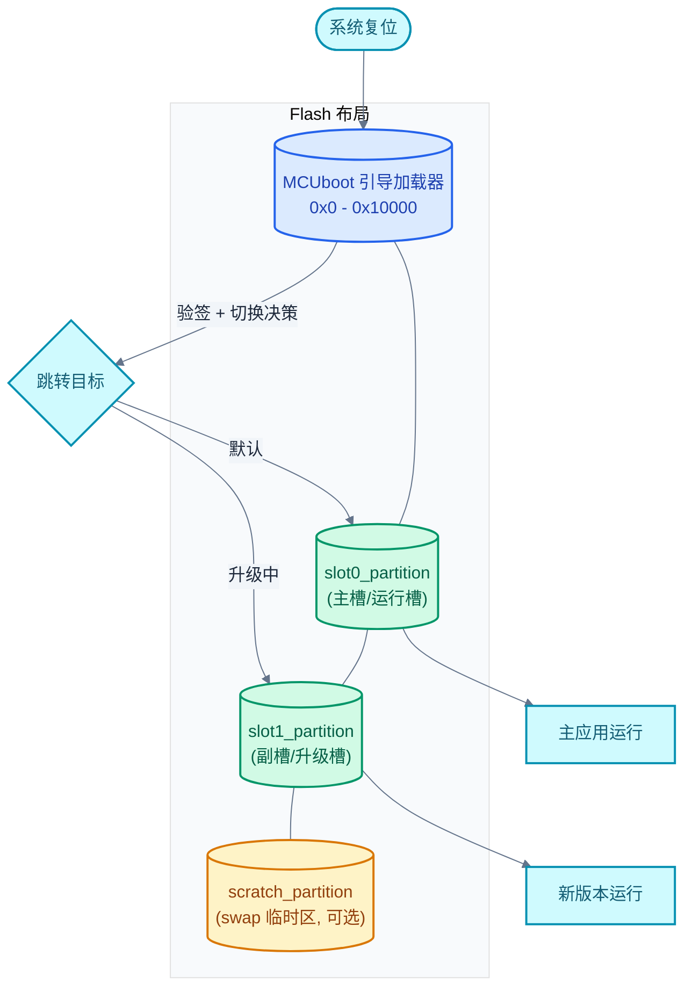
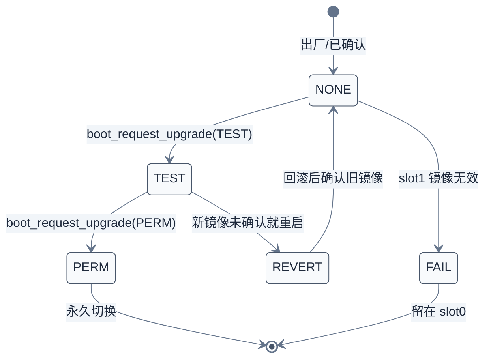
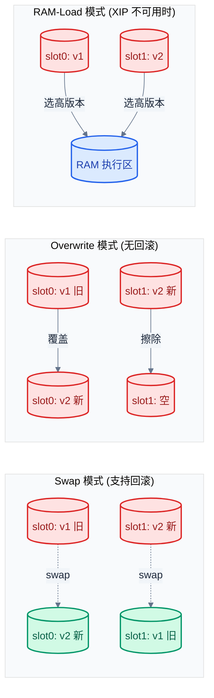
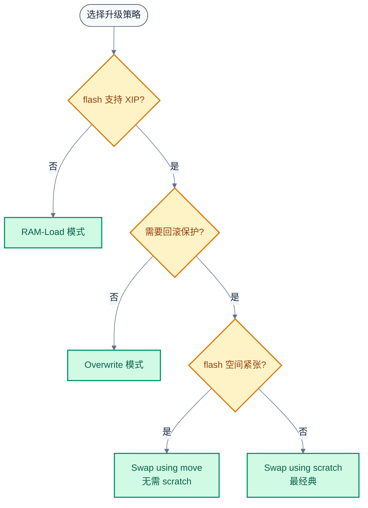
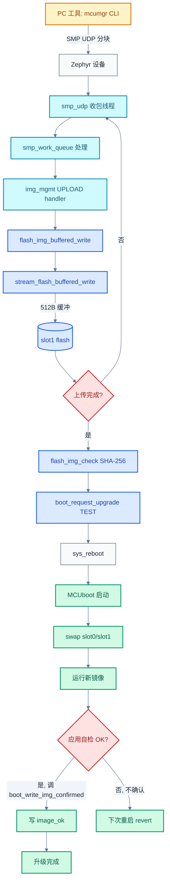
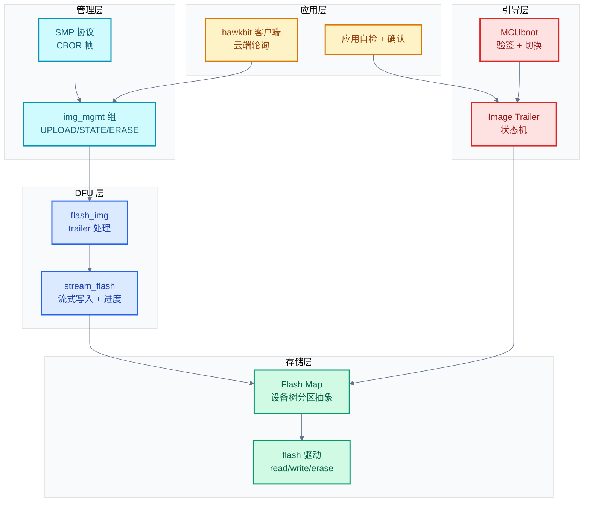

# 26. MCUboot 集成、Flash Map 与 OTA 升级

> 一句话概括：本文把 [25 章 Settings 键值持久化](./25-Settings键值持久化.md) 持久化的能力推向产品化的核心场景——OTA（Over-The-Air，空中升级），讲清 Zephyr 如何用 MCUboot 引导加载器 + Image Trailer + Flash Map 抽象 + stream_flash 流式写入 + MCUmgr/SMP 远程管理 + hawkbit 云端集成，拼出一条"接收 → 校验 → 切换 → 回滚"的完整升级链路。
> **工程师视角**：读完后应能回答"为什么 trailer 放在 slot 末尾而不是开头""swap 模式下断电如何保证不砖""RAM 受限设备如何避免缓存整片镜像""MCUboot 与 U-Boot 在 A/B 升级上的本质差异"这四个问题。

### 关键术语

| 缩写 | 全称 | 含义 |
|------|------|------|
| OTA | Over-The-Air | 空中（远程）固件升级 |
| DFU | Device Firmware Update | 设备固件升级 |
| MCU | Microcontroller Unit | 微控制器 |
| RAM | Random Access Memory | 随机存取存储器 |
| flash | Flash Memory | 闪存（嵌入式非易失存储） |
| XIP | eXecute In Place | 片上直接执行（不拷贝到 RAM） |
| SMP | Simple Management Protocol | MCUmgr 简单管理协议 |
| CBOR | Concise Binary Object Representation | 紧凑二进制对象表示（RFC 8949） |
| BLE | Bluetooth Low Energy | 低功耗蓝牙 |
| UART | Universal Asynchronous Receiver-Transmitter | 通用异步收发器 |
| UDP | User Datagram Protocol | 用户数据报协议 |
| REST | Representational State Transfer | 表述性状态转移（HTTP 风格 API） |
| TLS | Transport Layer Security | 传输层安全协议 |
| SHA | Secure Hash Algorithm | 安全散列算法 |
| DTLS | Datagram TLS | 数据报 TLS |
| ROM | Read-Only Memory | 只读存储器 |
| API | Application Programming Interface | 应用编程接口 |
| DDI | Direct Device Integration | hawkBit 设备直接集成 API |
| RTOS | Real-Time Operating System | 实时操作系统 |
| DTS | Devicetree Source | 设备树源文件 |
| MTU | Maximum Transmission Unit | 最大传输单元 |
| IPC | Inter-Process Communication | 进程间/核间通信 |

---

### 前置阅读

| 需要了解 | 参考文档 |
|----------|----------|
| 设备树 fixed-partition 与 chosen 节点 | [03-设备树详解](./03-设备树详解.md) |
| 设备驱动模型与 `struct device` | [13-设备驱动模型](./13-设备驱动模型.md) |
| Settings 持久化（stream_flash 进度保存依赖它） | [25-Settings键值持久化](./25-Settings键值持久化.md) |
| Logging 系统（升级过程日志） | [23-Logging日志系统](./23-Logging日志系统.md) |

---

## 1. 概述：RTOS 中的 OTA 升级

> [25 章 Settings 键值持久化](./25-Settings键值持久化.md) 解决了"配置与状态如何跨重启存活"——这是 OTA 的隐藏前提：升级中断后要能恢复、镜像确认标志要持久化。本章进入"进阶 III：产品化基础设施"的第一站，把 flash 分区、镜像格式、引导加载器、传输协议、云端集成串成一条完整的 OTA 链路。

### 1.1 为什么 MCU 需要 OTA

MCU 产品的固件升级方式经历了三个阶段：

1. **出厂即定型**——早期 MCU 烧录后不再更新，发现 bug 只能召回。
2. **JTAG/USB 有线升级**——需要物理接触，无法覆盖已部署设备。
3. **OTA 远程升级**——通过 BLE/Wi-Fi/以太网/LoRaWAN 推送固件，覆盖全场设备。

OTA 把"固件"从一次性产物变成"可演进的资产"，但它在 MCU 上比在 Linux 上难得多——MCU 通常没有 MMU、没有文件系统、flash 只有几百 KB、断电即停。任何一个环节设计不当都会让设备变砖。

### 1.2 OTA 的四个本质问题

不论用什么协议传输，OTA 都要回答四个问题：

1. **新镜像放哪？**——运行中的镜像不能被覆盖，必须有独立的存储槽。
2. **怎么切换？**——重启后谁来决定运行新镜像还是旧镜像？
3. **失败怎么办？**——新镜像起不来怎么回滚？断电在中间怎么不砖？
4. **RAM 装不下整片镜像怎么办？**——MCU 的 RAM 通常只有几十到几百 KB，而固件动辄几百 KB 到几 MB。

Zephyr 的回答是五件套：

| 组件 | 职责 | 源码位置 |
|------|------|----------|
| **MCUboot** | 引导加载器，验签 + slot 切换 | 独立项目 [mcuboot/mcuboot](https://github.com/mcu-tools/mcuboot) |
| **Flash Map** | 设备树分区抽象，统一访问接口 | [subsys/storage/flash_map/](file:///home/pbw/rtos/cs-learning-notes/zephyr-project/zephyr/subsys/storage/flash_map/) |
| **stream_flash** | 流式写入，边收边写 | [subsys/storage/stream/stream_flash.c](file:///home/pbw/rtos/cs-learning-notes/zephyr-project/zephyr/subsys/storage/stream/stream_flash.c) |
| **MCUmgr / SMP** | 远程管理协议，传输镜像 | [subsys/mgmt/mcumgr/](file:///home/pbw/rtos/cs-learning-notes/zephyr-project/zephyr/subsys/mgmt/mcumgr/) |
| **hawkbit** | 云端 OTA 集成（可选） | [subsys/mgmt/hawkbit/](file:///home/pbw/rtos/cs-learning-notes/zephyr-project/zephyr/subsys/mgmt/hawkbit/) |

> **核心要点**：MCU OTA 的本质是"用 flash 多槽 + 引导加载器"换取"断电安全 + 可回滚"，再用"流式写入 + 远程协议"解决"RAM 受限 + 无人值守"。本章顺着这五件套展开。

---

## 2. MCUboot 引导加载器

> 第一章列出了 OTA 的五件套，本节先看核心组件——MCUboot。它是独立于 Zephyr 的项目，但 Zephyr 通过 `CONFIG_BOOTLOADER_MCUBOOT` 与之深度集成。理解 MCUboot 的启动流程，是理解后续 trailer/swap/确认机制的基础。

### 2.1 MCUboot 是什么

MCUboot 是一个开源的、跨 RTOS 的安全引导加载器，目标是 32 位 MCU。它解决两个问题：

- **镜像完整性/真实性验证**——每次启动都校验镜像签名与哈希，防止刷入被篡改的固件。
- **升级切换**——决定本次启动运行 slot0 还是 slot1，支持断电安全的切换与回滚。

MCUboot 本身是一个独立的 Zephyr 应用（也可以跑在 Mynewt/FreeRTOS 上），编译后烧录到 flash 最前端，复位后最先执行。它与主应用的关系：



> **如何读这张图**：复位后 MCUboot 先执行，它读取 slot0/slot1 末尾的 trailer 决定本次启动哪个 slot，验签通过后跳转。scratch 分区只在 swap-with-scratch 模式下用作中转，其他模式可省略。

### 2.2 Zephyr 与 MCUboot 的集成接口

Zephyr 应用本身不实现 boot 逻辑，只通过 [include/zephyr/dfu/mcuboot.h](file:///home/pbw/rtos/cs-learning-notes/zephyr-project/zephyr/include/zephyr/dfu/mcuboot.h) 提供的 API 与 MCUboot "对话"——主要是读镜像头、查询/设置下次启动行为、确认当前镜像：

| API | 作用 |
|-----|------|
| `boot_read_bank_header(area_id, &hdr, sizeof(hdr))` | 解析 slot 头部的版本号与大小 |
| `mcuboot_swap_type()` | 查询下次重启的切换类型（NONE/TEST/PERM/REVERT/FAIL） |
| `boot_request_upgrade(permanent)` | 标记 slot1 镜像为待升级（test 或 permanent） |
| `boot_is_img_confirmed()` | 当前镜像是否已确认（未确认则下次重启回滚） |
| `boot_write_img_confirmed()` | 应用启动后自我确认（防止回滚） |
| `boot_erase_img_bank(area_id)` | 擦除某个 slot |

为什么需要 `boot_write_img_confirmed()`？因为 MCUboot 默认采用"试运行"策略：新镜像只在下一次启动试跑，如果应用不主动写 `image_ok` 标志，再下次重启就回滚到旧版本。这是断电安全的回滚机制——新镜像起不来（根本没机会写确认）就自动回滚。

### 2.3 镜像头格式

MCUboot 镜像在 slot 开头有固定头，[mcuboot.c](file:///home/pbw/rtos/cs-learning-notes/zephyr-project/zephyr/subsys/dfu/boot/mcuboot.c#L60-L103) 定义了 v1 头格式：

```c
/* mcuboot.c:60-63 — 头魔数与大小，MCUboot 实现强约束 */
#define BOOT_HEADER_MAGIC_V1 0x96f3b83d
#define BOOT_HEADER_SIZE_V1  32

/* mcuboot.c:89-103 — slot 开头的原始头布局（紧凑打包） */
struct mcuboot_v1_raw_header {
    uint32_t header_magic;        /* 必须为 0x96f3b83d */
    uint32_t image_load_address;  /* PIC 代码加载地址，否则忽略 */
    uint16_t header_size;         /* ≥ 32，可被 ROM_START_OFFSET 撑大 */
    uint16_t pad;
    uint32_t image_size;          /* 镜像净大小（不含头与 trailer） */
    uint32_t image_flags;         /* PIC / 加密标志 */
    struct {
        uint8_t  major;
        uint8_t  minor;
        uint16_t revision;
        uint32_t build_num;       /* 语义版本四元组 */
    } version;
    uint32_t pad2;
} __packed;
```

`boot_read_v1_header()`（[mcuboot.c](file:///home/pbw/rtos/cs-learning-notes/zephyr-project/zephyr/subsys/dfu/boot/mcuboot.c#L300-L347)）做两件事：读出头、校验魔数与 `header_size ≥ 32`。校验失败返回 `-EIO`，调用者据此判断该 slot 是否有有效镜像。

> **核心要点**：镜像头放版本与大小，trailer 放切换状态——头是"静态描述"，trailer 是"动态状态"。两者分离是因为头由 imgtool 签名时写死，trailer 由 boot loader / 应用在运行期反复改写。flash 只能从 1 写到 0（除非先擦除），把频繁改写的 trailer 与签名固定的头分开，避免改 trailer 触发头的重签。

---

## 3. Image Trailer 与 Slot 切换

> 第二章提到镜像头是静态描述。但 MCUboot 真正的"切换决策"依据是 slot 末尾的 **trailer**。trailer 是 boot loader 设计的精华——它用最少的 flash 字节记录"该 slot 处于什么状态、下次该做什么"。

### 3.1 trailer 的位置与内容

trailer 位于 slot 的**末尾**，[mcuboot.c](file:///home/pbw/rtos/cs-learning-notes/zephyr-project/zephyr/subsys/dfu/boot/mcuboot.c#L502-L505) 给出状态字段偏移：

```c
ssize_t boot_get_trailer_status_offset(size_t area_size)
{
    return (ssize_t)area_size - BOOT_MAGIC_SZ - BOOT_MAX_ALIGN * 2;
}
```

即 `trailer_status_offset = slot_size - magic_size - 2 * max_align`。`BOOT_MAX_ALIGN` 是 flash 写对齐（通常 8 或 16），`BOOT_MAGIC_SZ` 是魔数大小（16 字节）。trailer 主要字段：

| 字段 | 含义 | 写入时机 |
|------|------|----------|
| `magic` | trailer 魔数，标志 trailer 已初始化 | 第一次写入镜像时 |
| `image_ok` | 当前镜像被应用确认 OK | 应用调 `boot_write_img_confirmed()` |
| `copy_done` | swap 操作已完成 | MCUboot 完成 swap 后 |
| `swap_type` | 下次启动的切换类型 | `boot_request_upgrade()` 设置 |

### 3.2 为什么 trailer 放在末尾

这是 boot loader 设计的经典权衡。三个候选位置对比：

| 位置 | 优点 | 缺点 |
|------|------|------|
| slot 开头（紧跟头） | 读时顺序访问，省一次寻址 | 与签名头共享擦除单元；改 trailer 要擦整个头 |
| slot 中间 | 任意位置 | 没有任何优点 |
| **slot 末尾** | 与头分离，可独立擦除改写；断电时"完整写入"语义清晰 | 需要 flash 末尾寻址，但 flash 随机访问成本相同 |

> **核心要点**：trailer 放末尾的根本原因是"flash 擦除粒度"——擦除以 page（几 KB）为单位，把频繁改写的 trailer 与签名固定的头分到不同 page，避免每次改 trailer 都要重签整片头。这也是 `boot_get_trailer_status_offset` 要减 `BOOT_MAX_ALIGN * 2` 的原因——给 trailer 留出独立对齐的擦除空间。

### 3.3 五种 swap_type 状态

[include/zephyr/dfu/mcuboot.h](file:///home/pbw/rtos/cs-learning-notes/zephyr-project/zephyr/include/zephyr/dfu/mcuboot.h#L37-L80) 定义了五种切换类型，构成 slot 的状态机：



- `BOOT_SWAP_TYPE_NONE (1)`：正常运行 slot0，不切换。
- `BOOT_SWAP_TYPE_TEST (2)`：试运行 slot1，若未确认下次回滚。
- `BOOT_SWAP_TYPE_PERM (3)`：永久切换到 slot1。
- `BOOT_SWAP_TYPE_REVERT (4)`：回滚到原 slot。
- `BOOT_SWAP_TYPE_FAIL (5)`：slot1 镜像无效，放弃升级。

### 3.4 断电安全的小例子

假设 slot0 跑 v1.0.0，slot1 通过 SMP 收到 v2.0.0。完整时序：

1. 应用调 `boot_request_upgrade(BOOT_UPGRADE_TEST)` → slot1 trailer 写 `swap_type = TEST`。
2. 重启 → MCUboot 读到 `TEST` → 执行 swap（slot0↔slot1）→ 在新 slot0（原 slot1）的 trailer 写 `copy_done`。
3. 新 v2.0.0 启动 → 应用自检通过 → 调 `boot_write_img_confirmed()` → 写 `image_ok`。
4. 下次重启 → MCUboot 看到 `copy_done + image_ok` → `swap_type = NONE`，稳定运行 v2.0.0。

如果在第 2 步 swap 中途断电：MCUboot 用 scratch 分区或 move 模式的"两阶段写"保证——任何时刻 flash 上的状态都对应一个明确的操作阶段，重启后从断点续做。如果在第 3 步之前断电（新镜像没机会确认）：下次启动 MCUboot 看到 `copy_done` 但无 `image_ok` → `swap_type = REVERT` → 反向 swap 回 v1.0.0。

> **核心要点**：断电安全靠"两阶段写 + trailer 状态机"实现。每个 trailer 字段的写入都标志一个不可逆的进度节点——重启后 MCUboot 读 trailer 就知道"上次做到哪一步"，从中断点续做或回滚。这是嵌入式 boot loader 的通用设计模式。

---

## 4. 三种升级策略：swap/overwrite/RAM-load

> 第三章的 trailer 状态机回答了"怎么切换"，但"切换时 flash 上具体发生什么"取决于升级策略。MCUboot 支持多种策略，Zephyr 在 [modules/Kconfig.mcuboot](file:///home/pbw/rtos/cs-learning-notes/zephyr-project/zephyr/modules/Kconfig.mcuboot#L189) 暴露为 `choice MCUBOOT_BOOTLOADER_MODE`。本节对比三种主流策略的本质差异。

### 4.1 三种策略对比图



### 4.2 三种策略详细对比

| 维度 | Swap (move/offset/scratch) | Overwrite | RAM-Load |
|------|---------------------------|-----------|----------|
| **flash 操作** | 交换 slot0/slot1 内容 | slot1 拷贝覆盖 slot0 | 选高版本拷贝到 RAM |
| **是否需要 slot1** | 是 | 是 | 是 |
| **是否需要 scratch** | scratch 模式需要；move/offset 模式不需要 | 否 | 否 |
| **支持回滚** | 是（test 模式未确认则 revert） | 否 | with_revert 变体支持 |
| **flash 磨损** | 高（每次升级写两个 slot） | 中（只写 slot0） | 低（不写 flash，只写 RAM） |
| **断电安全** | 两阶段 swap，可恢复 | 拷贝中途断电需重传 | 选错版本可重启再选 |
| **XIP 要求** | 必须 XIP | 必须 XIP | 不需要 XIP（RAM 执行） |
| **典型场景** | 通用 MCU | 资源极度受限 | flash 不支持 XIP（如外挂 QSPI 未映射） |
| **对应 Kconfig** | `MCUBOOT_BOOTLOADER_MODE_SWAP_USING_OFFSET`（默认） | `MCUBOOT_BOOTLOADER_MODE_OVERWRITE_ONLY` | `MCUBOOT_BOOTLOADER_MODE_RAM_LOAD` |

> **如何读这张表**：第一行"flash 操作"决定磨损与速度——swap 最慢但可回滚，overwrite 折中，RAM-Load 最快但需要 RAM 足够大。"XIP 要求"是选择 RAM-Load 的根本原因：如果 flash 不能片上执行（例如通过 SPI 外挂且未映射到地址空间），只能拷到 RAM 跑。

### 4.3 RAM-Load 模式的多 slot 支持

RAM-Load 模式有一个独特能力——支持最多 16 个 slot。 [mcuboot.c](file:///home/pbw/rtos/cs-learning-notes/zephyr-project/zephyr/subsys/dfu/boot/mcuboot.c#L29-L44) 定义了 `SLOT0_PARTITION` 到 `SLOT15_PARTITION`：

```c
/* mcuboot.c:29-44 — RAM LOAD 模式支持最多 16 个 slot */
#define SLOT0_PARTITION  slot0_partition
#define SLOT1_PARTITION  slot1_partition
/* ... 中间省略 ... */
#define SLOT15_PARTITION slot15_partition
```

为什么 RAM-Load 需要 16 个 slot？因为 RAM-Load 不做 swap，每个 slot 可以独立存放一个版本。MCUboot 在启动时通过 [blinfo_lookup(BLINFO_RUNNING_SLOT, ...)](file:///home/pbw/rtos/cs-learning-notes/zephyr-project/zephyr/subsys/dfu/boot/mcuboot.c#L116) 查询当前运行 slot，再遍历所有 slot 选最高版本。这适合"多版本仓库"场景——设备可保留多个历史版本，按需回退到任意一个。

`boot_fetch_active_slot()`（[mcuboot.c](file:///home/pbw/rtos/cs-learning-notes/zephyr-project/zephyr/subsys/dfu/boot/mcuboot.c#L111-L210)）通过 `blinfo`（bootloader info）从 retention 区域读取当前 slot 号，再映射回 `PARTITION_ID`。retention 区域是 RAM/寄存器中由 MCUboot 写入的小段信息，复位不丢失——这是 RAM-Load 模式下"知道自己在跑哪个 slot"的关键。

### 4.4 选择策略的决策树



> **核心要点**：策略选择的本质是"flash 磨损 / 回滚能力 / RAM 占用"三角权衡。Zephyr 默认 `SWAP_USING_OFFSET`——它不需要 scratch 分区（省 flash），又支持回滚（安全），是大多数 MCU 的最佳折中。RAM-Load 是为"flash 不支持 XIP"这一硬件限制准备的逃生通道。

---

## 5. Flash Map：设备树分区抽象

> 第四章的策略选择最终落到"slot0/slot1/scratch 在 flash 上的具体位置"。Zephyr 用 Flash Map 子系统把设备树里的 `fixed-partition` 节点抽象成统一的 `flash_area` API，让上层（MCUboot、文件系统、OTA）不必关心物理偏移。这是 [03 章设备树](./03-设备树详解.md) 哲学的延伸——用声明式描述解耦代码与硬件。

### 5.1 设备树中的分区定义

一个典型的双槽 OTA 设备树片段：

```dts
/* 设备树：flash 控制器下的 fixed-partitions */
&flash0 {
    partitions {
        compatible = "fixed-partitions";
        #address-cells = <1>;
        #size-cells = <1>;

        /* MCUboot 自身：0x000000 - 0x010000 */
        boot_partition: partition@0 {
            label = "mcuboot";
            reg = <0x00000000 0x00010000>;
            read-only;
        };

        /* slot0：主槽，运行当前镜像 */
        slot0_partition: partition@10000 {
            label = "image-0";
            reg = <0x00010000 0x00060000>;
        };

        /* slot1：副槽，存放升级镜像 */
        slot1_partition: partition@70000 {
            label = "image-1";
            reg = <0x00070000 0x00060000>;
        };

        /* scratch：swap 中转区（swap-scratch 模式才需要） */
        scratch_partition: partition@d0000 {
            label = "image-scratch";
            reg = <0x000d0000 0x00010000>;
        };

        /* settings：持久化配置（25 章） */
        storage_partition: partition@e0000 {
            label = "storage";
            reg = <0x000e0000 0x00020000>;
        };
    };
};

/ {
    chosen {
        /* 告诉构建系统：应用从 slot0 启动 */
        zephyr,code-partition = <&slot0_partition>;
    };
};
```

`zephyr,code-partition` 这一行是关键——[mcuboot.c](file:///home/pbw/rtos/cs-learning-notes/zephyr-project/zephyr/subsys/dfu/boot/mcuboot.c#L83) 用它定位"当前运行 slot"：

```c
/* mcuboot.c:83 — 非 RAM-LOAD 模式下，活动 slot 来自 chosen 节点 */
#define ACTIVE_SLOT_FLASH_AREA_ID DT_PARTITION_ID(DT_CHOSEN(zephyr_code_partition))
```

### 5.2 flash_area 结构与 API

[include/zephyr/storage/flash_map.h](file:///home/pbw/rtos/cs-learning-notes/zephyr-project/zephyr/include/zephyr/storage/flash_map.h#L57-L71) 定义核心结构：

```c
/* flash_map.h:57-71 — flash 分区抽象 */
struct flash_area {
    uint8_t  fa_id;             /* 分区 ID（数字） */
    uint16_t pad16;
    off_t    fa_off;             /* 在 flash 设备上的起始偏移 */
    size_t   fa_size;            /* 分区大小 */
    const struct device *fa_dev; /* 后端 flash 设备 */
#if CONFIG_FLASH_MAP_LABELS
    const char *fa_label;        /* 设备树 label 字符串 */
#endif
};
```

上层 API 全部以 `flash_area*` 为参数，[flash_map.c](file:///home/pbw/rtos/cs-learning-notes/zephyr-project/zephyr/subsys/storage/flash_map/flash_map.c) 实现只做边界检查后转发给底层 flash 驱动：

```c
/* flash_map.c:56-64 — read 仅校验边界，然后调用 flash_read */
int flash_area_read(const struct flash_area *fa, off_t off, void *dst, size_t len)
{
    if (!is_in_flash_area_bounds(fa, off, len)) {
        return -EINVAL;
    }
    return flash_read(fa->fa_dev, fa->fa_off + off, dst, len);
}
```

`flash_area_open(id, &fa)` 通过 ID 查表返回 `const struct flash_area *`，[flash_map.c](file:///home/pbw/rtos/cs-learning-notes/zephyr-project/zephyr/subsys/storage/flash_map/flash_map.c#L29-L49)。这个表是编译期生成的（见 5.3）。

### 5.3 编译期生成 flash_map 表

[flash_map_default.c](file:///home/pbw/rtos/cs-learning-notes/zephyr-project/zephyr/subsys/storage/flash_map/flash_map_default.c#L61-L68) 展示了表的生成魔法：

```c
/* flash_map_default.c:61-68 — 编译期从设备树生成全局 flash_map 表 */
const struct flash_area default_flash_map[] = {
    DT_FOREACH_STATUS_OKAY(zephyr_mapped_partition, MAPPED_AREA_FOREACH)
    DT_FOREACH_STATUS_OKAY(fixed_partitions, FOREACH_PARTITION)
    DT_FOREACH_STATUS_OKAY(fixed_subpartitions, FOREACH_PARTITION)
};

const int flash_map_entries = ARRAY_SIZE(default_flash_map);
const struct flash_area *flash_map = default_flash_map;
```

`DT_FOREACH_STATUS_OKAY(fixed_partitions, FOREACH_PARTITION)` 是设备树宏——它遍历所有 `compatible = "fixed-partitions"` 且 status 为 okay 的节点，对每个子分区调用 `FOREACH_PARTITION` 宏展开。展开后每个分区变成一条 `{.fa_id=..., .fa_off=..., .fa_dev=..., .fa_size=...}` 初始化项。整张表在编译期就填好了，运行时零开销。

> **核心要点**：Flash Map 是设备树哲学在存储层的延伸——代码用 `flash_area_open(ID_SLOT1, &fa)` 这种符号化 ID 访问分区，物理偏移完全由设备树决定。换板子只改 DTS，代码不动。这与 [13 章设备驱动模型](./13-设备驱动模型.md) 的 `DEVICE_DT_DEFINE` 是同一套思路。

### 5.4 完整性校验

[flash_map_integrity.c](file:///home/pbw/rtos/cs-learning-notes/zephyr-project/zephyr/subsys/storage/flash_map/flash_map_integrity.c) 提供 SHA-256 校验，用于"镜像写入后是否完整"：

```c
/* flash_map_integrity.c:23-82 — 用 PSA Crypto 算 SHA-256，分块读 flash */
int flash_area_check_int_sha256(const struct flash_area *fa,
                                const struct flash_area_check *fac)
{
    unsigned char hash[PSA_HASH_LENGTH(PSA_ALG_SHA_256)];
    psa_hash_operation_t hash_ctx;
    /* ... */
    hash_ctx = psa_hash_operation_init();
    rc = psa_hash_setup(&hash_ctx, PSA_ALG_SHA_256);
    /* 分块读 flash，逐块喂给 hash */
    for (pos = 0; pos < fac->clen; pos += to_read) {
        rc = flash_read(fa->fa_dev, fa->fa_off + fac->off + pos,
                        fac->rbuf, to_read);
        rc = psa_hash_update(&hash_ctx, fac->rbuf, to_read);
    }
    rc = psa_hash_finish(&hash_ctx, hash, sizeof(hash), &hash_len);
    if (memcmp(hash, fac->match, sizeof(hash))) {
        return -EILSEQ;   /* 哈希不匹配 */
    }
    return 0;
}
```

注意它用 `fac->rbuf` 作为分块读缓冲——`rblen` 决定每次读多少。即使校验 1 MB 镜像，也只需要几 KB 的 RAM。这是"流式处理"思想在完整性校验上的体现，下一节 stream_flash 是更通用的流式框架。

---

## 6. stream_flash：流式写入

> 第五章的 Flash Map 解决了"在哪写"，但"怎么写"——尤其是"RAM 装不下整片镜像时怎么写"——是 OTA 的关键工程问题。stream_flash 子系统给出答案：用一个固定大小的小缓冲，边收边写，自动擦除与对齐。这是 RAM 受限设备 OTA 的核心组件。

### 6.1 为什么需要流式写入

考虑一个具体场景：nRF52840 有 1 MB flash、256 KB RAM，固件大小 400 KB。OTA 收镜像时如果先全收到 RAM 再写 flash，需要 400 KB RAM——直接爆 RAM。stream_flash 的解法：

- 用一个固定缓冲（默认 512 字节，`CONFIG_IMG_BLOCK_BUF_SIZE`）。
- 每收满一个缓冲就写 flash、清缓冲。
- 整个 400 KB 镜像全程只占 512 字节 RAM。

代价是"边收边写"要求传输协议支持分块——SMP 协议正好是分块的（见第 7 节）。

### 6.2 stream_flash_ctx 结构

stream_flash 的核心是 [stream_flash.c](file:///home/pbw/rtos/cs-learning-notes/zephyr-project/zephyr/subsys/storage/stream/stream_flash.c#L368-L428) 初始化的上下文：

```c
/* stream_flash 初始化：绑定 flash 设备、缓冲、写入范围 */
int stream_flash_init(struct stream_flash_ctx *ctx, const struct device *fdev,
                      uint8_t *buf, size_t buf_len, size_t offset, size_t size,
                      stream_flash_callback_t cb);
```

`stream_flash_ctx`（定义在 [include/zephyr/storage/stream_flash.h](file:///home/pbw/rtos/cs-learning-notes/zephyr-project/zephyr/include/zephyr/storage/stream_flash.h)）主要字段：

| 字段 | 含义 |
|------|------|
| `fdev` | 后端 flash 设备 |
| `buf` / `buf_len` | 写缓冲及其大小 |
| `buf_bytes` | 缓冲当前已填充字节数 |
| `bytes_written` | 已写入 flash 的总字节 |
| `offset` | 写入起始偏移（在 flash 设备上） |
| `available` | 可写总大小 |
| `write_block_size` | flash 写对齐（来自驱动） |
| `erased_up_to` | 已擦除到的偏移（流式擦除游标） |
| `erase_value` | 擦除态值（0xFF 或 0x00） |

### 6.3 流式写入的编号步骤

`stream_flash_buffered_write()`（[stream_flash.c](file:///home/pbw/rtos/cs-learning-notes/zephyr-project/zephyr/subsys/storage/stream/stream_flash.c#L261-L303)）是核心入口。一次写入的完整步骤：

```
1. 校验 ctx 非空，检查剩余空间是否够 (bytes_written + buf_bytes + len ≤ available)
2. while (待写数据 ≥ 缓冲剩余空间):
   a. 把数据拷满缓冲
   b. 调 flash_sync() 把缓冲写进 flash:
      - 若启用 CONFIG_STREAM_FLASH_ERASE: 调 stream_flash_erase_to_append() 擦除下一页
      - 用 erase_value 把不满 write_block_size 的尾部填充对齐
      - 调 flash_write() 写入对齐后的缓冲
      - 若启用 POST_WRITE_CALLBACK: 回读校验再调 cb
      - bytes_written += buf_bytes; buf_bytes = 0
   c. processed += 刚消耗的字节数
3. 把剩余数据拷进缓冲 (buf_bytes += 剩余)
4. 若 flush=true 且 buf_bytes > 0: 再调一次 flash_sync() 强制写
```

`stream_flash_erase_to_append()`（[stream_flash.c](file:///home/pbw/rtos/cs-learning-notes/zephyr-project/zephyr/subsys/storage/stream/stream_flash.c#L83-L130)）是流式擦除的关键——它不是一次擦整个 slot，而是"写到哪擦到哪"：

```c
/* stream_flash.c:83-130 — 只擦下一个不够写的 page，已擦过的不再擦 */
static int stream_flash_erase_to_append(struct stream_flash_ctx *ctx, size_t size)
{
    /* 已擦空间够用就不擦 */
    if (ctx->bytes_written + size <= ctx->erased_up_to) {
        return 0;
    }
    /* 找到下一个 page 边界，擦除它 */
    rc = flash_get_page_info_by_offs(ctx->fdev, ctx->offset + ctx->erased_up_to, &page);
    rc = flash_erase(ctx->fdev, page.start_offset, page.size);
    ctx->erased_up_to += page.size;   /* 游标前移 */
    return rc;
}
```

### 6.4 进度保存与断点续传

[stream_flash.c](file:///home/pbw/rtos/cs-learning-notes/zephyr-project/zephyr/subsys/storage/stream/stream_flash.c#L430-L504) 提供三个进度保存函数，依赖 [25 章 Settings](./25-Settings键值持久化.md)：

| 函数 | 作用 |
|------|------|
| `stream_flash_progress_load(ctx, key)` | 从 settings 子树加载 `bytes_written`，并修正 `erased_up_to` |
| `stream_flash_progress_save(ctx, key)` | 把当前 `bytes_written` 存到 settings |
| `stream_flash_progress_clear(ctx, key)` | 删除进度记录（升级完成后清理） |

为什么需要进度保存？OTA 镜像可能几 MB，传输中途设备断电/重启很常见。没有进度保存，每次重启都要从头传；有了进度保存，重启后 `stream_flash_progress_load` 恢复 `bytes_written`，从断点续传。hawkbit 的 `CONFIG_HAWKBIT_SAVE_PROGRESS` 就是基于这套机制（[hawkbit/Kconfig](file:///home/pbw/rtos/cs-learning-notes/zephyr-project/zephyr/subsys/mgmt/hawkbit/Kconfig#L234-L253)）。

### 6.5 flash_img：stream_flash 的 OTA 封装

[flash_img.c](file:///home/pbw/rtos/cs-learning-notes/zephyr-project/zephyr/subsys/dfu/img_util/flash_img.c) 在 stream_flash 之上加了一层"OTA 友好"封装：

- `flash_img_init(ctx)`：自动选 `UPLOAD_FLASH_AREA_ID`（即 slot1），初始化 stream_flash。
- `flash_img_buffered_write(ctx, data, len, flush)`：转发到 stream_flash，但额外处理 trailer。
- `flash_img_check(ctx, fic, area_id)`：写入完成后用 `flash_area_check_int_sha256` 校验整片镜像。

`scramble_mcuboot_trailer()`（[flash_img.c](file:///home/pbw/rtos/cs-learning-notes/zephyr-project/zephyr/subsys/dfu/img_util/flash_img.c#L71-L119)）是个微妙细节——在 `CONFIG_IMG_ERASE_PROGRESSIVELY` 启用时，它先把 slot 末尾的 trailer 区域提前擦除，避免新镜像写入后 trailer 还残留旧值导致 MCUboot 误判。

> **核心要点**：stream_flash 用"小缓冲 + 流式擦除 + 进度保存"三件套，把"写 N MB 镜像"的 RAM 占用从 O(N) 降到 O(buf_len)（默认 512 字节）。这是 MCU 能做 OTA 而不爆 RAM 的根本原因。`CONFIG_IMG_ERASE_PROGRESSIVELY` 进一步把"擦整个 slot"摊薄到写入过程中，避免 OTA 开始时几秒的 flash 擦除阻塞。

---

## 7. MCUmgr：SMP 协议远程管理

> 第六章解决了"如何写 flash"，但"镜像从哪来"——谁来推送、用什么协议、怎么分块——是另一个独立问题。Zephyr 的答案是 MCUmgr：一个基于 SMP 协议的远程管理框架，支持 BLE/UART/UDP/Shell 等多种传输。它是 OTA 的"传输层"。

### 7.1 SMP 协议帧格式

SMP（Simple Management Protocol）是应用层协议，与传输无关。[doc/services/device_mgmt/smp_protocol.rst](file:///home/pbw/rtos/cs-learning-notes/zephyr-project/zephyr/doc/services/device_mgmt/smp_protocol.rst) 定义帧格式：

```
+-+-+-+-+-+-+-+-+-+-+-+-+-+-+-+-+-+-+-+-+-+-+-+-+-+-+-+-+-+-+-+-+
| Res |Ver| OP  |      Flags    |          Data Length          |
+-+-+-+-+-+-+-+-+-+-+-+-+-+-+-+-+-+-+-+-+-+-+-+-+-+-+-+-+-+-+-+-+
|            Group ID           | Sequence Num  |   Command ID  |
+-+-+-+-+-+-+-+-+-+-+-+-+-+-+-+-+-+-+-+-+-+-+-+-+-+-+-+-+-+-+-+-+
|                             Data                              |
|                             ...                               |
+-+-+-+-+-+-+-+-+-+-+-+-+-+-+-+-+-+-+-+-+-+-+-+-+-+-+-+-+-+-+-+-+
```

| 字段 | 含义 |
|------|------|
| `Res` | 保留，必须为 0 |
| `Ver` | 协议版本（0=legacy, 1=新版本，错误码更详细） |
| `OP` | 操作类型（读/写/通知） |
| `Flags` | 保留 |
| `Data Length` | Data 字段字节数 |
| `Group ID` | 命令组（OS/IMG/Stat/Settings/FS/Shell/Enum/Zephyr） |
| `Sequence Num` | 帧序号，响应需匹配请求 |
| `Command ID` | 组内命令号 |
| `Data` | CBOR 编码的载荷 |

Data 用 CBOR（[RFC 8949](https://www.rfc-editor.org/rfc/rfc8949)）编码——比 JSON 紧凑得多，适合带宽受限的 BLE/UART。SMP 帧头固定 8 字节，加上 CBOR 载荷，一帧通常几十到几百字节，正好适配 BLE MTU（默认 23 字节，协商后可达 247+）。

### 7.2 传输层选项

[subsys/mgmt/mcumgr/transport/src/](file:///home/pbw/rtos/cs-learning-notes/zephyr-project/zephyr/subsys/mgmt/mcumgr/transport/src/) 实现了多种传输，每种一个独立 Kconfig：

| 传输 | 源文件 | Kconfig | 典型场景 |
|------|--------|---------|----------|
| **BLE** | [smp_bt.c](file:///home/pbw/rtos/cs-learning-notes/zephyr-project/zephyr/subsys/mgmt/mcumgr/transport/src/smp_bt.c) | `CONFIG_MCUMGR_TRANSPORT_BT` | 手机 APP 距近升级 |
| **UART** | [smp_uart.c](file:///home/pbw/rtos/cs-learning-notes/zephyr-project/zephyr/subsys/mgmt/mcumgr/transport/src/smp_uart.c) | `CONFIG_MCUMGR_TRANSPORT_UART` | 串口调试升级 |
| **UDP** | [smp_udp.c](file:///home/pbw/rtos/cs-learning-notes/zephyr-project/zephyr/subsys/mgmt/mcumgr/transport/src/smp_udp.c) | `CONFIG_MCUMGR_TRANSPORT_UDP` | 局域网/以太网升级 |
| **Shell** | [smp_shell.c](file:///home/pbw/rtos/cs-learning-notes/zephyr-project/zephyr/subsys/mgmt/mcumgr/transport/src/smp_shell.c) | `CONFIG_MCUMGR_TRANSPORT_SHELL` | shell 内嵌 SMP |
| **LoRaWAN** | [smp_lorawan.c](file:///home/pbw/rtos/cs-learning-notes/zephyr-project/zephyr/subsys/mgmt/mcumgr/transport/src/smp_lorawan.c) | `CONFIG_MCUMGR_TRANSPORT_LORAWAN` | 低功耗广域网 |
| **Raw UART** | [smp_raw_uart.c](file:///home/pbw/rtos/cs-learning-notes/zephyr-project/zephyr/subsys/mgmt/mcumgr/transport/src/smp_raw_uart.c) | `CONFIG_MCUMGR_TRANSPORT_RAW_UART` | 无编码的裸 UART |

UDP 传输（[smp_udp.c](file:///home/pbw/rtos/cs-learning-notes/zephyr-project/zephyr/subsys/mgmt/mcumgr/transport/src/smp_udp.c#L48-L76)）在独立线程里收包，配置结构体含 socket、信号量、栈：

```c
/* smp_udp.c:48-76 — UDP 传输每个协议版本一份配置 */
struct config {
    int sock;
    enum proto_type proto;            /* IPv4 / IPv6 */
    struct k_sem network_ready_sem;   /* 等网络就绪 */
    struct smp_transport smp_transport;
    char recv_buffer[CONFIG_MCUMGR_TRANSPORT_UDP_MTU];
    struct k_thread thread;
    K_KERNEL_STACK_MEMBER(stack, CONFIG_MCUMGR_TRANSPORT_UDP_STACK_SIZE);
};
```

注意 `recv_buffer` 大小由 `CONFIG_MCUMGR_TRANSPORT_UDP_MTU` 决定——这是单帧最大尺寸，OTA 镜像要分多次发送。

### 7.3 IMG 管理组命令

OTA 用的是 IMG（Image）管理组，[subsys/mgmt/mcumgr/grp/img_mgmt/](file:///home/pbw/rtos/cs-learning-notes/zephyr-project/zephyr/subsys/mgmt/mcumgr/grp/img_mgmt/) 实现。命令 ID 在 [include/zephyr/mgmt/mcumgr/grp/img_mgmt/img_mgmt.h](file:///home/pbw/rtos/cs-learning-notes/zephyr-project/zephyr/include/zephyr/mgmt/mcumgr/grp/img_mgmt/img_mgmt.h#L65-L71) 定义：

| Command ID | 宏名 | 命令 | Zephyr 是否实现 | 作用 |
|------------|------|------|----------------|------|
| `0` | `IMG_MGMT_ID_STATE` | STATE | 是（read + write） | 列出所有 slot 的版本、active、pending、confirmed 状态；write 用于设置 test/permanent/confirm |
| `1` | `IMG_MGMT_ID_UPLOAD` | UPLOAD | 是（write） | 上传镜像分块到指定 slot |
| `2` | `IMG_MGMT_ID_FILE` | FILE | 否（仅规范定义） | 文件下载（用于回读校验），Zephyr 未实现 |
| `3` | `IMG_MGMT_ID_CORELIST` | CORELIST | 否（仅规范定义） | core dump 列表，Zephyr 未实现 |
| `4` | `IMG_MGMT_ID_CORELOAD` | CORELOAD | 否（仅规范定义） | core dump 加载，Zephyr 未实现 |
| `5` | `IMG_MGMT_ID_ERASE` | ERASE | 是（write） | 擦除指定 slot |
| `6` | `IMG_MGMT_ID_SLOT_INFO` | SLOT_INFO | 是（read，需 `CONFIG_MCUMGR_GRP_IMG_SLOT_INFO`） | 查询 slot 详细信息 |

> **如何读这张表**：MCUmgr 规范定义了 7 个命令 ID，但 Zephyr 的 [img_mgmt.c](file:///home/pbw/rtos/cs-learning-notes/zephyr-project/zephyr/subsys/mgmt/mcumgr/grp/img_mgmt/src/img_mgmt.c#L1113-L1138) 只注册了 4 个 handler：STATE、UPLOAD、ERASE、SLOT_INFO。注意"设置 trailer 标志（test/permanent/confirm）"不是独立命令，而是通过 STATE 命令的 write 操作（`img_mgmt_state_write`）完成。FILE/CORELIST/CORELOAD 是 mcumgr 规范为其他系统保留的命令，Zephyr 不实现。

[img_mgmt_state.c](file:///home/pbw/rtos/cs-learning-notes/zephyr-project/zephyr/subsys/mgmt/mcumgr/grp/img_mgmt/src/img_mgmt_state.c#L48-L53) 定义了 STATE 命令返回的 slot 标志位：

```c
/* img_mgmt_state.c:48-53 — slot 状态标志位 */
#define REPORT_SLOT_ACTIVE    BIT(0)   /* 当前运行 slot */
#define REPORT_SLOT_PENDING   BIT(1)   /* 已标记下次启动 */
#define REPORT_SLOT_CONFIRMED BIT(2)   /* 已确认（不会回滚） */
#define REPORT_SLOT_PERMANENT BIT(3)   /* 永久切换 */
```

### 7.4 SMP 工作队列模型

[subsys/mgmt/mcumgr/transport/src/smp.c](file:///home/pbw/rtos/cs-learning-notes/zephyr-project/zephyr/subsys/mgmt/mcumgr/transport/src/smp.c#L30-L44) 展示了 SMP 的并发模型：

```c
/* smp.c:30-44 — SMP 用独立工作队列处理请求 */
K_THREAD_STACK_DEFINE(smp_work_queue_stack, CONFIG_MCUMGR_TRANSPORT_WORKQUEUE_STACK_SIZE);
static struct k_work_q smp_work_queue;

NET_BUF_POOL_DEFINE(pkt_pool, CONFIG_MCUMGR_TRANSPORT_NETBUF_COUNT,
                    CONFIG_MCUMGR_TRANSPORT_NETBUF_SIZE,
                    CONFIG_MCUMGR_TRANSPORT_NETBUF_USER_DATA_SIZE, NULL);
```

- 传输层（BLE/UART/UDP）收到帧 → 装进 `net_buf` → 投递到 `smp_work_queue`。
- 工作队列线程解析帧头、分发到对应 group handler。
- group handler 在工作队列线程上下文执行，可用互斥锁保护共享状态。

为什么用独立工作队列而不是 ISR 直接处理？因为 SMP 命令（如 UPLOAD 写 flash）耗时且可能阻塞——ISR 不能阻塞，必须延迟到线程上下文。这与 [09 章工作队列](./09-工作队列与延迟处理.md) 的顶半/底半模式是同一思路。

> **核心要点**：MCUmgr 的设计是"协议层 + 传输层"正交解耦——协议层（SMP 帧 + CBOR + group handler）与传输层（BLE/UART/UDP）独立。换传输只需实现 `smp_transport` 接口，协议代码完全复用。这与 [13 章设备驱动模型](./13-设备驱动模型.md) 的"驱动总线分离"是同一种架构思想。

---

## 8. Hawkbit：云端 OTA 集成

> 第七章的 MCUmgr 是"点对点"协议——需要一个客户端主动推送镜像。但产品化场景通常需要"一对多"：云服务器管理成千上万台设备，按版本/分组/灰度策略推送。Zephyr 集成了 Eclipse hawkBit 客户端来对接云端 OTA 平台。

### 8.1 hawkBit 架构与角色

Eclipse hawkBit 是一个独立的服务器框架，提供 REST API 供设备轮询。Zephyr 实现的是**设备端客户端**（[subsys/mgmt/hawkbit/](file:///home/pbw/rtos/cs-learning-notes/zephyr-project/zephyr/subsys/mgmt/hawkbit/)），它通过 HTTP/TLS 轮询 hawkBit 服务器：


### 8.2 hawkBit 客户端依赖

[hawkbit/Kconfig](file:///home/pbw/rtos/cs-learning-notes/zephyr-project/zephyr/subsys/mgmt/hawkbit/Kconfig#L4-L23) 列出了完整依赖链：

```kconfig
menuconfig HAWKBIT
    bool "Eclipse hawkBit Firmware Over-the-Air support"
    depends on SETTINGS          # 进度保存
    depends on FLASH             # flash 设备
    depends on REBOOT            # 升级后重启
    depends on NET_TCP           # TCP 网络
    depends on NET_SOCKETS       # socket API
    depends on IMG_MANAGER       # 镜像管理（stream_flash + flash_img）
    depends on NETWORKING
    depends on HTTP_CLIENT       # HTTP 客户端
    depends on JSON_LIBRARY      # JSON 解析（hawkBit 用 JSON 不用 CBOR）
    depends on BOOTLOADER_MCUBOOT  # MCUboot 集成
    depends on SMF               # 状态机框架
    depends on SMF_ANCESTOR_SUPPORT
    depends on !MCUBOOT_BOOTLOADER_MODE_DIRECT_XIP
    depends on !MCUBOOT_BOOTLOADER_MODE_DIRECT_XIP_WITH_REVERT
    select MPU_ALLOW_FLASH_WRITE
    select IMG_ENABLE_IMAGE_CHECK
    select IMG_ERASE_PROGRESSIVELY
```

> **如何读这段 Kconfig**：`depends on` 是"必须先有"，`select` 是"自动启用"。hawkBit 依赖 SETTINGS（进度断点续传）、HTTP_CLIENT（轮询服务器）、JSON_LIBRARY（解析 hawkBit 的 JSON 响应）、SMF（状态机驱动轮询流程）。它还自动启用 `IMG_ERASE_PROGRESSIVELY`（流式擦除）和 `IMG_ENABLE_IMAGE_CHECK`（SHA-256 校验）。注意它**不兼容 DIRECT_XIP 模式**——因为 DIRECT_XIP 不需要写 slot1 也能切换。

### 8.3 状态机驱动的轮询

[hawkbit.c](file:///home/pbw/rtos/cs-learning-notes/zephyr-project/zephyr/subsys/mgmt/hawkbit/hawkbit.c) 用 Zephyr 的 SMF（State Machine Framework）组织轮询流程。主要状态：

1. **IDLE**：等待 `poll_interval`（默认 5 分钟，[Kconfig](file:///home/pbw/rtos/cs-learning-notes/zephyr-project/zephyr/subsys/mgmt/hawkbit/Kconfig#L29-L37)）。
2. **POLL**：向 hawkBit 服务器发 HTTP GET，查询是否有新版本。
3. **DOWNLOAD**：HTTP GET 镜像二进制，流式写入 slot1。
4. **INSTALL**：调 `boot_request_upgrade()` 标记 trailer。
5. **REBOOT**：重启，MCUboot 接管切换。

### 8.4 认证与安全

hawkBit DDI（Direct Device Integration）API 支持两种认证（[Kconfig](file:///home/pbw/rtos/cs-learning-notes/zephyr-project/zephyr/subsys/mgmt/hawkbit/Kconfig#L102-L123)）：

- **Target Security Token**：每个设备一个唯一 token，需先在服务器注册设备。
- **Gateway Security Token**：一组设备共享 token，设备可自注册。

[hawkbit.c](file:///home/pbw/rtos/cs-learning-notes/zephyr-project/zephyr/subsys/mgmt/hawkbit/hawkbit.c#L61-L71) 构造 Authorization 头：

```c
/* hawkbit.c:61-71 — HTTP 认证头 */
#ifdef CONFIG_HAWKBIT_DDI_GATEWAY_SECURITY
#define AUTH_HEADER_START "Authorization: GatewayToken "
#else
#define AUTH_HEADER_START "Authorization: TargetToken "
#endif

#ifdef CONFIG_HAWKBIT_SET_SETTINGS_RUNTIME
#define AUTH_HEADER_FULL AUTH_HEADER_START "%s" HTTP_CRLF   /* 运行时填 token */
#else
#define AUTH_HEADER_FULL AUTH_HEADER_START CONFIG_HAWKBIT_DDI_SECURITY_TOKEN HTTP_CRLF
#endif
```

`CONFIG_HAWKBIT_USE_TLS`（[Kconfig](file:///home/pbw/rtos/cs-learning-notes/zephyr-project/zephyr/subsys/mgmt/hawkbit/Kconfig#L168-L200)）启用 TLS 加密传输——OTA 镜像与认证 token 都不能明文走公网。

### 8.5 进度保存与确认

`CONFIG_HAWKBIT_SAVE_PROGRESS`（[Kconfig](file:///home/pbw/rtos/cs-learning-notes/zephyr-project/zephyr/subsys/mgmt/hawkbit/Kconfig#L234-L253)）复用 stream_flash 的进度机制——下载中途断网/断电，下次从 `bytes_written` 续传，不重头下。`CONFIG_HAWKBIT_CONFIRM_IMG_ON_INIT`（[Kconfig](file:///home/pbw/rtos/cs-learning-notes/zephyr-project/zephyr/subsys/mgmt/hawkbit/Kconfig#L254-L260)）让 hawkbit 客户端启动时自动确认当前镜像——避免应用层忘记确认导致反复回滚。

> **核心要点**：hawkbit 把"云端轮询 + HTTP 下载 + 状态机驱动 + 进度保存"封装成一个开箱即用的 OTA 客户端，下层复用 stream_flash + flash_img + MCUboot 链路。它是 Zephyr OTA 栈的"最高层封装"——产品化部署时只需配置服务器地址、token、poll 间隔即可。

---

## 9. 实战：配置双槽 OTA 升级

> 前八章分别讲了组件，本节把它们串成一个可运行的端到端流程。以 swap-using-offset 模式 + UDP 传输为例，给出从设备树到 Kconfig 到客户端命令的完整配置。

### 9.1 端到端 OTA 流程图



### 9.2 编号步骤：完整 OTA 时序

```
1. 构建镜像：west build -b <board> -- -DCONFIG_BOOTLOADER_MCUBOOT=y
2. 签名镜像：west sign -t imgtool -- --key root-rsa-3072.pem（生成带头的 signed.bin）
3. 烧录 MCUboot：west flash --hex build/mcuboot/mcuboot.hex
4. 烧录初始应用：west flash --hex build/zephyr/zephyr.signed.confirmed.hex
5. 启动 mcumgr 客户端（PC 端）：
   mcumgr conn add dev1 type=udp connstring="192.168.1.100:1337"
6. 上传新镜像（自动分块）：
   mcumgr -c dev1 image upload build/zephyr/zephyr.signed.bin
   ↳ 每块经 SMP UPLOAD 命令 → img_mgmt → flash_img_buffered_write → stream_flash → slot1
7. 列出镜像状态：
   mcumgr -c dev1 image list
   ↳ 应看到 slot0=active,confirmed; slot1=pending
8. 标记下次启动切到 slot1：
   mcumgr -c dev1 image test <slot1-hash>
9. 重启设备：
   mcumgr -c dev1 reset
10. MCUboot 启动 → 读 trailer → swap slot0/slot1 → 运行新镜像
11. 新镜像自检通过后调 boot_write_img_confirmed() 写 image_ok
12. 下次重启稳定运行新版本；若第 11 步没做，再下次重启 revert 回旧版本
```

### 9.3 最小 Kconfig 配置

```kconfig
# --- 启用 MCUboot 兼容构建 ---
CONFIG_BOOTLOADER_MCUBOOT=y

# --- 升级策略：swap using offset（默认，无需 scratch） ---
CONFIG_MCUBOOT_BOOTLOADER_MODE_SWAP_USING_OFFSET=y

# --- DFU 镜像管理 ---
CONFIG_IMG_MANAGER=y
CONFIG_MCUBOOT_IMG_MANAGER=y
CONFIG_IMG_BLOCK_BUF_SIZE=512              # stream_flash 缓冲大小
CONFIG_IMG_ERASE_PROGRESSIVELY=y           # 流式擦除，避免开始时阻塞
CONFIG_IMG_ENABLE_IMAGE_CHECK=y            # 启用 SHA-256 校验

# --- stream_flash ---
CONFIG_STREAM_FLASH=y
CONFIG_STREAM_FLASH_ERASE=y

# --- Flash Map ---
CONFIG_FLASH_MAP=y

# --- MCUmgr：UDP 传输 + IMG 组 ---
CONFIG_MCUMGR=y
CONFIG_MCUMGR_TRANSPORT_UDP=y
CONFIG_MCUMGR_TRANSPORT_UDP_IPV4=y
CONFIG_MCUMGR_TRANSPORT_UDP_MTU=1500
CONFIG_MCUMGR_GRP_IMG=y
CONFIG_MCUMGR_GRP_IMG_UPLOAD=y

# --- 应用自我确认（可选，由应用代码调用 boot_write_img_confirmed） ---
# 应用需在启动后主动调用，否则 test 模式会回滚
```

### 9.4 应用代码骨架

应用层只需要做两件事：上传是 mcumgr 客户端触发的（无需应用代码），但"确认新镜像"必须由应用主动做：

```c
#include <zephyr/dfu/mcuboot.h>
#include <zephyr/kernel.h>
#include <zephyr/logging/log.h>

LOG_MODULE_REGISTER(ota_app, CONFIG_LOG_DEFAULT_LEVEL);

int main(void)
{
    /* 启动后做自检：传感器、网络、存储都正常 */
    int rc = self_test();
    if (rc == 0) {
        /* 自检通过，确认当前镜像——防止 MCUboot 下次回滚 */
        if (!boot_is_img_confirmed()) {
            rc = boot_write_img_confirmed();
            LOG_INF("Image confirmed: %d", rc);
        } else {
            LOG_INF("Image already confirmed");
        }
    } else {
        LOG_ERR("Self-test failed, will revert on next reboot");
        /* 不确认，下次重启 MCUboot 自动 revert */
    }

    while (1) {
        k_sleep(K_SECONDS(1));
    }
    return 0;
}
```

> **核心要点**：完整 OTA 链路是"传输层（SMP/UDP）→ 协议层（img_mgmt UPLOAD）→ 写入层（flash_img + stream_flash）→ 切换层（MCUboot trailer + swap）→ 应用层（确认）"五段接力。任何一段失败都要能回退——传输失败靠进度保存续传，切换失败靠 trailer 状态机回滚，应用失败靠"不确认"触发 revert。

---

## 10. 与 Linux A/B 更新对比

> 前九章讲的都是 MCU 世界的 OTA。但读者可能更熟悉 Linux 的 A/B 更新（Android/ChromeOS/嵌入式 Linux）。本节对比两者，帮助理解 MCU OTA 的设计为什么"长这样"。

### 10.1 架构对比

| 维度 | Linux A/B 更新 | Zephyr/MCUboot OTA |
|------|---------------|-------------------|
| **存储介质** | eMMC/UFS（块设备） | NOR/NAND flash（原始 flash） |
| **文件系统** | ext4/squashfs 等成熟 FS | 通常无 FS，或 LittleFS |
| **分区抽象** | GPT/MBR + /dev/by-name/ | 设备树 fixed-partition |
| **引导加载器** | U-Boot/GRUB + bootloader 模块 | MCUboot（独立项目） |
| **A/B 切换** | 改 boot flag，不动数据 | swap 或 direct-xip |
| **回滚** | 改回 boot flag | swap 回去（test 模式） |
| **传输协议** | HTTP/HTTPS 整包下载 | SMP 分块 + CBOR |
| **RAM 占用** | 几百 MB，可整包缓存 | 几 KB，必须流式 |
| **签名验证** | dm-verity / AVB | imgtool 签名 + MCUboot 验签 |
| **断电安全** | journaling FS + atomic flag | trailer 状态机 + 两阶段写 |

### 10.2 本质差异：为什么 MCU 不用 Linux 那套

Linux A/B 更新是"两个完整分区 + 改启动标志"——A 跑时下 B，下次启动改标志指向 B。这种方式简单，但要求：

1. **两个完整 rootfs 分区**——每个几百 MB 到几 GB。MCU flash 通常只有 512 KB ~ 2 MB，根本塞不下两份。
2. **块设备 + 文件系统**——能在分区上写任意位置。MCU 的 NOR flash 写前必须擦除，且擦除粒度大（4 KB）。
3. **大 RAM**——可以整包下载到 RAM 或临时文件再安装。MCU RAM 只有几十 KB。

所以 MCUboot 选择了不同的路：

- **swap 而非改标志**——因为 MCU 只有一个运行槽，必须把新镜像物理搬到 slot0 才能跑（XIP 要求）。
- **trailer 而非 boot flag 文件**——因为没文件系统，状态只能写在 flash 末尾的固定位置。
- **stream_flash 而非整包下载**——因为 RAM 装不下整包。
- **SMP/CBOR 而非 HTTP**——因为 BLE/UART 带宽低，需要紧凑协议。

### 10.3 一个具体小例子：Android A/B vs MCUboot swap

设备有 v1.0，要升级到 v2.0。

**Android A/B**：

1. 当前 slot A 跑 v1.0，slot B 闲置。
2. 下载 v2.0 整包到 slot B（通过 update_engine）。
3. 改 bootloader 标志：`slot B = bootable, active`。
4. 重启 → bootloader 读标志 → 启动 slot B 的 v2.0。
5. v2.0 自检 OK → 标 `slot B = successful`。
6. 失败 → 重启时 bootloader 看到 B 未 successful → 切回 A。

**MCUboot swap-using-offset**：

1. slot0 跑 v1.0，slot1 闲置。
2. 通过 SMP 分块上传 v2.0 到 slot1（stream_flash 边收边写）。
3. 应用调 `boot_request_upgrade(TEST)` → slot1 trailer 写 `swap_type=TEST`。
4. 重启 → MCUboot 读 trailer → 执行 swap（slot0/slot1 内容互换，分块搬移 + 擦除）。
5. 新 v2.0 在 slot0 跑 → 自检 OK → `boot_write_img_confirmed()` 写 `image_ok`。
6. 失败（未确认）→ 下次重启 MCUboot 看到 `copy_done` 但无 `image_ok` → `swap_type=REVERT` → 反向 swap 回 v1.0。

差异：

- Android 是"改标志"，MCUboot 是"物理搬数据"——因为 MCU XIP 要求镜像在固定地址。
- Android 的 slot B 是完整 rootfs，MCUboot 的 slot1 只是镜像副本（无 FS）。
- Android 回滚是"切标志"，MCUboot 回滚是"再 swap 一次"——所以 MCUboot swap 磨损更高。

> **核心要点**：MCU OTA 与 Linux A/B 的本质差异源于"flash 大小 + XIP + RAM 大小"三重约束。MCUboot 的 swap 模式本质是"用磨损换 flash 空间"——因为塞不下两份完整镜像，只能就地交换。Linux A/B 用"两份完整分区"换"零磨损切换"，因为它的存储够大。

---

## 11. 总结

### 11.1 五件套的层次关系



### 11.2 关键设计回顾

| 设计 | 解决的问题 | 核心机制 |
|------|-----------|----------|
| trailer 放 slot 末尾 | 频繁改写状态 vs 签名固定头 | flash 擦除粒度隔离 |
| swap 两阶段写 | 断电安全 | 任何时刻 flash 状态对应明确阶段 |
| test/permanent 双模式 | 新镜像可能起不来 | 未确认就回滚 |
| stream_flash 流式写 | RAM 装不下整包 | 固定小缓冲 + 边收边写 |
| 进度保存 | 传输中断要重头 | settings 持久化 bytes_written |
| SMP/CBOR | BLE/UART 带宽低 | 紧凑二进制协议 |
| 协议/传输正交 | 换传输不改协议 | smp_transport 抽象接口 |
| Flash Map 设备树抽象 | 换板子不改代码 | DT_FOREACH_STATUS_OKAY 编译期生成 |

### 11.3 常见陷阱

1. **忘记 `boot_write_img_confirmed()`**——test 模式下新镜像启动后不确认，下次重启被回滚，看起来"升级莫名其妙失败"。
2. **签名密钥不匹配**——imgtool 用的私钥与 MCUboot 编译时内置的公钥不一致，验签失败。
3. **slot 大小不够**——slot1 必须能装下镜像 + trailer 对齐空间，否则 stream_flash 返回 `-ENOMEM`。
4. **DIRECT-XIP 模式忘了擦 slot1**——DIRECT-XIP 不写 slot1 也能切，但旧 trailer 残留会误导 MCUboot。
5. **CONFIG_IMG_BLOCK_BUF_SIZE 不是 write_block_size 的整数倍**——[flash_img.c](file:///home/pbw/rtos/cs-learning-notes/zephyr-project/zephyr/subsys/dfu/img_util/flash_img.c#L63-L66) 的 BUILD_ASSERT 会编译失败。
6. **网络未就绪就调 hawkbit**——UDP 传输需等 `network_ready_sem`，hawkbit 需等 IP 获取。

> **核心要点**：MCU OTA 是"用软件复杂性换硬件简单性"的典型——flash 小、RAM 小、无 FS、无 MMU，所有"安全/回滚/断电恢复"都得靠软件层（trailer 状态机 + stream_flash + SMP）补齐。理解这条链路，就理解了嵌入式产品化的核心基础设施。

---

## 参考资料

### 官方文档

- [Device Firmware Upgrade](file:///home/pbw/rtos/cs-learning-notes/zephyr-project/zephyr/doc/services/device_mgmt/dfu.rst) — DFU 子系统总览
- [Over-the-Air Update](file:///home/pbw/rtos/cs-learning-notes/zephyr-project/zephyr/doc/services/device_mgmt/ota.rst) — OTA 方案对比（Golioth/hawkBit/UpdateHub/SMP/LwM2m）
- [MCUmgr](file:///home/pbw/rtos/cs-learning-notes/zephyr-project/zephyr/doc/services/device_mgmt/mcumgr.rst) — MCUmgr 管理子系统
- [SMP Protocol Specification](file:///home/pbw/rtos/cs-learning-notes/zephyr-project/zephyr/doc/services/device_mgmt/smp_protocol.rst) — SMP 帧格式规范
- [MCUboot 官方文档](https://docs.mcuboot.com/) — MCUboot 引导加载器
- [MCUboot with Zephyr](https://docs.mcuboot.com/readme-zephyr) — MCUboot 与 Zephyr 集成指南
- [Eclipse hawkBit](https://www.eclipse.org/hawkbit/) — hawkBit 服务器框架

### 源码索引

| 组件 | 路径 |
|------|------|
| MCUboot 集成 | [subsys/dfu/boot/mcuboot.c](file:///home/pbw/rtos/cs-learning-notes/zephyr-project/zephyr/subsys/dfu/boot/mcuboot.c) |
| MCUboot 头文件 | [include/zephyr/dfu/mcuboot.h](file:///home/pbw/rtos/cs-learning-notes/zephyr-project/zephyr/include/zephyr/dfu/mcuboot.h) |
| 镜像写入封装 | [subsys/dfu/img_util/flash_img.c](file:///home/pbw/rtos/cs-learning-notes/zephyr-project/zephyr/subsys/dfu/img_util/flash_img.c) |
| DFU Kconfig | [subsys/dfu/Kconfig](file:///home/pbw/rtos/cs-learning-notes/zephyr-project/zephyr/subsys/dfu/Kconfig) |
| MCUboot 模式 Kconfig | [modules/Kconfig.mcuboot](file:///home/pbw/rtos/cs-learning-notes/zephyr-project/zephyr/modules/Kconfig.mcuboot) |
| Flash Map 核心 | [subsys/storage/flash_map/flash_map.c](file:///home/pbw/rtos/cs-learning-notes/zephyr-project/zephyr/subsys/storage/flash_map/flash_map.c) |
| Flash Map 表生成 | [subsys/storage/flash_map/flash_map_default.c](file:///home/pbw/rtos/cs-learning-notes/zephyr-project/zephyr/subsys/storage/flash_map/flash_map_default.c) |
| Flash Map 布局 | [subsys/storage/flash_map/flash_map_layout.c](file:///home/pbw/rtos/cs-learning-notes/zephyr-project/zephyr/subsys/storage/flash_map/flash_map_layout.c) |
| Flash Map 完整性 | [subsys/storage/flash_map/flash_map_integrity.c](file:///home/pbw/rtos/cs-learning-notes/zephyr-project/zephyr/subsys/storage/flash_map/flash_map_integrity.c) |
| Flash Map 头文件 | [include/zephyr/storage/flash_map.h](file:///home/pbw/rtos/cs-learning-notes/zephyr-project/zephyr/include/zephyr/storage/flash_map.h) |
| stream_flash | [subsys/storage/stream/stream_flash.c](file:///home/pbw/rtos/cs-learning-notes/zephyr-project/zephyr/subsys/storage/stream/stream_flash.c) |
| SMP 传输核心 | [subsys/mgmt/mcumgr/transport/src/smp.c](file:///home/pbw/rtos/cs-learning-notes/zephyr-project/zephyr/subsys/mgmt/mcumgr/transport/src/smp.c) |
| SMP UDP 传输 | [subsys/mgmt/mcumgr/transport/src/smp_udp.c](file:///home/pbw/rtos/cs-learning-notes/zephyr-project/zephyr/subsys/mgmt/mcumgr/transport/src/smp_udp.c) |
| IMG 管理组 | [subsys/mgmt/mcumgr/grp/img_mgmt/src/img_mgmt.c](file:///home/pbw/rtos/cs-learning-notes/zephyr-project/zephyr/subsys/mgmt/mcumgr/grp/img_mgmt/src/img_mgmt.c) |
| IMG 状态查询 | [subsys/mgmt/mcumgr/grp/img_mgmt/src/img_mgmt_state.c](file:///home/pbw/rtos/cs-learning-notes/zephyr-project/zephyr/subsys/mgmt/mcumgr/grp/img_mgmt/src/img_mgmt_state.c) |
| hawkBit 客户端 | [subsys/mgmt/hawkbit/hawkbit.c](file:///home/pbw/rtos/cs-learning-notes/zephyr-project/zephyr/subsys/mgmt/hawkbit/hawkbit.c) |
| hawkBit Kconfig | [subsys/mgmt/hawkbit/Kconfig](file:///home/pbw/rtos/cs-learning-notes/zephyr-project/zephyr/subsys/mgmt/hawkbit/Kconfig) |

### 规范与标准

- [CBOR — RFC 8949](https://www.rfc-editor.org/rfc/rfc8949) — SMP 帧载荷编码
- [Semantic Versioning 2.0.0](https://semver.org/) — MCUboot 镜像版本号格式
- [JEDEC Standard No. 21-C](https://www.jedec.org/) — flash 物理特性（擦除粒度、写对齐）

---

## 下一篇

[27-RTIO异步IO框架](./27-RTIO异步IO框架.md) — 从存储 I/O 转向通用异步 I/O：RTIO 如何用 submission/completion queue 模型（借鉴 Linux io_uring）把 flash 读写、传感器采样、网络收发统一成一套零拷贝异步 I/O 框架，以及它如何与 stream_flash 这类同步接口协作。
