# 27. RTIO：异步 I/O 框架

> 一句话概括：本文讲清 Zephyr RTIO 如何借鉴 Linux io_uring 的"提交队列 + 完成队列"模型，用一对无锁 MPSC 环把"描述一次 I/O"和"执行一次 I/O"解耦，让批量 I2C/SPI 读、传感器流式采样、依赖图式的串行链路都能用一份 SQE 描述在内核侧异步推进，而不必为每路外设起一个线程。
> **工程师视角**：读完后应能回答"SQE 与 CQE 为什么必须分两个队列""`RTIO_SQE_CHAINED` 与 `RTIO_SQE_TRANSACTION` 有何区别""为什么 `RTIO_OP_CALLBACK` 不允许从用户态提交""`RTIO_OP_AWAIT` 解决了 io_uring 原生模型表达不了的什么问题"这四个问题。

### 关键术语

| 缩写 | 全称 | 含义 |
|------|------|------|
| RTIO | Real-Time I/O | Zephyr 异步 I/O 框架，借鉴 io_uring |
| io_uring | Linux I/O Ring | Linux 5.1 引入的异步 I/O 接口，用一对共享内存环 |
| SQE | Submission Queue Entry | 提交队列项，描述一次 I/O 请求 |
| CQE | Completion Queue Event | 完成队列事件，描述一次 I/O 结果 |
| MPSC | Multi-Producer Single-Consumer | 多生产者单消费者无锁队列 |
| IODEV | I/O Device | RTIO 抽象的 I/O 设备，实现 `submit` 回调 |
| DMA | Direct Memory Access | 直接内存访问，外设与内存间不经 CPU 的搬运 |
| ISR | Interrupt Service Routine | 中断服务例程 |
| I2C | Inter-Integrated Circuit | 两线串行总线协议 |
| SPI | Serial Peripheral Interface | 串行外设接口总线 |
| I3C | Improved Inter-Integrated Circuit | I2C 的下一代演进标准 |
| CCC | Common Command Code | I3C 公共命令码 |
| RTOS | Real-Time Operating System | 实时操作系统 |
| API | Application Programming Interface | 应用编程接口 |

---

### 前置阅读

| 需要了解 | 参考文档 |
|----------|----------|
| 无锁 MPSC 队列实现 | [19-无锁数据结构深入](./19-无锁数据结构深入.md) |
| 工作队列与延迟处理 | [09-工作队列与延迟处理](./09-工作队列与延迟处理.md) |
| 用户态与 syscall 校验 | [14-用户态与Syscall机制](./14-用户态与Syscall机制.md) |
| 内核超时队列 `timeout_q` | [08-中断与时序](./08-中断与时序.md) |

---

## 1. 概述：为什么 RTOS 需要异步 I/O

> [26 章 MCUboot 与 OTA 升级](./26-MCUboot与OTA升级.md) 解决的是"如何把镜像安全搬到 flash"的问题，本质是一次性的批量存储 I/O。但嵌入式系统里更常见的是周期性、流水线式的 I/O：每 1 ms 读一次 IMU、每帧把 SPI 显示缓冲推出去、多路 I2C 传感器轮流采样。这些场景的共同诉求是"提交一批、等一批"，而不是"调一次、阻塞一次"。本章进入"进阶 III：异步与批量"的第一站——RTIO 框架，看 Zephyr 如何用一对无锁环把 I/O 的描述与执行解耦。下一篇 [28-电源管理 PM](./28-电源管理PM.md) 会讨论 RTIO 与 idle 线程、pm policy 的配合。

### 1.1 同步 I/O 模型的痛点

Zephyr 传统的 I2C/SPI API 是同步阻塞的：调用 `i2c_transfer` 后，线程被挂起直到硬件完成。这套模型在简单场景工作良好，但在三类场景下崩塌：

1. **多设备总线复用**——一条 I2C 总线上挂 4 个传感器，每个都要"写寄存器地址 → 读数据"两步。同步写法只能串行：传感器 A 读完后才轮到 B，CPU 在每次 `i2c_transfer` 期间空转等中断。
2. **流式采样**——IMU 以 1 kHz 输出，每次读完才能发起下次读。同步模型里"读完→处理→再发起"的间隙会丢采样窗。
3. **依赖图式 I/O**——"等外部信号 X 到达后，再向 SPI 设备发命令 Y"。同步写法要用一个线程阻塞在信号量上，再发 SPI，每个依赖都消耗一个线程栈。

### 1.2 本质：把"做什么"和"何时做"分开

RTIO 的核心思路是把一次 I/O 拆成两半：

- **描述**——"向这个 IODEV 写 2 字节、再读 6 字节"，存进提交队列（SQE）。
- **执行**——由执行器和 IODEV 在合适的时机取出 SQE，交给硬件（可能是 DMA 描述符链），完成后往完成队列（CQE）写一条结果。

这种分离带来的直接收益是"批量提交、批量完成"：应用线程可以一次性把 10 个 I/O 请求推进 SQ，然后去做别的；执行器在内核侧按依赖顺序推进，完成后应用线程一次性从 CQ 收割 10 个结果。中间没有任何一次线程阻塞。

> **核心要点**：RTIO 不是"另一种工作队列"。工作队列（[09 章](./09-工作队列与延迟处理.md)）延迟的是"任务"——一段可执行函数；RTIO 延迟的是"I/O 描述"——一段数据。前者关心"谁来做"，后者关心"做什么"。两者的代价结构也不同：每个工作项要一个线程上下文切换，每个 SQE 只是一次无锁入队。

### 1.3 一个最小例子先行

先看一段最小的 RTIO 用法，建立直觉再讲机制。下面用 RTIO 向 I2C 设备写一个寄存器地址、再读 6 字节，整个过程不阻塞调用线程：

```c
#include <zephyr/rtio/rtio.h>
#include <zephyr/drivers/i2c.h>

/* 1. 静态定义一个 RTIO 上下文：SQE 池 8 项，CQE 池 8 项 */
RTIO_DEFINE(my_rtio, 8, 8);

/* 2. 定义一个 I2C IODEV，绑定到 DT spec */
static const struct i2c_dt_spec sensor =
    I2C_DT_SPEC_INST_GET(0);
struct rtio_iodev iodev;            /* 由 i2c_iodev API 填充 */

void read_sensor_async(void)
{
    uint8_t reg = 0x3B;             /* 加速度寄存器地址 */
    uint8_t out[6];

    /* 3. 申请两个 SQE：先 tiny_write 寄存器地址，再 read 6 字节 */
    struct rtio_sqe *w = rtio_sqe_acquire(&my_rtio);
    struct rtio_sqe *r = rtio_sqe_acquire(&my_rtio);
    rtio_sqe_prep_tiny_write(w, &iodev, RTIO_PRIO_NORM, &reg, 1, NULL);
    w->flags |= RTIO_SQE_TRANSACTION;     /* 与下一个 SQE 同属一个事务 */
    rtio_sqe_prep_read(r, &iodev, RTIO_PRIO_NORM, out, sizeof(out), out);

    /* 4. 提交，等 1 个完成（事务只产生 1 个 CQE） */
    rtio_submit(&my_rtio, 1);

    /* 5. 取回结果 */
    struct rtio_cqe *cqe = rtio_cqe_consume(&my_rtio);
    if (cqe->result == 0) {
        /* out[] 已是传感器数据 */
    }
    rtio_cqe_release(&my_rtio, cqe);
}
```

这段代码的关键点：第 3 步用 `RTIO_SQE_TRANSACTION` 把"写地址"和"读数据"绑成一个事务——执行器只会向 IODEV 提交一次，IODEV 内部把两条 SQE 翻译成一条 `i2c_transfer(msgs, 2, addr)`；第 4 步 `rtio_submit` 才真正启动执行，期间调用线程可以睡眠等待。整个流程没有为这次读单独起线程。

---

## 2. SQE 与 CQE：提交与完成队列

> 第 1 章用最小例子建立了"描述与执行分离"的直觉。一个自然的问题是：这对队列在内存里长什么样？为什么是两个而不是一个？本章用 `struct rtio` 的字段拆解回答——先讲 SQ/CQ 的无锁环结构，再讲 SQE/CQE 池的空闲链表，最后讲为什么分离是必要的。

### 2.1 rtio 上下文：一对 MPSC 环

RTIO 上下文 `struct rtio` 的核心是两个 `struct mpsc`：

```c
/* include/zephyr/rtio/rtio.h */
struct rtio {
    struct rtio_sqe_pool *sqe_pool;   /* SQE 空闲池 */
    struct rtio_cqe_pool *cqe_pool;   /* CQE 空闲池 */
    struct mpsc sq;                   /* 提交队列（生产者：应用，消费者：执行器） */
    struct mpsc cq;                   /* 完成队列（生产者：IODEV，消费者：应用） */
    atomic_t cq_count;                /* CQE 总计数，用于 rtio_submit 等待 */
    atomic_t xcqcnt;                  /* CQE 池耗尽时丢弃的计数 */
    /* ... 可选的 submit_sem / consume_sem / block_pool ... */
};
```

`struct mpsc` 是 [19 章](./19-无锁数据结构深入.md) 讲过的多生产者单消费者无锁队列。它的关键性质：入队是 CAS 串行化的（多个线程/ISR 可同时 `rtio_sqe_acquire`），出队是单消费者的（只有执行器 `mpsc_pop`）。这正好匹配 RTIO 的并发模型：

- **SQ**：多个应用线程（甚至 ISR）都能往里塞 SQE，单执行器消费。
- **CQ**：多个 IODEV（可能在不同的中断或工作线程里）都能往里塞 CQE，单应用线程消费。

> **核心要点**：选用 MPSC 而非 SPSC 或 MPMC，是因为 RTIO 的现实并发模式就是"多生产者 + 单消费者"。MPSC 的无锁实现（CAS 入队、原子 head 出队）比 MPMC 简单一个数量级，又比 SPSC 多了多线程提交能力——这是为 RTIO 量身定制的折中。

### 2.2 SQE/CQE 池：固定大小的对象池

`sqe_pool` 和 `cqe_pool` 是固定大小的对象池，配合空闲链表复用：

```c
/* include/zephyr/rtio/sqe.h */
struct rtio_sqe_pool {
    struct mpsc free_q;              /* 空闲链表，本身也是个 MPSC */
    const uint16_t pool_size;
    uint16_t pool_free;              /* 当前空闲数 */
    struct rtio_iodev_sqe *pool;     /* 静态数组 */
};
```

`rtio_sqe_acquire` 的流程是：从 `free_q` 弹出一个空闲 `rtio_iodev_sqe`，把它 push 到 `r->sq`，返回内部的 `sqe` 字段。如果池空了返回 `NULL`——这就是 `rtio_sqe_acquirable` 的用途：提交前先查剩余量，避免半截提交。

`RTIO_DEFINE(name, sq_sz, cq_sz)` 宏在编译期生成 SQE 数组、CQE 数组、两个池、一个 `struct rtio`，并通过 `STRUCT_SECTION_ITERABLE` 放进链接器 section（参考 [20 章](./20-Iterable%20Sections链接器魔法.md)），让 `rtio_init` 能遍历所有池做初始化。

### 2.3 为什么 SQ 与 CQ 必须分离

把提交和完成塞进一个队列看似更简单，但会丢失两个关键能力：

1. **完成顺序 ≠ 提交顺序**——两个 SQE 提交给两个不同 IODEV，先提交的可能后完成（比如慢总线上）。分离的 CQ 让完成按实际结束顺序入队，应用层能尽早收割已就绪的结果。
2. **批量提交、批量完成**——应用可以一次塞 10 个 SQE 然后离开，IODEV 异步完成后应用再来一次性收 10 个 CQE。共享队列的话，每塞一个就要检查"是不是已经完成了"，破坏了批量性。

io_uring 用两个环也是出于同样的原因。RTIO 把这个模型从"内核/用户态共享内存"搬到"进程内无锁 MPSC"，去掉了 syscall 开销。

下面这张图展示 SQ/CQ 的生产消费关系：

```mermaid
%%{init: {"theme": "base", "themeVariables": {"primaryColor": "#f8fafc", "primaryTextColor": "#1e293b", "primaryBorderColor": "#475569", "lineColor": "#64748b", "secondaryColor": "#f1f5f9", "secondaryBorderColor": "#94a3b8", "tertiaryColor": "#f8fafc", "fontFamily": "\"trebuchet ms\", verdana, arial, sans-serif"}}}%%
flowchart LR
    T1([应用线程 A]) --> Acq[rtio_sqe_acquire]
    T2([应用线程 B]) --> Acq
    ISR([ISR/驱动]) --> Acq
    Acq -->|从 sqe_pool 取空闲| SQ[("SQ 提交队列&#10;MPSC")]
    SQ -->|执行器 mpsc_pop| Exec[rtio_executor_submit]
    Exec -->|分发| D1[IODEV 1]
    Exec -->|分发| D2[IODEV 2]
    D1 -->|rtio_cqe_submit| CQ[("CQ 完成队列&#10;MPSC")]
    D2 -->|rtio_cqe_submit| CQ
    CQ -->|rtio_cqe_consume| App([应用线程收结果])

    classDef producer fill:#dbeafe, stroke:#2563eb, color:#1e40af, stroke-width:2px
    classDef queue fill:#cffafe, stroke:#0891b2, color:#155e75, stroke-width:2px
    classDef consumer fill:#d1fae5, stroke:#059669, color:#065f46, stroke-width:2px
    class T1,T2,ISR,D1,D2 producer
    class SQ,CQ queue
    class Exec,App,Acq consumer
```



> **如何读这张图**：蓝色是生产者，青色是队列（无锁 MPSC 环），绿色是消费者。注意 SQ 与 CQ 的生产者/消费者角色恰好对调——SQ 由应用生产、执行器消费；CQ 由 IODEV 生产、应用消费。两个 IODEV 可能并发完成，因此 CQ 必须支持多生产者。

---

## 3. rtio_iodev_sqe：I/O 请求描述

> 第 2 章建立了 SQ/CQ 的队列骨架。但队列里放的到底是什么？为什么 `rtio_sqe` 不能直接用，要包一层 `rtio_iodev_sqe`？本章拆开这个结构，看 RTIO 如何用 union 复用同一份内存表达十几种操作，又如何用 chain/transaction 标志把多个 SQE 串成有依赖关系的请求链。

### 3.1 三层包装：sqe → iodev_sqe → 池

`rtio_sqe` 是用户可见的"请求描述"，但它只是 `rtio_iodev_sqe` 的一个字段：

```c
/* include/zephyr/rtio/sqe.h */
struct rtio_iodev_sqe {
    struct rtio_sqe sqe;            /* 用户填充的请求描述 */
    struct mpsc_node q;             /* 挂到 r->sq 或 sqe_pool.free_q 的节点 */
    struct rtio_iodev_sqe *next;    /* chain/transaction 链的下一个 */
    struct rtio *r;                 /* 反向指针，回指所属 RTIO 上下文 */
};
```

为什么要包一层？因为同一个 `rtio_iodev_sqe` 对象在生命周期里要挂到三个不同的链表上：

1. **池的空闲链表** `sqe_pool->free_q`——未使用时。
2. **提交队列** `r->sq`——已被 acquire、待执行器消费时。
3. **chain/transaction 链**——通过 `next` 字段，与后续 SQE 形成依赖序列。

`q` 字段是 `mpsc_node`，复用为前两者的链表节点；`next` 是独立指针，专门做第三件事。`r` 反向指针让执行器在任何上下文都能找到回 `rtio` 上下文（比如多 IODEV 并发完成时，IODEV 回调里需要 `r` 来 push CQE）。

> **核心要点**：`rtio_iodev_sqe` 必须塞进一个 cache line（64 字节）。`CONFIG_RTIO_SQE_CACHELINE_CHECK` 在编译期 `BUILD_ASSERT` 这一点——因为执行器会频繁遍历 chain 链，跨 cache line 的 `next` 解引用会让每次跳转多吃一次内存访问。这就是为什么 `rtio_sqe` 的 union 要精心控制大小。

### 3.2 rtio_sqe 的 union：一份内存，多种操作

`rtio_sqe` 用 union 表达所有操作类型，共享前 5 个公共字段：

```c
/* include/zephyr/rtio/sqe.h */
struct rtio_sqe {
    uint8_t op;                     /* 操作码 RTIO_OP_* */
    uint8_t prio;                   /* 优先级 RTIO_PRIO_LOW/NORM/HIGH */
    uint16_t flags;                 /* RTIO_SQE_CHAINED/TRANSACTION/... */
    uint32_t iodev_flags;           /* IODEV 私有标志（如 I2C STOP/RESTART） */
    const struct rtio_iodev *iodev; /* 目标设备，NULL 表示执行器自处理 */
    void *userdata;                 /* 完成时原样回传的指针 */

    union {                         /* 按 op 解释 */
        struct { uint32_t buf_len; const uint8_t *buf; } tx;
        struct { uint32_t buf_len; uint8_t *buf; } rx;
        struct { uint8_t buf_len; uint8_t buf[7]; } tiny_tx;
        struct { rtio_callback_t callback; void *arg0; } callback;
        struct { uint32_t buf_len; const uint8_t *tx_buf; uint8_t *rx_buf; } txrx;
        struct { k_timeout_t timeout; struct _timeout to; } delay;  /* 需 CONFIG_RTIO_OP_DELAY */
        struct { atomic_t ok; rtio_signaled_t callback; void *userdata; } await;
        /* ... i2c_config / i3c_config / ccc_payload ... */
    };
};
```

`tiny_tx` 是个有意思的设计：写 I2C/SPI 寄存器地址通常只有 1–2 字节，专门留 7 字节内联缓冲，省掉一次外部缓冲的生命周期管理——`tiny_tx` 的数据直接拷进 SQE，调用者无需保证外部缓冲存活。

操作码分两类：

| 类别 | 操作码 | 谁执行 |
|------|--------|--------|
| 执行器内置 | `NOP` `CALLBACK` `DELAY` `AWAIT` | `rtio_executor_op`（iodev==NULL） |
| IODEV 处理 | `RX` `TX` `TINY_TX` `TXRX` `I2C_RECOVER` `I2C_CONFIGURE` `I3C_*` | `iodev->api->submit` |

> **如何读这张表**：第一类操作的 `iodev` 字段为 NULL，执行器自己处理——`CALLBACK` 调一个函数、`DELAY` 起内核定时器、`AWAIT` 等信号。第二类操作的 `iodev` 非 NULL，执行器转交给 IODEV 的 `submit` 回调，由 IODEV 决定怎么翻译成硬件动作。这个分叉在 `rtio_iodev_submit` 里完成（见第 5 章）。

### 3.3 CHAINED vs TRANSACTION：两种串行语义

`flags` 里两个关键位 `RTIO_SQE_CHAINED` 和 `RTIO_SQE_TRANSACTION` 都表示"下一个 SQE 要等我完成"，但失败传播和 CQE 产生方式不同：

| 维度 | `RTIO_SQE_CHAINED` | `RTIO_SQE_TRANSACTION` |
|------|--------------------|-----------------------|
| 完成后是否提交下一个 | 是，调用 `rtio_iodev_submit(next)` | 否，事务整体由首个 SQE 处理 |
| 每条 SQE 是否单独产 CQE | 是，每条一个 CQE | 否，整个事务只产一个 CQE |
| 失败传播 | 当前失败 → 链上后续 `ECANCELED` | 当前失败 → 整个事务失败 |
| 典型用途 | "A 完成后做 B，但各自要看结果" | "写地址 + 读数据，对 I2C 是一次 transfer" |

第 1 章例子里 `tiny_write` 设了 `RTIO_SQE_TRANSACTION`，意思是"这条和下一条是一个 I2C 事务"——I2C IODEV 收到首条 SQE 后，会沿 `next` 链把两条 SQE 拼成 `i2c_msg[2]` 一次性 `i2c_transfer`，只回一个 CQE。如果用 `CHAINED`，两条会分别提交、分别产生 CQE，I2C 总线上会出现两次独立事务（中间可能有 STOP），寄存器地址和数据就读不连续了。

执行器在 `rtio_executor_submit` 里沿 `CHAIN/TXN` 标志把 `next` 链接好：

```c
/* subsys/rtio/rtio_executor.c（节选） */
while (curr->sqe.flags & (RTIO_SQE_TRANSACTION | RTIO_SQE_CHAINED)) {
    node = mpsc_pop(&iodev_sqe->r->sq);
    next = CONTAINER_OF(node, struct rtio_iodev_sqe, q);
    curr->next = next;              /* 串起来 */
    curr = next;
}
curr->next = NULL;
rtio_iodev_submit(iodev_sqe, 0);   /* 只提交链首 */
```

> **核心要点**：`TRANSACTION` 是"硬件视角的一次事务"——IODEV 把整条链翻译成一次总线操作；`CHAINED` 是"软件视角的依赖"——前一个软件完成后才提交下一个。前者省 CQE、省总线往返，后者保留每步结果。选错会让 I2C 寄存器读崩或让本该一次完成的事务被拆散。

---

## 4. 内置操作：CALLBACK/DELAY/AWAIT

> 第 3 章看到操作码分两半，IODEV 处理的那一半留到第 5 章。本章先讲执行器自处理的三种内置操作——它们不需要任何 IODEV，是 RTIO 用来表达"逻辑控制流"的工具。理解 `AWAIT` 是理解 RTIO 为何能表达依赖图的关键。

### 4.1 RTIO_OP_CALLBACK：在执行流里插一段函数

`CALLBACK` 操作让执行器在链路里调一个 C 函数：

```c
/* include/zephyr/rtio/sqe.h */
typedef void (*rtio_callback_t)(struct rtio *r, const struct rtio_sqe *sqe,
                                int res, void *arg0);
```

`res` 是前一个链上 SQE 的结果。这让 CALLBACK 能做"中间变换"：比如读完 6 字节原始数据后，用一个 CALLBACK 把它解析成物理单位，再让后续 SQE 用。执行器的处理极简：

```c
/* subsys/rtio/rtio_executor.c */
case RTIO_OP_CALLBACK:
    sqe->callback.callback(iodev_sqe->r, sqe, last_result, sqe->callback.arg0);
    rtio_iodev_sqe_ok(iodev_sqe, 0);   /* 同步完成 */
    break;
```

`rtio_sqe_prep_callback_no_cqe` 进一步设置 `RTIO_SQE_NO_RESPONSE`，让这条 SQE 不产生 CQE——常用于链尾的清理回调，避免清理动作自己又产生一个无法消费的 CQE。

> **为什么 CALLBACK 不允许从用户态提交**：`rtio_vrfy_sqe`（见第 7 章）的白名单只有 `NOP/TX/RX/TINY_TX/TXRX`。CALLBACK 直接在内核侧执行任意函数指针，用户态若能提交就能提权——这和 [14 章](./14-用户态与Syscall机制.md) 讲的"用户态不能调用任意内核函数"是一致的边界。

### 4.2 RTIO_OP_DELAY：链路里插入一段定时

`DELAY` 操作让链路暂停一段 `k_timeout_t` 后继续。它不在执行器线程上忙等，而是把 SQE 挂到内核超时队列（见第 6 章），定时器到期后回调 `rtio_iodev_sqe_ok` 让链路继续。

```c
/* subsys/rtio/rtio_executor.c */
case RTIO_OP_DELAY:
    rtio_sched_alarm(iodev_sqe, sqe->delay.timeout);
    break;
```

典型用途：传感器数据手册要求"发命令后等 2 ms 再读结果"。同步写法是 `k_msleep(2)` 阻塞一个线程；RTIO 写法是把"读"作为 DELAY 后的 chained SQE，2 ms 期间线程可以服务别的 SQE。

`DELAY` 默认开启（`CONFIG_RTIO_OP_DELAY=y`），但 Kconfig 提示它会增大 `rtio_sqe` 体积——因为 `struct _timeout to` 要内联进 union，可能超过一个 cache line。这是第 3 章那个 cacheline 检查的权衡点。

### 4.3 RTIO_OP_AWAIT：表达依赖图的"等信号"原语

`AWAIT` 是 RTIO 区别于 io_uring 原生模型的杀手锏。它的语义是：这条 SQE 阻塞链路，直到有人调用 `rtio_sqe_signal(sqe)` 把它唤醒。

```c
/* include/zephyr/rtio/rtio.h */
static inline void z_impl_rtio_sqe_signal(struct rtio_sqe *sqe)
{
    struct rtio_iodev_sqe *iodev_sqe = CONTAINER_OF(sqe, struct rtio_iodev_sqe, sqe);
    if (!atomic_cas(&iodev_sqe->sqe.await.ok, 0, 1)) {
        iodev_sqe->sqe.await.callback(iodev_sqe, iodev_sqe->sqe.await.userdata);
    }
}
```

`await.ok` 是个 `atomic_t`，用 CAS 做"一次性触发"：第一次 signal 把 0→1 时什么也不发生（执行器还没到这条 SQE）；执行器走到 AWAIT 时调 `rtio_iodev_sqe_await_signal` 注册回调，此时若 `ok` 已是 1 就立即触发回调，否则等后续 signal。这处理了"先 signal 后 await"和"先 await 后 signal"两种时序。

执行器侧的处理：

```c
/* subsys/rtio/rtio_executor.c */
case RTIO_OP_AWAIT:
    rtio_iodev_sqe_await_signal(iodev_sqe, rtio_executor_sqe_signaled, NULL);
    break;
```

`rtio_sqe_prep_await_iodev`（iodev 非 NULL）会让 IODEV 阻塞在等信号期间——相当于"锁住总线等外部事件"，适合"SPI 读完成前不能让别的请求抢总线"。`rtio_sqe_prep_await_executor`（iodev 为 NULL）则不锁 IODEV，适合长时间等待。

下面用一个例子说明 AWAIT 如何表达"A 完成且信号 X 到达后，才提交 B"的依赖：

```mermaid
%%{init: {"theme": "base", "themeVariables": {"primaryColor": "#f8fafc", "primaryTextColor": "#1e293b", "primaryBorderColor": "#475569", "lineColor": "#64748b", "secondaryColor": "#f1f5f9", "secondaryBorderColor": "#94a3b8", "tertiaryColor": "#f8fafc", "fontFamily": "\"trebuchet ms\", verdana, arial, sans-serif"}}}%%
flowchart TD
    A([SQE A: SPI 读]) -->|chained| AW{SQE AWAIT&#10;阻塞链路}
    AW -->|被 rtio_sqe_signal 唤醒| B([SQE B: I2C 写])
    Ext([外部事件: DMA 完成 IRQ]) -.->|rtio_sqe_signal| AW

    classDef sqe fill:#dbeafe, stroke:#2563eb, color:#1e40af, stroke-width:2px
    classDef await fill:#fef3c7, stroke:#d97706, color:#92400e, stroke-width:2px
    classDef ext fill:#cffafe, stroke:#0891b2, color:#155e75, stroke-width:2px
    class A,B sqe
    class AW await
    class Ext ext
```



> **如何读这张图**：蓝色是普通 SQE，黄色是 AWAIT 节点，虚线是外部 signal。整条链的语义是"A 完成后到 AWAIT 暂停；外部事件（比如另一个 DMA 完成中断）调 `rtio_sqe_signal` 唤醒 AWAIT；唤醒后才提交 B"。没有 AWAIT 的话，要表达这个依赖得用一个线程阻塞在信号量上再发 B——每个依赖消耗一个线程栈。AWAIT 把"等"变成了一个数据描述。

> **核心要点**：`AWAIT` 让 RTIO 能表达依赖图而不仅是链。多个 SQE 链可以汇聚到一个 AWAIT（"A 和 B 都完成后才做 C"），也可以从一个 AWAIT 分叉（"等信号后并发 C 和 D"）。这是 RTIO 相对 io_uring 原生 SQE 链的扩展——io_uring 的链是纯线性的。

---

## 5. 执行器与 IODEV

> 第 4 章讲完执行器自处理的内置操作，本章补全另一半：执行器如何把 I/O 类 SQE 转交给 IODEV，IODEV 又如何把"完成"回传给执行器。这一来一回构成了 RTIO 的运行时核心循环。

### 5.1 IODEV 接口：只有一个 submit 回调

IODEV 的 API 极简，只有一个函数指针：

```c
/* include/zephyr/rtio/iodev.h */
struct rtio_iodev_api {
    void (*submit)(struct rtio_iodev_sqe *iodev_sqe);
};

struct rtio_iodev {
    const struct rtio_iodev_api *api;
    void *data;                     /* IODEV 私有数据，如 i2c_dt_spec */
};
```

`submit` 的契约是："收下这个 SQE，完成时调 `rtio_iodev_sqe_ok` 或 `rtio_iodev_sqe_err`"。它可以是同步的（立刻完成），也可以是异步的（挂到硬件队列，中断里回调）。`data` 字段携带 IODEV 私有上下文——I2C IODEV 这里放 `i2c_dt_spec`，SPI IODEV 放 `spi_dt_spec`。

`RTIO_IODEV_DEFINE` 把 IODEV 放进链接器 section，让用户态 syscall 能通过 `K_OBJ_RTIO_IODEV` 校验它（见第 7 章）。

### 5.2 执行器主循环：rtio_executor_submit

`rtio_submit` 调用 `rtio_executor_submit` 启动执行。执行器从 `r->sq` 弹出链首，沿 chain/transaction 标志链接 `next`，然后只把链首交给 `rtio_iodev_submit`：

```c
/* subsys/rtio/rtio_executor.c（节选） */
static inline void rtio_iodev_submit(struct rtio_iodev_sqe *iodev_sqe, int last_result)
{
    if (FIELD_GET(RTIO_SQE_CANCELED, iodev_sqe->sqe.flags)) {
        rtio_iodev_sqe_err(iodev_sqe, -ECANCELED);     /* 取消传播 */
        return;
    }
    if (iodev_sqe->sqe.iodev == NULL) {
        rtio_executor_op(iodev_sqe, last_result);      /* CALLBACK/DELAY/AWAIT */
        return;
    }
    iodev_sqe->sqe.iodev->api->submit(iodev_sqe);      /* 交给 IODEV */
}
```

注意三个分叉：`CANCELED` 标志优先（取消传播），`iodev==NULL` 走内置操作，其余才进 IODEV。这就是第 3.2 节那张表在代码里的体现。

### 5.3 完成回调：ok/err 与 multishot 重投

IODEV 完成后调 `rtio_iodev_sqe_ok`/`rtio_iodev_sqe_err`，它们都进 `rtio_executor_done`，按 `RTIO_SQE_MULTISHOT` 分两路：

- **oneshot**（默认）：沿 transaction/chain 链释放 SQE，每条产一个 CQE（除非 `NO_RESPONSE`），若链是 CHAINED 则继续提交下一个。
- **multishot**：不释放 SQE，而是把它重新 push 回 `r->sq` 并再次 `rtio_executor_submit`——形成"持续读"循环。配合 `RTIO_SQE_MEMPOOL_BUFFER`，每次读自动从池里分配新缓冲，CQE 里带缓冲索引。典型用途是 IMU 流式采样：一条 multishot SQE 持续产出 CQE，直到 `rtio_sqe_cancel`。

```c
/* subsys/rtio/rtio_executor.c（multishot 路径节选） */
if (is_canceled || !is_ok) {
    rtio_release_buffer(r, iodev_sqe->sqe.rx.buf, iodev_sqe->sqe.rx.buf_len);
    rtio_sqe_pool_free(r->sqe_pool, iodev_sqe);        /* 取消/出错才释放 */
} else {
    if (iodev_sqe->sqe.op == RTIO_OP_RX && uses_mempool) {
        iodev_sqe->sqe.rx.buf = NULL;                  /* 清空，下次重新分配 */
    }
    mpsc_push(&r->sq, &iodev_sqe->q);                  /* 重投 */
    rtio_executor_submit(r);
}
```

> **核心要点**：multishot 把"持续轮询"从"应用循环提交"变成了"执行器自驱动"。应用只需消费 CQE 流，不必每次读完再发一条 SQE——这对高频传感器采样省掉了重复提交的开销和时序抖动。

下面这张图把第 5 章的完整流程串起来：

```mermaid
%%{init: {"theme": "base", "themeVariables": {"primaryColor": "#f8fafc", "primaryTextColor": "#1e293b", "primaryBorderColor": "#475569", "lineColor": "#64748b", "secondaryColor": "#f1f5f9", "secondaryBorderColor": "#94a3b8", "tertiaryColor": "#f8fafc", "fontFamily": "\"trebuchet ms\", verdana, arial, sans-serif"}}}%%
flowchart TD
    Submit([rtio_submit]) --> Pop[mpsc_pop SQ]
    Pop --> Link[沿 CHAIN/TXN 链接 next]
    Link --> Disp{iodev==NULL?}
    Disp -->|是| Built[执行器内置:&#10;CALLBACK/DELAY/AWAIT]
    Disp -->|否| Iodev[iodev->api->submit]
    Iodev --> HW[硬件/DMA 异步执行]
    HW --> Done{完成结果}
    Done -->|ok| Ok[rtio_executor_ok]
    Done -->|err| Err[rtio_executor_err]
    Ok --> Multi{MULTISHOT?}
    Err --> OneShot[oneshot: 释放链&#10;产 ECANCELED CQE]
    Multi -->|是| Req[重投 SQ 到队列&#10;回 Pop]
    Multi -->|否| OneShot
    Built --> OneShot
    OneShot --> Cqe[rtio_cqe_submit]
    Cqe --> Chain{CHAINED?}
    Chain -->|是| Next[提交下一个 iodev_sqe]
    Chain -->|否| End([结束])
    Next --> Cqe

    classDef start fill:#d1fae5, stroke:#059669, color:#065f46, stroke-width:2px
    classDef proc fill:#dbeafe, stroke:#2563eb, color:#1e40af, stroke-width:2px
    classDef dec fill:#fef3c7, stroke:#d97706, color:#92400e, stroke-width:2px
    classDef term fill:#f1f5f9, stroke:#64748b, color:#334155, stroke-width:2px
    class Submit,Ok,Err,Cqe,Next start
    class Pop,Link,Built,Iodev,HW,OneShot,Req proc
    class Disp,Done,Multi,Chain dec
    class End term
```



> **如何读这张图**：从顶部 `rtio_submit` 进入，执行器弹出 SQE 并按 iodev 是否为 NULL 分叉。完成后走 ok/err 两条路径，multishot 会绕回 `mpsc_pop` 形成持续循环，oneshot 则产 CQE 并按 CHAINED 决定是否提交下一个。整张图覆盖了一次 SQE 从提交到产 CQE 的全部状态迁移。

---

## 6. 调度器：按 deadline 排序的延迟调度

> 第 4 章提到 `RTIO_OP_DELAY` 把 SQE 挂到"内核超时队列"。这个超时队列长什么样？为什么 RTIO 不自己维护一个红黑树而要复用内核基础设施？本章用 `rtio_sched.c` 的几十行代码回答——它薄到几乎只是个适配层。

### 6.1 rtio_sched 的全部代码

`subsys/rtio/rtio_sched.c` 去掉注释和 include 后只有约 15 行：

```c
/* subsys/rtio/rtio_sched.c */
static void rtio_sched_alarm_expired(struct _timeout *t)
{
    struct rtio_sqe *sqe = CONTAINER_OF(t, struct rtio_sqe, delay.to);
    struct rtio_iodev_sqe *iodev_sqe = CONTAINER_OF(sqe, struct rtio_iodev_sqe, sqe);

    rtio_iodev_sqe_ok(iodev_sqe, 0);            /* 到期：完成这条 DELAY SQE */
}

void rtio_sched_alarm(struct rtio_iodev_sqe *iodev_sqe, k_timeout_t timeout)
{
    struct rtio_sqe *sqe = &iodev_sqe->sqe;
    z_init_timeout(&sqe->delay.to);
    z_add_timeout(&sqe->delay.to, rtio_sched_alarm_expired, timeout);
}
```

`z_add_timeout` 来自内核私有头 `kernel/include/timeout_q.h`（参考 [08 章](./08-中断与时序.md)）。它把 `_timeout` 节点插入内核的全局超时队列 `z_timeout_q`，按到期 tick 排序。到期时在系统 tick 中断里调 `rtio_sched_alarm_expired`，后者用 `CONTAINER_OF` 反查到 `rtio_iodev_sqe`，调 `rtio_iodev_sqe_ok` 让链路继续。

### 6.2 为什么复用内核 timeout_q 而非自建红黑树

注释里写明了原因：

> `k_timer is more than double the size of _timeout. Users will have to instantiate a pool of SQE objects, thus its size directly impacts memory footprint of RTIO applications.`

权衡如下：

| 维度 | 自建红黑树/最小堆 | 复用 `z_add_timeout` |
|------|-------------------|----------------------|
| 数据结构 | 红黑树（按 deadline 排序） | dlist（按到期 tick 排序） |
| 每个 DELAY 的额外内存 | 树节点指针（~24 字节） | `struct _timeout`（约 16 字节，已内联进 union） |
| 插入复杂度 | $O(\log n)$ | $O(n)$（线性扫描插入点） |
| 与内核时钟的关系 | 需自己接 tick | 天然共享系统 tick |
| SQE 体积影响 | 需额外字段 | 复用已有的 `delay.to` |

> **核心要点**：RTIO 选择 $O(n)$ 插入的 dlist 而非 $O(\log n)$ 的红黑树，是因为 RTIO 的 DELAY 数量典型值是个位数（每条链至多几个 DELAY），$O(n)$ 在小 n 下常数更小、代码更简、内存更省。这是嵌入式 RTOS"小 n 用线性结构"的典型权衡——和 [11 章核心数据结构](./11-核心数据结构.md) 里 `dlist` 代替平衡树的逻辑一致。

### 6.3 数值演算：DELAY 的时序代价

`z_add_timeout` 的精度受系统 tick 频率限制。假设 `CONFIG_SYS_CLOCK_TICKS_PER_SEC=1000`（1 ms/tick），一条 `rtio_sqe_prep_delay(sqe, K_MSEC(2), NULL)` 的真实等待时间：

- 目标 tick：`k_ticks = ceil(2ms / 1ms) = 2` ticks
- 入队时刻 $t_0$（tick 边界附近的任意时刻）
- 到期 tick：$t_0 + 2$ tick
- 实际等待：$[1, 2]$ ms（取决于 $t_0$ 在 tick 周期内的位置）

最坏情况 $t_0$ 恰好在 tick 边界后一点，实际只等了略多于 1 ms。若数据手册要求"至少 2 ms"，应向上取整到 3 ticks（`K_MS_TO_TICKS_CEIL`）。这是 [08 章](./08-中断与时序.md) 讲的 tick 量化误差在 RTIO 上的直接体现。

---

## 7. workq 模式与用户态接口

> 第 5 章的执行器模型假设 IODEV 是异步的——`submit` 立刻返回，硬件中断里回调。但很多 I2C/SPI 驱动只有同步阻塞 API。本章讲 RTIO 如何用 workq 线程池把这些同步驱动"假装"成异步 IODEV，以及用户态如何安全地用 RTIO。

### 7.1 workq：把同步驱动包成异步 IODEV

`CONFIG_RTIO_WORKQ` 开启一个独立的线程池，专门跑"本应阻塞"的 I/O。默认线程数：若使能了 `SPI_RTIO || I2C_RTIO || I3C_RTIO` 则 2 个，否则 1 个（见 `Kconfig.workq`）。

workq 的核心是一个 `k_queue` 和一组 worker 线程：

```c
/* subsys/rtio/rtio_workq.c */
static K_QUEUE_DEFINE(rtio_workq);     /* 全局工作队列 */

static void rtio_workq_thread_fn(void *arg1, void *arg2, void *arg3)
{
    while (true) {
        struct rtio_work_req *req = k_queue_get(&rtio_workq, K_FOREVER);
        if (req != NULL) {
            req->handler(req->iodev_sqe);          /* 在 worker 线程里跑同步 I/O */
            k_mem_slab_free(&rtio_work_items_slab, req);
        }
    }
}
```

`rtio_work_req` 从 slab 分配，携带 `iodev_sqe` 和一个 `handler` 函数指针。IODEV 的 `submit` 回调不直接做 I/O，而是 `rtio_work_req_submit` 把工作项丢进队列——worker 线程取出后在自家上下文里调阻塞的 `i2c_transfer`，完成后 `rtio_iodev_sqe_ok/err` 回传。

I2C 的 fallback 实现就是这套：驱动若没实现原生 `iodev_submit`，就设成 `i2c_iodev_submit_fallback`：

```c
/* drivers/i2c/i2c_rtio_default.c */
void i2c_iodev_submit_fallback(const struct device *dev, struct rtio_iodev_sqe *iodev_sqe)
{
    struct rtio_work_req *req = rtio_work_req_alloc();
    if (req == NULL) {
        rtio_iodev_sqe_err(iodev_sqe, -ENOMEM);
        return;
    }
    rtio_work_req_submit(req, iodev_sqe, i2c_iodev_submit_work_handler);
}
```

`i2c_iodev_submit_work_handler` 把整条 transaction 链翻译成 `i2c_msg[]`，在 worker 线程里调阻塞的 `i2c_transfer`。

> **核心要点**：workq 让"老同步驱动"零改造接入 RTIO——驱动作者不用重写中断驱动状态机，只要把 `submit` 指向 fallback。代价是多一次线程上下文切换和 worker 栈内存（默认 1024 字节）。原生异步 IODEV 没有这个代价，所以新驱动应尽量实现原生 `iodev_submit`。

### 7.2 workq 与 09 章工作队列的区别

[09 章](./09-工作队列与延迟处理.md) 的 `k_work` 是"延迟执行一个函数"，每个工作项绑定一个具体函数；RTIO workq 是"延迟执行一个 I/O 描述"，worker 线程通过 `handler` 函数指针翻译 SQE。两者都用线程池，但抽象层次不同：

| 维度 | `k_work`（09 章） | RTIO workq |
|------|-------------------|------------|
| 工作单元 | 一个函数调用 | 一条 SQE（带 chain/transaction 语义） |
| 谁来翻译 | 提交者直接写函数 | IODEV 的 handler 翻译 SQE |
| 失败传播 | 工作项各自处理 | 执行器统一产 CQE + ECANCELED 级联 |
| 适用场景 | 通用延迟任务 | 把同步 I/O 包成异步 |

### 7.3 用户态：syscall 校验与白名单

RTIO 上下文可放进 `rtio_partition`（`K_APPMEM_PARTITION_DEFINE`），让用户态线程通过 `rtio_access_grant` 获得访问权。用户态通过一组 syscall 操作 RTIO（参考 [14 章](./14-用户态与Syscall机制.md)）：

| syscall | 作用 | 校验 |
|---------|------|------|
| `rtio_sqe_copy_in_get_handles` | 从用户数组拷入 SQE | `rtio_vrfy_sqe` 逐条校验操作码与缓冲 |
| `rtio_cqe_copy_out` | 拷出 CQE | 校验目标数组可写 |
| `rtio_submit` | 提交 | 校验 `submit_sem` 对象权限 |
| `rtio_sqe_cancel` | 取消 | 无额外校验（标志位操作） |
| `rtio_release_buffer` | 释放 mempool 缓冲 | 校验 RTIO 对象 |

`rtio_vrfy_sqe` 的白名单是用户态安全的核心：

```c
/* subsys/rtio/rtio_syscalls.c */
switch (sqe->op) {
case RTIO_OP_NOP:    break;
case RTIO_OP_TX:     valid_sqe &= K_SYSCALL_MEMORY(sqe->tx.buf, sqe->tx.buf_len, false); break;
case RTIO_OP_RX:     /* 校验 rx.buf 可写，或 mempool 模式免校验 */ break;
case RTIO_OP_TINY_TX: break;        /* 数据已拷进 SQE，无外部指针 */
case RTIO_OP_TXRX:   /* 校验 tx_buf/rx_buf */ break;
default:             valid_sqe = false;   /* CALLBACK/DELAY/AWAIT/I2C_*/I3C_* 全禁 */
}
```

> **为什么 DELAY/AWAIT 也被禁**：DELAY 会让用户态线程间接占用内核定时器资源、AWAIT 涉及跨上下文 signal 语义复杂——两者都只在内核侧使用。用户态若需要延迟，应在自己的链路里用 NOP 占位，把 DELAY 留给内核侧组装。

---

## 8. 实战：批量 I2C 传感器读取

> 前 7 章拆完了机制。本章用一个具体场景——一条 I2C 总线上 3 个传感器轮流采样——把所有零件拼起来，对比同步写法和 RTIO 写法的时序与开销。

### 8.1 场景设定

一条 I2C 总线挂 3 个 IMU（地址 0x68/0x69/0x6A），每个采样流程：写寄存器地址 `0x3B`（1 字节）→ 重启 → 读 6 字节加速度。I2C 速率 400 kHz，单次 transfer 约 250 μs。要求 1 kHz 采样率（每 1 ms 一轮）。

### 8.2 同步写法的瓶颈

```c
/* 伪代码：同步串行读 3 个传感器 */
for (int i = 0; i < 3; i++) {
    uint8_t reg = 0x3B;
    i2c_write(sensor[i].bus, &reg, 1, sensor[i].addr);
    i2c_read(sensor[i].bus, buf[i], 6, sensor[i].addr);
}
```

3 个传感器串行，每次 `i2c_write`+`i2c_read` ≈ 500 μs，总计 1.5 ms——已经超过 1 ms 预算。CPU 在每次 transfer 期间阻塞空转。

### 8.3 RTIO 写法：批量提交、批量完成

用 `i2c_rtio_copy_reg_burst_read` 把每个传感器的"写地址+读数据"打包成 transaction，三个 transaction 链头设 `RTIO_SQE_CHAINED` 串起来：

```c
#include <zephyr/rtio/rtio.h>
#include <zephyr/drivers/i2c.h>

RTIO_DEFINE(sensor_rtio, 16, 16);          /* SQE/CQE 池各 16 */

static struct i2c_rtio ctx[3];              /* 每个传感器一个 I2C RTIO 上下文 */

void sample_three_sensors(void)
{
    uint8_t buf[3][6];

    /* 为每个传感器准备"写地址+读数据"事务 */
    for (int i = 0; i < 3; i++) {
        struct rtio_sqe *sqe =
            i2c_rtio_copy_reg_burst_read(&sensor_rtio, &ctx[i].iodev,
                                         0x3B, buf[i], 6);
        if (i < 2) {
            sqe->flags |= RTIO_SQE_CHAINED; /* 串成链：A 完成后才提交 B */
        }
    }

    rtio_submit(&sensor_rtio, 3);           /* 等 3 个 CQE（每事务 1 个） */

    /* 收割 3 个 CQE */
    for (int i = 0; i < 3; i++) {
        struct rtio_cqe *cqe = rtio_cqe_consume(&sensor_rtio);
        if (cqe->result == 0) {
            /* buf[i] 已就绪 */
        }
        rtio_cqe_release(&sensor_rtio, cqe);
    }
}
```

`i2c_rtio_copy_reg_burst_read` 内部就是第 1 章例子的封装：一个 `TINY_TX`(写地址) + 一个 `RX`(读数据)，用 `RTIO_SQE_TRANSACTION` 绑成一个 I2C 事务。

### 8.4 时序对比

| 维度 | 同步写法 | RTIO 写法（原生 IODEV） | RTIO 写法（workq fallback） |
|------|----------|--------------------------|------------------------------|
| 总耗时 | ~1.5 ms（串行） | ~0.75 ms（DMA 重叠） | ~1.5 ms（仍串行，但 CPU 不阻塞） |
| CPU 占用 | 100%（阻塞空转） | ~10%（仅提交/收割） | ~10%（worker 跑 I/O，主线程空闲） |
| 线程栈 | 1 个采样线程 | 1 个采样线程 | 1 个采样线程 + 2 个 worker（各 1 KB） |
| 1 kHz 可行性 | 不可行（超预算） | 可行 | 可行（但余量小） |

> **核心要点**：原生异步 IODEV 的收益来自"硬件重叠"——执行器提交第二个传感器的 SQE 时，第一个的 DMA 可能还在跑。workq fallback 没有这个收益（worker 仍串行调阻塞 API），但解放了 CPU——主线程可以在 worker 跑 I/O 时做融合算法。这正是 RTIO 对"传感器融合"场景的价值：I/O 与计算流水线化。

---

## 9. 与 Linux io_uring 对比

> RTIO 公开承认"受 io_uring 启发"。本章把两者并排放，看 RTIO 借鉴了什么、又因为 RTOS 语境改了什么。理解这些差异能帮你判断哪些 io_uring 经验可以迁移、哪些不行。

### 9.1 模型对比

| 维度 | Linux io_uring | Zephyr RTIO |
|------|----------------|-------------|
| 队列实现 | 共享内存环形缓冲（SPSC） | 进程内无锁 MPSC（`struct mpsc`） |
| 提交方式 | 用户态写 SQE → 一次 `io_uring_enter` syscall | 用户态写 SQE → `rtio_submit`（无 syscall，除非用户态） |
| 完成通知 | 内核写 CQE → 用户态轮询或 eventfd | IODEV 写 CQE → 应用 `rtio_cqe_consume` 或信号量 |
| 链式依赖 | `IOSQE_IO_LINK`（链） | `RTIO_SQE_CHAINED`（链）+ `TRANSACTION`（事务） |
| 等信号原语 | 无原生（需 `IORING_OP_POLL_ADD`） | `RTIO_OP_AWAIT`（一等公民） |
| 用户态边界 | syscall（enter/register） | syscall（copy_in/submit/copy_out） |
| 典型 IODEV | 文件/网络/socket | I2C/SPI/I3C/ADC |
| 执行位置 | 内核态 | 内核态或 workq 线程 |

### 9.2 为什么 RTIO 不直接照搬环形缓冲

io_uring 用 SPSC 环形缓冲是因为它有明确的"内核/用户"边界：用户是单生产者，内核是单消费者，两者通过共享内存 + 内存屏障协调，零拷贝。RTIO 没有这个边界——多个应用线程都要提交，所以必须是 MPSC。代价是入队要 CAS，但省掉了 syscall 和共享内存映射的复杂性。

### 9.3 RTIO 的扩展：TRANSACTION 与 AWAIT

io_uring 的 `IO_LINK` 只表达线性链。RTIO 加了两个 io_uring 没有的东西：

1. **TRANSACTION**——把多个 SQE 合并成"一次硬件事务"，对应 I2C/SPI 的多 msg transfer。io_uring 的世界是文件读写，没有"事务"概念。
2. **AWAIT**——在链里插一个"等信号"节点，让依赖图成为可能。io_uring 要表达"等事件 X 后做 Y"得用 `POLL_ADD` + 链，语义更绕。

这两个扩展反映了 RTOS 语境的特殊性：总线事务有原子性要求、外部事件依赖比文件 I/O 更常见。

> **核心要点**：RTIO 是"io_uring 的 RTOS 化"——保留 SQE/CQE 双队列和链式语义，把共享内存环换成 MPSC、把文件 I/O 换成总线 I/O、补上 TRANSACTION 和 AWAIT 表达 RTOS 特有依赖。可以迁移的 io_uring 经验是"批量提交、用 CQE 收割"的思维模式；不能迁移的是具体 syscall 和共享内存细节。

---

## 10. 总结

RTIO 把 Linux io_uring 的双队列模型搬进 RTOS，用一对无锁 MPSC 环把"I/O 描述"与"I/O 执行"解耦。核心数据流是：应用往 SQ 塞 SQE（`rtio_sqe_acquire` + `prep_*`），执行器（`rtio_executor_submit`）按 chain/transaction 链接后分发给 IODEV 或自处理（CALLBACK/DELAY/AWAIT），完成后 IODEV 回调 `rtio_iodev_sqe_ok/err` 产 CQE，应用从 CQ 收割（`rtio_cqe_consume`）。

几个值得记住的设计选择：

- **MPSC 而非 SPSC**——多线程提交是 RTOS 现实需求，CAS 入队代价可接受。
- **TRANSACTION vs CHAINED**——前者是硬件事务视角（省 CQE、原子性），后者是软件依赖视角（保留每步结果）。
- **AWAIT 一等公民**——让 RTIO 表达依赖图，不止线性链，这是相对 io_uring 的扩展。
- **DELAY 复用内核 timeout_q**——牺牲 $O(\log n)$ 换 SQE 体积，小 n 下的正确权衡。
- **workq fallback**——零改造接入同步驱动，代价是上下文切换。
- **用户态白名单**——CALLBACK/DELAY/AWAIT 禁止从用户态提交，与 [14 章](./14-用户态与Syscall机制.md) 的权限边界一致。

RTIO 的代价是每个上下文要一对池 + IODEV 结构，但相比"每路外设一个线程"省太多了。对传感器融合、多 SPI 设备、流式采样这类"批量 I/O"场景，RTIO 是 Zephyr 当前最合适的抽象。

---

## 参考资料

- 官方文档 [doc/services/rtio/index.rst](file:///home/pbw/rtos/cs-learning-notes/zephyr-project/zephyr/doc/services/rtio/index.rst) — RTIO 总览与 rings.png 图示
- 源码 [subsys/rtio/rtio_init.c](file:///home/pbw/rtos/cs-learning-notes/zephyr-project/zephyr/subsys/rtio/rtio_init.c) — SQE/CQE 池初始化（遍历 iterable section）
- 源码 [subsys/rtio/rtio_executor.c](file:///home/pbw/rtos/cs-learning-notes/zephyr-project/zephyr/subsys/rtio/rtio_executor.c) — 执行器：链链接、dispatch、multishot 重投
- 源码 [subsys/rtio/rtio_sched.c](file:///home/pbw/rtos/cs-learning-notes/zephyr-project/zephyr/subsys/rtio/rtio_sched.c) — DELAY 调度（复用内核 timeout_q）
- 源码 [subsys/rtio/rtio_sched.h](file:///home/pbw/rtos/cs-learning-notes/zephyr-project/zephyr/subsys/rtio/rtio_sched.h) — 调度器内部接口
- 源码 [subsys/rtio/rtio_workq.c](file:///home/pbw/rtos/cs-learning-notes/zephyr-project/zephyr/subsys/rtio/rtio_workq.c) — workq 线程池实现
- 源码 [subsys/rtio/rtio_syscalls.c](file:///home/pbw/rtos/cs-learning-notes/zephyr-project/zephyr/subsys/rtio/rtio_syscalls.c) — 用户态 syscall 校验（rtio_vrfy_sqe 白名单）
- 源码 [subsys/rtio/Kconfig](file:///home/pbw/rtos/cs-learning-notes/zephyr-project/zephyr/subsys/rtio/Kconfig) — RTIO 配置（SUBMIT_SEM/CONSUME_SEM/OP_DELAY/SQE_CACHELINE_CHECK）
- 源码 [subsys/rtio/Kconfig.workq](file:///home/pbw/rtos/cs-learning-notes/zephyr-project/zephyr/subsys/rtio/Kconfig.workq) — workq 线程池配置
- 源码 [include/zephyr/rtio/rtio.h](file:///home/pbw/rtos/cs-learning-notes/zephyr-project/zephyr/include/zephyr/rtio/rtio.h) — `struct rtio`、`rtio_sqe_acquire`、`rtio_submit`、`RTIO_DEFINE`
- 源码 [include/zephyr/rtio/sqe.h](file:///home/pbw/rtos/cs-learning-notes/zephyr-project/zephyr/include/zephyr/rtio/sqe.h) — `struct rtio_sqe`/`rtio_iodev_sqe`、操作码、标志位、prep_* 系列函数
- 源码 [include/zephyr/rtio/cqe.h](file:///home/pbw/rtos/cs-learning-notes/zephyr-project/zephyr/include/zephyr/rtio/cqe.h) — `struct rtio_cqe`、CQE flags、池定义
- 源码 [include/zephyr/rtio/iodev.h](file:///home/pbw/rtos/cs-learning-notes/zephyr-project/zephyr/include/zephyr/rtio/iodev.h) — `struct rtio_iodev`/`rtio_iodev_api`、`RTIO_IODEV_DEFINE`
- 源码 [include/zephyr/rtio/work.h](file:///home/pbw/rtos/cs-learning-notes/zephyr-project/zephyr/include/zephyr/rtio/work.h) — `rtio_work_req` 与 workq 接口
- 源码 [include/zephyr/drivers/i2c/rtio.h](file:///home/pbw/rtos/cs-learning-notes/zephyr-project/zephyr/include/zephyr/drivers/i2c/rtio.h) — I2C RTIO 上下文与 `i2c_rtio_copy`
- 源码 [include/zephyr/drivers/spi/rtio.h](file:///home/pbw/rtos/cs-learning-notes/zephyr-project/zephyr/include/zephyr/drivers/spi/rtio.h) — SPI RTIO 上下文与 `spi_rtio_copy`
- 源码 [drivers/i2c/i2c_rtio.c](file:///home/pbw/rtos/cs-learning-notes/zephyr-project/zephyr/drivers/i2c/i2c_rtio.c) — `i2c_rtio_copy`/`i2c_rtio_copy_reg_burst_read` 实现
- 源码 [drivers/i2c/i2c_rtio_default.c](file:///home/pbw/rtos/cs-learning-notes/zephyr-project/zephyr/drivers/i2c/i2c_rtio_default.c) — workq fallback 实现（`i2c_iodev_submit_fallback`）
- [19-无锁数据结构深入](./19-无锁数据结构深入.md) — `struct mpsc` 无锁队列实现
- [09-工作队列与延迟处理](./09-工作队列与延迟处理.md) — `k_work` 与 RTIO workq 的关系
- [14-用户态与Syscall机制](./14-用户态与Syscall机制.md) — syscall 校验机制
- [08-中断与时序](./08-中断与时序.md) — 内核 timeout_q 与 tick 量化误差
- [20-Iterable Sections链接器魔法](./20-Iterable%20Sections链接器魔法.md) — `STRUCT_SECTION_ITERABLE` 原理

---

## 下一篇

[28-电源管理PM](./28-电源管理PM.md) — 从 I/O 异步转向功耗管理：RTIO 让 I/O 不再阻塞线程，但 idle 线程何时该让 CPU 进低功耗？下一篇讲 Zephyr 的 pm policy 状态机、tickless idle、pm device runtime 如何与 RTIO 的"批量提交、长尾完成"配合——当 CQE 还在路上时，CPU 能不能睡？
