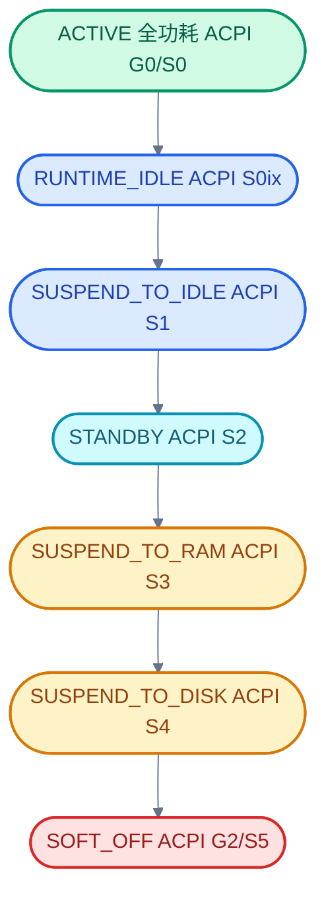
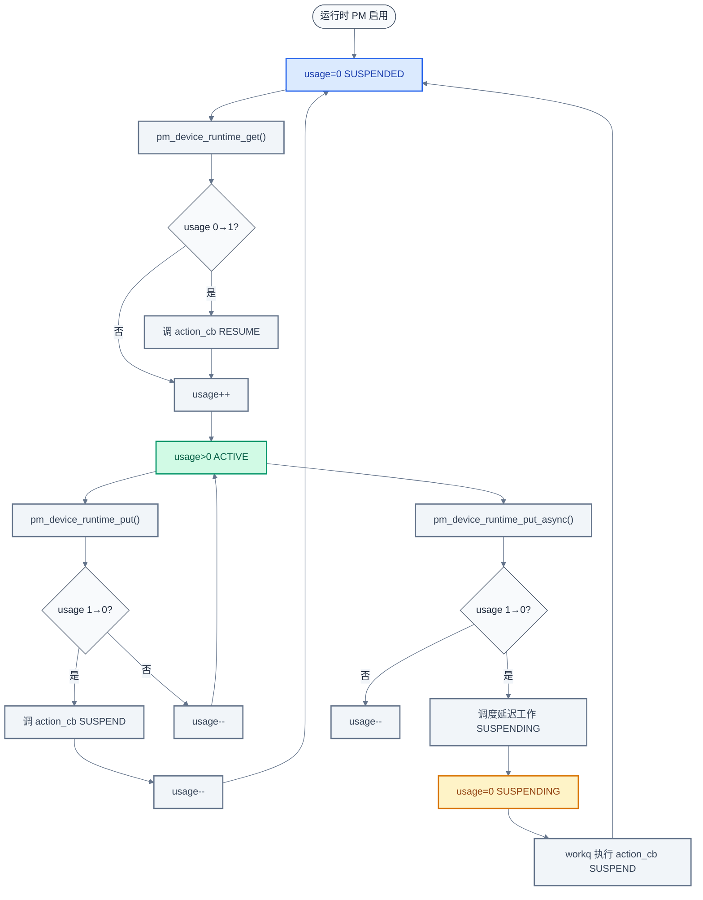
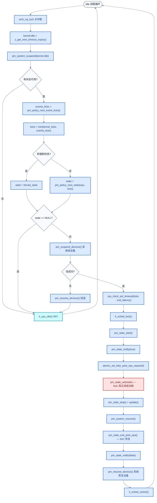

# 28. 电源管理 PM

> 一句话概括：本文讲清 Zephyr 电源管理子系统如何把"何时睡、睡多深"完全交给可插拔的 policy，把"睡下去要关哪些外设、醒来要恢复哪些外设"交给设备 PM 与运行时 PM，让 idle 线程在每次进入空转时只调一次 `pm_system_suspend()` 就完成"选状态 → 挂外设 → 切 SoC 状态 → 醒来恢复 → 通知监听者"的完整闭环。
> **工程师视角**：读完后应能回答"`pm_policy_next_state` 与 `pm_policy_next_event_ticks` 为什么是两个独立函数""`pm_device_runtime_get/put` 的引用计数归零时为什么还要先看 `PM_DEVICE_FLAG_PD_CLAIMED`""`EXIT_LATENCY_US_TO_TICKS` 的 near/ceil/floor 三种换算各用在什么场景""`device_system_managed` 与 `device_runtime` 为什么不能同时管一个设备"这四个问题。

### 关键术语

| 缩写 | 全称 | 含义 |
|------|------|------|
| PM | Power Management | 电源管理 |
| SoC | System on Chip | 片上系统 |
| RTOS | Real-Time Operating System | 实时操作系统 |
| ISR | Interrupt Service Routine | 中断服务例程 |
| CPU | Central Processing Unit | 中央处理器 |
| RAM | Random Access Memory | 随机存取存储器 |
| DMA | Direct Memory Access | 直接内存访问 |
| I2C | Inter-Integrated Circuit | 两线串行总线协议 |
| SPI | Serial Peripheral Interface | 串行外设接口总线 |
| GPIO | General Purpose Input/Output | 通用输入输出 |
| RTC | Real-Time Clock | 实时时钟 |
| PD | Power Domain | 电源域，共享同一电源开关的一组设备/逻辑 |
| ACPI | Advanced Configuration and Power Interface | 高级配置与电源接口 |
| S2RAM | Suspend-to-RAM | 挂起到内存 |
| WFI | Wait For Interrupt | 等中断指令 |
| MPU | Memory Protection Unit | 内存保护单元 |
| SMP | Symmetric Multi-Processing | 对称多处理 |
| API | Application Programming Interface | 应用编程接口 |

---

### 前置阅读

| 需要了解 | 参考文档 |
|----------|----------|
| idle 线程的角色与 `K_ESSENTIAL` 标志 | [05-线程与状态迁移](./05-线程与状态迁移.md) §6.2 |
| 内核 timeout_q 与 `z_get_next_timeout_expiry` | [08-中断与时序](./08-中断与时序.md) |
| 工作队列与延迟工作 | [09-工作队列与延迟处理](./09-工作队列与延迟处理.md) |
| 设备模型与 `DEVICE_DT_DEFINE` | [13-设备驱动模型](./13-设备驱动模型.md) |
| 异步 I/O 与 idle 的关系 | [27-RTIO异步IO框架](./27-RTIO异步IO框架.md) |

---

## 1. 概述：RTOS 电源管理的挑战

> [27 章 RTIO](./27-RTIO异步IO框架.md) 让 I/O 不再阻塞线程——SQE 提交后线程可以继续干活，也可以让 CPU 进 idle。但 idle 不是简单地执行 `WFI` 就够了：电池供电的传感器节点可能要求空闲 100 ms 就进 S2RAM，蓝牙 SoC 在连接事件之间只有 1.25 ms 可睡，而正在跑 DMA 的外设不能被一起关掉。本章是"进阶篇"的最后一站——剖析 Zephyr 的 PM 子系统如何把"何时睡、睡多深"和"睡下去要关哪些外设"两件事彻底解耦，让 idle 线程在 `pm_system_suspend()` 一次调用里完成全部决策与切换。

### 1.1 本质：把"决策"与"执行"分层

电源管理在嵌入式系统里有两层独立的问题：

1. **决策层**——CPU 现在能睡多深？睡下去之前要保证多久能醒？哪些状态被锁住了？这一层只关心"可不可以睡"，不关心"怎么睡"。
2. **执行层**——选定一个状态后，要把哪些外设挂起？SoC 要配哪些寄存器？醒来后按什么顺序恢复？这一层只关心"怎么睡"，不再问"该不该睡"。

Zephyr 把这两层完全分离：决策层由 `subsys/pm/policy/` 下的若干 policy 文件实现，执行层由 `subsys/pm/pm.c`、`subsys/pm/device.c`、`subsys/pm/device_runtime.c`、`subsys/pm/device_system_managed.c` 协同完成。idle 线程只负责调一次 `pm_system_suspend()`，剩下的事 PM 子系统自己安排。

> **核心要点**：PM 子系统的架构原则是"决策与执行分离"——policy 只回答"睡哪个状态"，pm.c 把答案翻译成"挂设备 → 切 SoC → 醒来恢复"的动作序列。任何想加新策略的应用都只需替换 policy，不需要碰 SoC 切换代码。

### 1.2 PM 状态层级

Zephyr 用 `enum pm_state` 定义了 7 个系统级电源状态，与 ACPI 的 G/S 状态一一对应：



> **如何读这张图**：从上到下功耗递减、唤醒延迟递增。`ACTIVE` 是 CPU 全速运行；`RUNTIME_IDLE` 仅让所有核进入最深 idle，外设状态不动；`SUSPEND_TO_IDLE` 保留 CPU 上下文（不丢寄存器），外设可进低功耗；`STANDBY` 在多核系统关掉非启动核；`SUSPEND_TO_RAM` 把内存进 self-refresh，CPU 完全掉电，唤醒要 ROM 代码引导；`SOFT_OFF` 内存内容也丢，等价于冷启动。索引越大越省电也越难醒——policy 选状态时就是在这个链上往下走。

定义见 [include/zephyr/pm/state.h](file:///home/pbw/rtos/cs-learning-notes/zephyr-project/zephyr/include/zephyr/pm/state.h#L28-L110)。

---

## 2. PM 状态：pm_state_info

> 上一章建立了"决策与执行分离"的总框架。但 policy 要在 7 个状态里挑哪一个？挑之前它需要知道每个状态的两个关键参数：**最少要睡多久才划算**（min_residency）和**醒过来要多久**（exit_latency）。这两个数从哪来？来自 devicetree 里每个 CPU 节点引用的 `zephyr,power-state` 节点。本章先讲状态描述符 `pm_state_info`，再讲它如何从 devicetree 静态生成。

### 2.1 结构体定义

每个 PM 状态由 `struct pm_state_info` 描述（[include/zephyr/pm/state.h](file:///home/pbw/rtos/cs-learning-notes/zephyr-project/zephyr/include/zephyr/pm/state.h#L115-L168)）：

```c
/* include/zephyr/pm/state.h （节选） */
struct pm_state_info {
	enum pm_state state;        /* 哪个状态 */
	uint8_t substate_id;        /* 子状态 ID，区分同 state 的多种实现 */
	bool pm_device_disabled;    /* 进入此状态时是否跳过设备 PM */
	uint32_t min_residency_us;  /* 最少驻留时间（us），睡不到这么久就不划算 */
	uint32_t exit_latency_us;   /* 唤醒延迟（us），从触发到 CPU 重新跑代码 */
};
```

逐字段解释：

- `state`：枚举值，对应上节 7 个状态之一
- `substate_id`：某些 SoC 一个 `PM_STATE_SUSPEND_TO_RAM` 下有多种子模式（如低漏电版与正常版），用此 ID 区分
- `pm_device_disabled`：若为 `true`，进入此状态时 PM 子系统**不**调用 `pm_suspend_devices()`——典型用于"外设必须保持供电"的状态
- `min_residency_us`：阈值。如果 idle 时间短于此值 + `exit_latency_us`，进这个状态反而比留在 ACTIVE 更耗电
- `exit_latency_us`：唤醒延迟。policy 用它判断"能不能在下一个事件前醒来"

### 2.2 devicetree 描述

状态信息全部静态来自 devicetree。典型 DTS 片段：

```dts
cpus {
    cpu0: cpu@0 {
        device_type = "cpu";
        cpu-power-states = <&state0 &state1 &state2>;
    };

    power-states {
        state0: state0 {
            compatible = "zephyr,power-state";
            power-state-name = "suspend-to-idle";
            min-residency-us = <10000>;
            exit-latency-us = <100>;
        };
        state1: state1 {
            compatible = "zephyr,power-state";
            power-state-name = "suspend-to-ram";
            min-residency-us = <50000>;
            exit-latency-us = <500>;
        };
        state2: state2 {
            compatible = "zephyr,power-state";
            power-state-name = "suspend-to-ram";
            substate-id = <2>;
            min-residency-us = <200000>;
            exit-latency-us = <2000>;
            zephyr,pm-device-disabled;
        };
    };
};
```

[state.c](file:///home/pbw/rtos/cs-learning-notes/zephyr-project/zephyr/subsys/pm/state.c#L14-L29) 用宏 `DT_FOREACH_CHILD_STATUS_OKAY` 把每个 CPU 引用的状态展开成静态数组：

```c
/* subsys/pm/state.c */
#define DEFINE_CPU_STATES(n) \
	static const struct pm_state_info pmstates_##n[] \
		= PM_STATE_INFO_LIST_FROM_DT_CPU(n);
#define CPU_STATE_REF(n) pmstates_##n

DT_FOREACH_CHILD_STATUS_OKAY(DT_PATH(cpus), DEFINE_CPU_STATES);

static const struct pm_state_info *cpus_states[] = {
	DT_FOREACH_CHILD_STATUS_OKAY_SEP(DT_PATH(cpus), CPU_STATE_REF, (,))
};
static const uint8_t states_per_cpu[] = {
	DT_FOREACH_CHILD_STATUS_OKAY_SEP(DT_PATH(cpus), DT_NUM_CPU_POWER_STATES, (,))
};
```

> **核心要点**：`pm_state_info` 是只读的——状态信息在编译期固定，运行时只能查不能改。所有动态约束（"现在不能进 S2RAM"）通过 policy 层的锁与延迟请求表达，**不**修改 `pm_state_info` 本身。这让 SoC 描述与运行时策略彻底解耦。

> **设计洞察**：把 `pm_state_info` 做成编译期只读静态表，是嵌入式系统"能静态就不动态"原则的典型体现。SoC 的电源状态物理参数（min_residency、exit_latency）由硅片工艺决定，不会因运行时事件改变——既然如此，让它们在编译期固定下来，运行时零分配、零初始化、零同步开销。
>
> 这个选择带来三个工程收益：一是只读数据可放 flash（XIP 系统中）或 `.rodata` 段，不占宝贵 RAM；二是连续数组的 cache 友好性优于指针追踪的链表——`num_cpu_states` 通常 ≤ 7，整个表占不到一个 cache line；三是 `state.c` 用 `DT_FOREACH_CHILD_STATUS_OKAY` 在编译期展开 DTS，等价于"用编译器做依赖注入"——SoC 厂商改 DTS 即可改状态表，不必动 C 代码。对比 Linux cpuidle 的 `cpuidle_register_driver` 运行时注册机制，Zephyr 选择了更静态的方案：RTOS 场景的 SoC 通常固定、内存更紧张、启动速度更重要，KISS 原则在资源约束下自然胜出。

### 2.3 查询接口

[state.c](file:///home/pbw/rtos/cs-learning-notes/zephyr-project/zephyr/subsys/pm/state.c#L50-L81) 提供两个查询函数：

- `pm_state_cpu_get_all(cpu, &states)`：返回某 CPU 支持的状态数与状态数组指针
- `pm_state_get(cpu, state, substate_id)`：按 `(state, substate_id)` 反查 `pm_state_info`，先查启用状态，再查 disabled 状态（供 `pm_state_force` 强制使用 disabled 状态）

---

## 3. 策略框架：可插拔的 policy

> 上一章定义了"状态是什么"。但 idle 线程每次进空转时，要在多个状态里挑一个——挑的依据是什么？这就是 policy 的工作。本章讲 policy 框架的可插拔结构，下一章讲最常用的 `policy_latency`。

### 3.1 policy 的入口函数

policy 唯一对外暴露的入口是 `pm_policy_next_state(cpu, ticks)`（[policy_default.c](file:///home/pbw/rtos/cs-learning-notes/zephyr-project/zephyr/subsys/pm/policy/policy_default.c#L12)）：

```c
const struct pm_state_info *pm_policy_next_state(uint8_t cpu, int32_t ticks);
```

- 入参：CPU 索引、距离下一个 kernel timer 的 tick 数
- 返回值：选定的状态指针，`NULL` 表示保持 `PM_STATE_ACTIVE`

应用可以选择默认实现（`CONFIG_PM_POLICY_DEFAULT`）或自定义实现（`CONFIG_PM_POLICY_CUSTOM`）。自定义时应用自己写这个函数即可，无需改内核。

### 3.2 五个 policy 模块

Zephyr 把 policy 拆成五个独立文件，每个负责一种约束维度：

| 模块 | 文件 | 职责 |
|------|------|------|
| **default** | [policy_default.c](file:///home/pbw/rtos/cs-learning-notes/zephyr-project/zephyr/subsys/pm/policy/policy_default.c) | 默认 residency-based 决策：按 idle 时长选最深可睡状态 |
| **latency** | [policy_latency.c](file:///home/pbw/rtos/cs-learning-notes/zephyr-project/zephyr/subsys/pm/policy/policy_latency.c) | 维护"最大允许唤醒延迟"请求列表，约束可选状态 |
| **events** | [policy_events.c](file:///home/pbw/rtos/cs-learning-notes/zephyr-project/zephyr/subsys/pm/policy/policy_events.c) | 注册"未来某 tick 会发生的事件"，让 policy 知道还有多久要醒 |
| **state_lock** | [policy_state_lock.c](file:///home/pbw/rtos/cs-learning-notes/zephyr-project/zephyr/subsys/pm/policy/policy_state_lock.c) | 引用计数锁——某模块锁住后该状态不可进 |
| **device_lock** | [policy_device_lock.c](file:///home/pbw/rtos/cs-learning-notes/zephyr-project/zephyr/subsys/pm/policy/policy_device_lock.c) | 把 state_lock 包装成"按设备锁状态"——某设备依赖的电源域在指定状态会断电，则锁住那些状态 |

> **如何读这张表**：default 是"主决策者"，其他四个是"约束提供者"。default 在选状态时调用 `pm_policy_state_is_available()` 询问 state_lock"这个状态被锁了吗"、间接通过 latency_mask 询问 latency"这个状态的 exit_latency 是否超出最大允许延迟"。device_lock 则是 state_lock 的语法糖——把 devicetree 里 `zephyr,disabling-power-states` 属性翻译成对 state_lock 的调用。

### 3.3 default policy 的决策逻辑

[policy_default.c](file:///home/pbw/rtos/cs-learning-notes/zephyr-project/zephyr/subsys/pm/policy/policy_default.c#L12-L49) 的核心逻辑只有 30 行：

```c
/* subsys/pm/policy/policy_default.c （节选） */
const struct pm_state_info *pm_policy_next_state(uint8_t cpu, int32_t ticks)
{
	uint8_t num_cpu_states;
	const struct pm_state_info *cpu_states;
	const struct pm_state_info *out_state = NULL;

#ifdef CONFIG_PM_NEED_ALL_DEVICES_IDLE
	if (pm_device_is_any_busy()) {
		return NULL;  /* 有设备正忙，留在 ACTIVE */
	}
#endif

	num_cpu_states = pm_state_cpu_get_all(cpu, &cpu_states);

	for (uint32_t i = 0; i < num_cpu_states; i++) {
		const struct pm_state_info *state = &cpu_states[i];
		uint32_t min_residency_ticks = 0;
		uint32_t min_residency_us = state->min_residency_us + state->exit_latency_us;

		/* If the input is zero, avoid 64-bit conversion from microseconds to ticks. */
		if (min_residency_us > 0) {
			min_residency_ticks = k_us_to_ticks_ceil32(min_residency_us);
		}

		if (ticks < min_residency_ticks) {
			break;  /* 状态按 residency 升序排列，再深也够不着 */
		}

		if (!pm_policy_state_is_available(state->state, state->substate_id)) {
			continue;  /* 被锁或延迟不达标，跳过 */
		}

		out_state = state;  /* 持续向更深状态推进 */
	}

	return out_state;
}
```

决策步骤：

1. 如果 `CONFIG_PM_NEED_ALL_DEVICES_IDLE=y`，先检查有没有设备 busy，有就返回 NULL
2. 取出该 CPU 所有状态（按 devicetree 顺序，约定由浅到深）
3. 对每个状态，检查 `ticks >= min_residency + exit_latency`（转成 tick）
4. 不够则 `break`——后面的状态更深，residency 更大，不可能够
5. 够则检查可用性（`pm_policy_state_is_available`：未锁且延迟未超限），可用就更新 `out_state`
6. 最终返回最深的可用状态，或 NULL

> **核心要点**：default policy 的本质是"在 idle 时长允许的范围内，挑最深的、未被锁的状态"。`min_residency + exit_latency` 是因为睡下去要花 exit_latency 才能醒，加上至少睡 min_residency 才回本——总开销必须小于 idle 时长。

### 3.4 state_lock：引用计数锁

[state_lock.c](file:///home/pbw/rtos/cs-learning-notes/zephyr-project/zephyr/subsys/pm/policy/policy_state_lock.c#L66-L82) 实现了简单的引用计数锁：

```c
/* subsys/pm/policy/policy_state_lock.c */
void pm_policy_state_lock_get(enum pm_state state, uint8_t substate_id)
{
	for (size_t i = 0; i < ARRAY_SIZE(substates); i++) {
		if (substates[i].state == state &&
		   (substates[i].substate_id == substate_id || substate_id == PM_ALL_SUBSTATES)) {
			k_spinlock_key_t key = k_spin_lock(&lock);

			if (lock_cnt[i] == 0) {
				unlock_mask &= ~BIT(i);  /* 从可用掩码中清掉 */
			}
			lock_cnt[i]++;
			k_spin_unlock(&lock, key);
		}
	}
}
```

`substate_id == PM_ALL_SUBSTATES` 表示锁住该 state 下所有子状态。`lock_cnt[i]` 是第 i 个状态的引用计数，为 0 表示未被锁。`unlock_mask` 是与 `lock_cnt` 同步维护的位掩码，第 i 位为 1 表示第 i 个状态未被锁。另外还有一个 `global_lock_cnt` 全局计数器——由 `pm_policy_state_all_lock_get/put` 操作，非 0 时锁住**所有**状态（用于 `pm_policy_state_all_lock_get()` 这种"一键全锁"场景）。

`pm_policy_state_is_available()`（[state_lock.c](file:///home/pbw/rtos/cs-learning-notes/zephyr-project/zephyr/subsys/pm/policy/policy_state_lock.c#L134-L151)）的检查顺序是：先看 `global_lock_cnt != 0`（全局锁），再看 `lock_cnt[i] == 0`（逐状态锁），最后看 `latency_mask & BIT(i)`（延迟约束）——三者都通过才返回 true。`unlock_mask` 则由 `pm_policy_state_any_active()`（[policy_state_lock.c](file:///home/pbw/rtos/cs-learning-notes/zephyr-project/zephyr/subsys/pm/policy/policy_state_lock.c#L153)）使用，通过 `unlock_mask & latency_mask` 一次性判断"是否还有任何可用状态"。

> **设计洞察**：state_lock 用"引用计数 + 位掩码"的组合实现多约束源聚合，是系统软件中反复出现的设计模式。引用计数支持"多个模块独立锁同一状态，最后一个释放才解锁"——比布尔标志强；位掩码把"该状态被锁吗？延迟达标吗？"压缩成 O(1) 位运算，policy 在 idle 热点路径选状态时不必遍历约束源链表。
>
> 这个模式在 Linux 内核里随处可见：`cpumask`、`node_states`、`__cpu_active_mask` 都是用位掩码聚合多种状态。Zephyr 把它进一步简化——`unlock_mask & latency_mask` 一次 AND 就得到"既未锁又延迟达标"的状态集合。多模块约束叠加时，"最严的胜出"语义通过 `latency_reqs` 取最小值实现，对应 Linux runtime PM 的 `pm_qos_request` 机制。**核心是数据局部性**：约束聚合在两个机器字内，热点路径只需读一次缓存行——这是把"机制"（位掩码）与"策略"（哪些约束、阈值多少）分离后获得的性能红利，没有这层分离，每加一种约束就要改 policy 主循环。

---

## 4. policy_latency：按唤醒延迟选状态

> 上一章的 default policy 用 `min_residency` 选状态，但它没回答一个关键问题：**如果应用要求"唤醒延迟必须小于 500 us"怎么办？** S2RAM 的 exit_latency 是 500 us，刚好卡在边界——选不选它？policy_latency 就是回答这个问题的：它维护一份"最大允许延迟"的请求列表，凡是 `exit_latency_us > max_latency_us` 的状态都被自动屏蔽。

### 4.1 延迟请求列表

[policy_latency.c](file:///home/pbw/rtos/cs-learning-notes/zephyr-project/zephyr/subsys/pm/policy/policy_latency.c#L14-L23) 维护一个全局最大延迟：

```c
/* subsys/pm/policy/policy_latency.c */
static struct k_spinlock latency_lock;
static sys_slist_t latency_reqs;             /* 延迟请求链表 */
static int32_t max_latency_us = SYS_FOREVER_US;  /* 当前最大允许延迟 */
int32_t max_latency_cyc = -1;                /* 转成 cycle 数，给 SoC 用 */
static sys_slist_t latency_subs;             /* 延迟变化订阅者 */
```

`update_max_latency()`（[policy_latency.c](file:///home/pbw/rtos/cs-learning-notes/zephyr-project/zephyr/subsys/pm/policy/policy_latency.c#L26-L55)）遍历所有请求，取**最小值**作为当前 `max_latency_us`——多个模块同时约束时，最严的胜出。

### 4.2 三种 API：add/update/remove

```c
void pm_policy_latency_request_add(struct pm_policy_latency_request *req,
                                   uint32_t value_us);
void pm_policy_latency_request_update(struct pm_policy_latency_request *req,
                                      uint32_t value_us);
void pm_policy_latency_request_remove(struct pm_policy_latency_request *req);
```

典型用法：UART 驱动在打开时 `add(req, 100)`——"我要求唤醒延迟不超过 100 us，否则会丢字符"；关闭时 `remove(req)`。

### 4.3 与 state_lock 的联动

[state_lock.c](file:///home/pbw/rtos/cs-learning-notes/zephyr-project/zephyr/subsys/pm/policy/policy_state_lock.c#L165-L176) 在系统初始化时订阅 latency 变化：

```c
/* subsys/pm/policy/policy_state_lock.c */
static void pm_policy_latency_update_locked(int32_t max_latency_us)
{
	for (size_t i = 0; i < ARRAY_SIZE(substates); i++) {
		if (substates[i].exit_latency_us > max_latency_us) {
			latency_mask &= ~BIT(i);  /* 状态 exit_latency 超限，禁用 */
		} else {
			latency_mask |= BIT(i);   /* 否则允许 */
		}
	}
}

static int pm_policy_latency_init(void)
{
	static struct pm_policy_latency_subscription sub;
	pm_policy_latency_changed_subscribe(&sub, pm_policy_latency_update_locked);
	return 0;
}
SYS_INIT(pm_policy_latency_init, PRE_KERNEL_1, 0);
```

每当 `max_latency_us` 变化，回调更新 `latency_mask`——`pm_policy_state_is_available()` 检查这个掩码。所以 latency 不是单独的 policy，而是 state_lock 的"延迟维度约束"。

### 4.4 events：告诉 policy 何时要醒

[policy_events.c](file:///home/pbw/rtos/cs-learning-notes/zephyr-project/zephyr/subsys/pm/policy/policy_events.c) 提供事件注册：应用告诉 PM "我会在 uptime_ticks = X 时有事要做"，policy 在选状态时把 X 算进 idle 时长。

[pm.c](file:///home/pbw/rtos/cs-learning-notes/zephyr-project/zephyr/subsys/pm/pm.c#L173-L174) 在 `pm_system_suspend` 入口先取 `events_ticks`：

```c
/* subsys/pm/pm.c */
events_ticks = pm_policy_next_event_ticks();
ticks = ticks_expiring_sooner(kernel_ticks, events_ticks);
```

`ticks_expiring_sooner`（[pm.c](file:///home/pbw/rtos/cs-learning-notes/zephyr-project/zephyr/subsys/pm/pm.c#L77-L98)）取两个 tick 数的较小者，把 `K_TICKS_FOREVER` 当作"无穷大"处理。

> **核心要点**：policy 框架把"何时睡、睡多深"完全解耦——default 选最深可睡状态，state_lock 锁住某些状态，latency 按延迟屏蔽，events 提供唤醒时间。应用根据自己的约束调相应 API，PM 子系统在 idle 时综合所有约束自动决策。这就是"决策与执行分离"的具体实现。

---

## 5. 设备 PM：SUSPEND/RESUME/LOW_POWER

> 前四章讲清了"CPU 状态怎么选"。但 SoC 进 S2RAM 时，挂在总线上的传感器、外设也得跟着挂起——否则它们的状态会丢。本章讲设备 PM 的基础：每个设备怎么响应 PM action、状态如何转换。

### 5.1 设备 PM 状态与动作

[include/zephyr/pm/device.h](file:///home/pbw/rtos/cs-learning-notes/zephyr-project/zephyr/include/zephyr/pm/device.h#L68-L172) 定义了 4 个设备状态与 4 个动作：

| 状态 | 含义 |
|------|------|
| `PM_DEVICE_STATE_ACTIVE` | 设备供电且需要工作，可调任意 API |
| `PM_DEVICE_STATE_SUSPENDED` | 设备供电但不需要，应进内部最低功耗 |
| `PM_DEVICE_STATE_SUSPENDING` | 异步挂起中（运行时 PM 专用） |
| `PM_DEVICE_STATE_OFF` | 设备未供电，初始状态 |

| 动作 | 触发场景 | 目标状态 |
|------|----------|----------|
| `PM_DEVICE_ACTION_SUSPEND` | 系统进低功耗 / 运行时 put | SUSPENDED |
| `PM_DEVICE_ACTION_RESUME` | 系统唤醒 / 运行时 get | ACTIVE |
| `PM_DEVICE_ACTION_TURN_OFF` | 电源域关电前通知 | OFF |
| `PM_DEVICE_ACTION_TURN_ON` | 电源域上电后通知 | SUSPENDED |

[device.c](file:///home/pbw/rtos/cs-learning-notes/zephyr-project/zephyr/subsys/pm/device.c#L15-L26) 用两个静态表把 action 映射到"目标状态"和"期望的前置状态"：

```c
/* subsys/pm/device.c */
static const enum pm_device_state action_target_state[] = {
	[PM_DEVICE_ACTION_SUSPEND]  = PM_DEVICE_STATE_SUSPENDED,
	[PM_DEVICE_ACTION_RESUME]   = PM_DEVICE_STATE_ACTIVE,
	[PM_DEVICE_ACTION_TURN_OFF] = PM_DEVICE_STATE_OFF,
	[PM_DEVICE_ACTION_TURN_ON]  = PM_DEVICE_STATE_SUSPENDED,
};
static const enum pm_device_state action_expected_state[] = {
	[PM_DEVICE_ACTION_SUSPEND]  = PM_DEVICE_STATE_ACTIVE,
	[PM_DEVICE_ACTION_RESUME]   = PM_DEVICE_STATE_SUSPENDED,
	[PM_DEVICE_ACTION_TURN_OFF] = PM_DEVICE_STATE_SUSPENDED,
	[PM_DEVICE_ACTION_TURN_ON]  = PM_DEVICE_STATE_OFF,
};
```

> **如何读这两张表**：`action_target_state` 是动作执行后应进入的状态，`action_expected_state` 是动作执行前必须处于的状态。`pm_device_action_run` 先用这两张表做状态校验，再调驱动的 `action_cb`。`TURN_OFF/TURN_ON` 的目标状态会"强制更新"——即使驱动回调失败，状态也会被改（因为电源域掉电是物理事实，驱动改不了）。

### 5.2 pm_device_action_run

[device.c](file:///home/pbw/rtos/cs-learning-notes/zephyr-project/zephyr/subsys/pm/device.c#L48-L103) 是设备 PM 的核心入口：

```c
/* subsys/pm/device.c （节选） */
int pm_device_action_run(const struct device *dev, enum pm_device_action action)
{
	struct pm_device_base *pm = dev->pm_base;
	int ret;

	if (pm == NULL) {
		return -ENOSYS;  /* 设备不支持 PM */
	}

	/* 状态机校验 */
	if (pm->state == action_target_state[action]) {
		return -EALREADY;  /* 已经在目标状态 */
	}
	if (pm->state != action_expected_state[action]) {
		return -ENOTSUP;  /* 前置状态不对 */
	}

	ret = pm->action_cb(dev, action);
	if (ret < 0) {
		/* TURN_OFF/TURN_ON 即使失败也要更新状态 */
		switch (action) {
		case PM_DEVICE_ACTION_TURN_ON:
			if (ret != -ENOTSUP) {
				atomic_set_bit(&pm->flags, PM_DEVICE_FLAG_TURN_ON_FAILED);
			}
			__fallthrough;
		case PM_DEVICE_ACTION_TURN_OFF:
			pm->state = action_target_state[action];
			break;
		default:
			break;
		}
		return ret;
	}

	pm->state = action_target_state[action];
	/* TURN_OFF 后清掉电源域相关标志 */
	if (action == PM_DEVICE_ACTION_TURN_OFF) {
		atomic_clear_bit(&pm->flags, PM_DEVICE_FLAG_PD_CLAIMED);
		atomic_clear_bit(&pm->flags, PM_DEVICE_FLAG_TURN_ON_FAILED);
	}
	return 0;
}
```

> **核心要点**：`pm_device_action_run` 不直接改设备硬件，只更新 PM 子系统记录的 `pm->state`；硬件操作完全由驱动的 `action_cb` 负责。这种"框架管状态、驱动管硬件"的分工让 PM 子系统不依赖具体外设。

### 5.3 busy 标志与唤醒源

[device.c](file:///home/pbw/rtos/cs-learning-notes/zephyr-project/zephyr/subsys/pm/device.c#L249-L302) 提供两类辅助 API：

- `pm_device_busy_set/clear/is_busy/is_any_busy`——标记设备正在做不可打断的事（如 DMA 传输），系统挂设备时要跳过
- `pm_device_wakeup_enable/is_enabled/is_capable`——标记设备能作唤醒源（如 GPIO 按键），系统挂设备时也要跳过

`device_system_managed` 挂设备时会跳过 busy 和 wakeup-enabled 的设备（[device_system_managed.c](file:///home/pbw/rtos/cs-learning-notes/zephyr-project/zephyr/subsys/pm/device_system_managed.c#L43-L45)）。

---

## 6. 设备运行时 PM：引用计数自动挂起

> 上一章的 `pm_device_action_run` 是手动 API——调用者要自己判断何时挂起、何时恢复。但在实际驱动里，"用则 resume、不用则 suspend"是更自然的模式：传感器采样前打开 I2C 总线，采样完释放。本章讲运行时 PM 如何用引用计数把这件事自动化。

### 6.1 引用计数模型

[device_runtime.c](file:///home/pbw/rtos/cs-learning-notes/zephyr-project/zephyr/subsys/pm/device_runtime.c) 用 `pm->base.usage` 计数：

- `pm_device_runtime_get(dev)`：`usage++`，若 `usage` 从 0 变 1 则 resume 设备
- `pm_device_runtime_put(dev)`：`usage--`，若 `usage` 从 1 变 0 则 suspend 设备
- `pm_device_runtime_put_async(dev, delay)`：同 put，但 suspend 推迟到工作队列



> **如何读这张图**：核心是 `usage` 计数器。`get` 加 1，`put` 减 1；只在 0↔1 跨越时才真正调硬件。`put_async` 把 suspend 推迟到 workq，期间状态是 `SUSPENDING`——如果在这期间又来一个 `get`，可以取消挂起避免无谓的 suspend/resume 循环。多用户共享同一总线时，第二个 `get` 不触发 resume（usage 已经 ≥1），最后一个 `put` 才真正 suspend。

### 6.2 get 的实现

[device_runtime.c](file:///home/pbw/rtos/cs-learning-notes/zephyr-project/zephyr/subsys/pm/device_runtime.c#L194-L309) 是 `pm_device_runtime_get` 的核心逻辑。关键步骤：

1. 若设备支持 `PM_DEVICE_FLAG_ISR_SAFE`，走 `get_sync_locked` 自旋锁路径
2. 否则取信号量 `pm->lock`（ISR 里用 `K_NO_WAIT`，可能返回 `-EWOULDBLOCK`）
3. 若设备在电源域上且未 claim，先 `pm_device_runtime_get(domain)`——递归把电源域打开
4. `usage++`
5. 若 `usage == 1`（从挂起到活跃），调 `action_cb(PM_DEVICE_ACTION_RESUME)`
6. 异步模式下若状态是 `SUSPENDING`，尝试取消挂起工作；取消不掉就等它完成

### 6.3 put 与电源域释放

**电源域（Power Domain）** 是 SoC 上"一组共享同一个电源开关的设备/逻辑"——电源域关电后，域内所有设备同时掉电，寄存器内容全部丢失。典型低功耗 SoC 有多个电源域：CPU 核心域、SRAM 域、主外设域、Always-On 域（RTC、GPIO 按键等可作唤醒源的设备所在）。进 S2RAM 时主外设域掉电、Always-On 域保持供电——这就是为什么 GPIO 能把系统从 S2RAM 唤醒（§5.3 的 wakeup 机制依赖于此）。

Zephyr 把电源域本身也建模为设备——`PM_DOMAIN(dev->pm_base)` 返回该设备所属的电源域设备。为什么这样设计？因为一个外设要 resume，必须先确保它所在的电源域已经上电，否则访问寄存器会引发总线错误。把电源域做成普通设备后，"先上电再操作子设备"就退化成"先 `pm_device_runtime_get(domain)` 再操作子设备"——复用同一套引用计数机制，不需要单独的电源域状态机。这也是 §5.1 表里 `TURN_OFF/TURN_ON` 两个动作存在的理由：它们是电源域关电/上电时给子设备的"伴随通知"，让子设备有机会在掉电前保存状态、上电后恢复状态。

电源域设备的 `usage` 反映了"有几个子设备在用它"：子设备 resume 时 claim 电源域（设置 `PM_DEVICE_FLAG_PD_CLAIMED`，递归 get），suspend 时 release（递归 put）。最后一个子设备 release 时电源域 `usage` 归零、自动掉电。这就是下文"释放电源域引用"和 §6.2 第 3 步"递归把电源域打开"的全部含义。

[runtime_suspend](file:///home/pbw/rtos/cs-learning-notes/zephyr-project/zephyr/subsys/pm/device_runtime.c#L55-L121) 在 `usage` 减到 0 时挂起设备，并释放电源域：

```c
/* subsys/pm/device_runtime.c （节选） */
ret = pm->base.action_cb(pm->dev, PM_DEVICE_ACTION_SUSPEND);
if (ret < 0) {
    pm->base.usage++;
    goto unlock;
}

pm->base.state = PM_DEVICE_STATE_SUSPENDED;

/* 释放电源域引用 */
if (atomic_test_bit(&dev->pm_base->flags, PM_DEVICE_FLAG_PD_CLAIMED)) {
    (void)pm_device_runtime_put(PM_DOMAIN(dev->pm_base));
    atomic_clear_bit(&dev->pm_base->flags, PM_DEVICE_FLAG_PD_CLAIMED);
}
```

> **核心要点**：`PM_DEVICE_FLAG_PD_CLAIMED` 表示"这个设备已经 claim 过它的电源域"。运行时 PM 在 resume 时 claim（递归 get 电源域），在 suspend 时 release（递归 put 电源域）——这样电源域的 usage 反映了"有几个子设备在用它"，最后一个子设备释放时电源域自动掉电。

> **设计洞察**：把电源域建模为普通设备、用递归 `pm_device_runtime_get` 打开父资源，是"层次化资源管理"的优雅实现。子设备 resume 前 claim 电源域、suspend 后 release，电源域的 `usage` 自动反映"还有几个子设备在用"——最后一个释放时父资源自动关闭。这套机制可无限递归（电源域还能再嵌套电源域），且每个层级都用同一份 `device_runtime.c` 代码处理，不需要为"层级"特化逻辑。
>
> 引用计数是系统软件设计的"万能钥匙"：C++ 的 `shared_ptr`、Linux 内核的 `kref`、Objective-C 的 ARC、POSIX 文件描述符的 `dup/close`、Linux DMA buffer 的引用——都是同一思想的不同实例。Zephyr 的 `pm->base.usage` 是这个家族在 RTOS 世界的代表，电源域递归 claim 把"父资源生命周期 ≥ 子资源生命周期"这个不变量用计数器自动维护，调用者无需显式管理。对比 Linux 的 `genpd` 框架用了独立的 `struct generic_pm_domain`、性能域回调、链表遍历，Zephyr 的方案更轻量——这是 RTOS 与通用 OS 在复杂度上的本质差异：能用同一套机制解决的问题，绝不引入第二套抽象。

### 6.4 ISR_SAFE 模式

`PM_DEVICE_ISR_SAFE` 标志（[device.h](file:///home/pbw/rtos/cs-learning-notes/zephyr-project/zephyr/include/zephyr/pm/device.h#L57-L65)）表示设备的 suspend/resume 很短，可在自旋锁临界区里完成。这种模式下：

- 用 `struct pm_device_isr`（自旋锁）而非 `struct pm_device`（信号量）
- `get/put` 可在 ISR 里调用，不会 `-EWOULDBLOCK`
- 节省约 80 字节 RAM（无 `k_sem`、`k_event`、`k_work_delayable`）

代价是 suspend/resume 不能阻塞——只适合"写个寄存器就完事"的简单设备。

---

## 7. device_system_managed：系统切状态时自动管理

> 上一章的运行时 PM 是"应用驱动"——驱动自己决定何时 get/put。但有些设备（如简单外设）不想写运行时 PM 代码，希望"系统进 S2RAM 时自动跟着挂起，醒来时自动跟着恢复"。这就是 `device_system_managed` 的职责。

### 7.1 工作原理

[device_system_managed.c](file:///home/pbw/rtos/cs-learning-notes/zephyr-project/zephyr/subsys/pm/device_system_managed.c#L27-L68) 在 `pm_system_suspend` 决定进某个状态后，由 [pm.c](file:///home/pbw/rtos/cs-learning-notes/zephyr-project/zephyr/subsys/pm/pm.c#L197-L211) 调用：

```c
/* subsys/pm/pm.c */
#ifdef CONFIG_PM_DEVICE_SYSTEM_MANAGED
	if (atomic_sub(&_cpus_active, 1) == 1) {
		if ((z_cpus_pm_state[id]->state != PM_STATE_RUNTIME_IDLE) &&
		    !z_cpus_pm_state[id]->pm_device_disabled) {
			if (!pm_suspend_devices()) {
				pm_resume_devices();
				z_cpus_pm_state[id] = NULL;
				(void)atomic_add(&_cpus_active, 1);
				return false;  /* 挂设备失败，放弃 PM */
			}
		}
	}
#endif
```

关键点：

1. **只在最后一个活跃 CPU 上挂设备**——`atomic_sub(&_cpus_active, 1) == 1` 表示从 1 减到 0
2. **跳过 `RUNTIME_IDLE`**——这个状态定义为"不动外设"
3. **跳过 `pm_device_disabled` 的状态**——devicetree 里 `zephyr,pm-device-disabled` 显式说不挂设备
4. **挂失败就回滚**——任何一个设备挂失败，把已挂的全部 resume 回来，放弃本次 PM

### 7.2 pm_suspend_devices 的遍历顺序

[device_system_managed.c](file:///home/pbw/rtos/cs-learning-notes/zephyr-project/zephyr/subsys/pm/device_system_managed.c#L36-L65) 反向遍历设备数组：

```c
/* subsys/pm/device_system_managed.c （节选） */
for (const struct device *dev = devs + devc - 1; dev >= devs; dev--) {
    /* 跳过未初始化、busy、唤醒源、运行时 PM 启用的设备 */
    if (!device_is_ready(dev) || pm_device_is_busy(dev) ||
        pm_device_wakeup_is_enabled(dev) ||
        pm_device_runtime_is_enabled(dev)) {
        continue;
    }

    ret = pm_device_action_run(dev, PM_DEVICE_ACTION_SUSPEND);
    if ((ret == -ENOSYS) || (ret == -ENOTSUP) || (ret == -EALREADY)) {
        continue;  /* 不支持 PM / 已挂起 / 状态不对 */
    } else if (ret < 0) {
        return false;  /* 其他错误，整体失败 */
    }

    TYPE_SECTION_START(pm_device_slots)[num_susp] = dev;
    num_susp++;
}
```

> **核心要点**：挂设备按"反初始化顺序"——后初始化的设备先挂。这与 [13 章 设备驱动模型](./13-设备驱动模型.md) 讲的 devicetree `ord` 顺序对应：子设备依赖父设备，初始化时父先子后，挂起时必须反过来先子后父，否则父设备掉电时子设备还在用。`pm_resume_devices`（[device_system_managed.c](file:///home/pbw/rtos/cs-learning-notes/zephyr-project/zephyr/subsys/pm/device_system_managed.c#L70)）按相反顺序（先挂的最后 resume）恢复。

> **设计洞察**：挂设备按"反初始化顺序"、resume 按"挂起的逆序"，本质是拓扑排序的逆应用——这是系统软件中普遍存在的"构建顺序的反转就是销毁顺序"原理。设备初始化时父总线先 ready 再挂子设备（否则子设备 probe 时访问不到寄存器）；挂起时必须反过来：先子后父，否则父设备掉电时子设备的寄存器写还没完成，状态就丢了。
>
> 这个原则在计算机科学里反复出现：C++ 对象成员的析构顺序与构造顺序相反、Linux 内核 `device_shutdown` 反向遍历 `devices_kset`、Go `defer` 按 LIFO 执行、函数栈帧销毁是入栈的反转。背后的不变量是**依赖关系**——若 A 依赖 B 的存在（子设备依赖父总线供电），则 B 必须先于 A 创建、晚于 A 销毁。`pm_suspend_devices` 还把"挂失败回滚所有已挂设备"作为内置语义，对应工程实践中的 fail-fast + 补偿事务模式：要么全部挂成功，要么回到一致状态，绝不留下"半挂起"的中间态——这与数据库事务的原子性是同一种智慧。

### 7.3 与 device_runtime 的关系

两种设备 PM 模式互斥：

| 维度 | device_system_managed | device_runtime |
|------|----------------------|-----------------|
| 决策者 | 系统（idle 线程） | 驱动（get/put 调用点） |
| 触发时机 | CPU 进低功耗时 | 设备使用/释放时 |
| 状态保留 | 不需要——靠 resume 恢复 | 不需要——靠 resume 恢复 |
| 适用设备 | 简单外设、被动设备 | 复杂外设、需精细控制 |
| 阻塞限制 | 不能阻塞（idle 上下文） | 可阻塞（线程上下文） |
| 资源开销 | 几乎为零 | 信号量+事件+工作项 |

[device_system_managed.c](file:///home/pbw/rtos/cs-learning-notes/zephyr-project/zephyr/subsys/pm/device_system_managed.c#L43-L45) 显式跳过 `pm_device_runtime_is_enabled` 的设备——避免双重管理。一个设备要么归系统管，要么归运行时 PM 管，不能两边都管。

---

## 8. PM 统计与 Shell

> 前七章讲完了 PM 的决策与执行。但实际调试低功耗设备时，最常问的问题是"系统到底进了哪个状态？进了多少次？睡了多久？"——这需要可观测性。本章讲 PM 统计与 Shell 命令。

### 8.1 pm_stats：状态计数与驻留时长

[pm_stats.c](file:///home/pbw/rtos/cs-learning-notes/zephyr-project/zephyr/subsys/pm/pm_stats.c#L15-L25) 用 Zephyr 的 stats 子系统为每个 CPU 的每个状态定义三个计数器：

```c
/* subsys/pm/pm_stats.c */
STATS_SECT_START(pm_stats)
STATS_SECT_ENTRY32(state_count)         /* 进入次数 */
STATS_SECT_ENTRY32(state_last_cycles)   /* 上次驻留 cycle 数 */
STATS_SECT_ENTRY32(state_total_cycles)  /* 累计驻留 cycle 数 */
STATS_SECT_END;
```

[pm.c](file:///home/pbw/rtos/cs-learning-notes/zephyr-project/zephyr/subsys/pm/pm.c#L237-L251) 在 `pm_state_set` 前后调用 `pm_stats_start/stop`：

```c
/* subsys/pm/pm.c */
if (IS_ENABLED(CONFIG_PM_STATS)) {
    pm_stats_start();  /* 记起始 cycle */
}
pm_state_notify(true);
atomic_set_bit(z_post_ops_required, id);
pm_state_set(z_cpus_pm_state[id]->state, z_cpus_pm_state[id]->substate_id);

if (IS_ENABLED(CONFIG_PM_STATS)) {
    pm_stats_stop();  /* 记结束 cycle */
    pm_stats_update(z_cpus_pm_state[id] ? z_cpus_pm_state[id]->state : PM_STATE_ACTIVE);
}
```

`pm_stats_update`（[pm_stats.c](file:///home/pbw/rtos/cs-learning-notes/zephyr-project/zephyr/subsys/pm/pm_stats.c#L64-L72)）算出 `time_total = time_stop - time_start`，更新三个计数器：

```c
/* subsys/pm/pm_stats.c */
void pm_stats_update(enum pm_state state)
{
    uint8_t cpu = CPU_ID;
    uint32_t time_total = time_stop[cpu] - time_start[cpu];

    STATS_INC(stats[cpu][state], state_count);
    STATS_INCN(stats[cpu][state], state_total_cycles, time_total);
    STATS_SET(stats[cpu][state], state_last_cycles, time_total);
}
```

> **核心要点**：`pm_stats` 配合 stats 子系统为每个 CPU × 每个状态独立统计——可量化"CPU 0 进 S2RAM 共 1234 次，累计驻留 5678 ms，上次 4 ms"。`state_last_cycles` 是最近一次的驻留时长，便于快速看效果；`state_total_cycles` 是累计，便于算平均。注意 `time_total` 是 cycle 数，要除以 `CONFIG_SYS_CLOCK_HW_CYCLES_PER_SEC` 才得到秒。

### 8.2 PM Shell 命令

启用 `CONFIG_PM_DEVICE_SHELL` 后（[pm_shell.c](file:///home/pbw/rtos/cs-learning-notes/zephyr-project/zephyr/subsys/pm/pm_shell.c)），可用 shell 手动触发设备 PM：

```console
uart:~$ pm suspend buttons
uart:~$ pm resume buttons
uart:~$ pm runtime-get buttons
uart:~$ pm runtime-put buttons
uart:~$ pm runtime-put-async buttons
```

`suspend`/`resume` 只对**未启用**运行时 PM 的设备有效——避免与运行时 PM 引用计数冲突。运行时 PM 设备必须用 `runtime-get/put`。

`CONFIG_PM_CPU_SHELL` 启用 CPU PM shell（[pm_cpu_shell.c](file:///home/pbw/rtos/cs-learning-notes/zephyr-project/zephyr/subsys/pm/pm_cpu_shell.c)），可列出 devicetree 定义的状态、查询可用性、让 shell 线程空闲以触发 PM。

### 8.3 pm_state_notify：监听状态切换

[pm.c](file:///home/pbw/rtos/cs-learning-notes/zephyr-project/zephyr/subsys/pm/pm.c#L46-L75) 提供通知机制：应用注册 `struct pm_notifier`，在进/出状态时被回调。

```c
struct pm_notifier {
    sys_snode_t _node;
    union {
        struct {
            void (*state_entry)(enum pm_state state);
            void (*state_exit)(enum pm_state state);
        };
        struct {
            void (*substate_entry)(enum pm_state state, uint8_t substate_id);
            void (*substate_exit)(enum pm_state state, uint8_t substate_id);
        };
    };
    bool report_substate;
};
```

应用通过 `pm_notifier_register/unregister` 加入链表。回调在 `pm_state_set` 前后调用，可能在中断上下文——不能阻塞。

---

## 9. 实战：配置低功耗传感器节点

> 前八章讲完了机制。本章用一个具体场景把所有知识点串起来——配置一个电池供电、每 10 秒采样一次的传感器节点，目标平均电流 < 100 μA。

### 9.1 idle 线程中的 PM 决策流程

整个 PM 的入口是 [kernel/idle.c](file:///home/pbw/rtos/cs-learning-notes/zephyr-project/zephyr/kernel/idle.c#L22-L95) 的 `idle()` 函数。它是个死循环，每次循环检查 PM：



> **如何读这张图**：左边是"不进 PM"的快速路径——直接 `k_cpu_idle()` 走 WFI。右边是完整 PM 路径：选状态 → 挂设备 → 设提前唤醒定时器 → 通知进入 → 真正切状态 → 通知退出 → 恢复设备。`exit_latency_ticks` 提前唤醒定时器是关键——S2RAM 醒来要 500 us，定时器必须比下一个事件早 500 us 触发，否则会错过 deadline。

### 9.2 EXIT_LATENCY_US_TO_TICKS：三种延迟换算策略

[pm.c](file:///home/pbw/rtos/cs-learning-notes/zephyr-project/zephyr/subsys/pm/pm.c#L30-L33) 定义了一个三选一的换算宏：

```c
/* subsys/pm/pm.c */
#define EXIT_LATENCY_US_TO_TICKS(us)						        \
	IS_ENABLED(CONFIG_PM_PREWAKEUP_CONV_MODE_NEAR) ? k_us_to_ticks_near32(us) : \
	IS_ENABLED(CONFIG_PM_PREWAKEUP_CONV_MODE_CEIL) ? k_us_to_ticks_ceil32(us) : \
		k_us_to_ticks_floor32(us)
```

三种模式：

| 模式 | Kconfig | 行为 | 适用场景 |
|------|---------|------|----------|
| **near** | `CONFIG_PM_PREWAKEUP_CONV_MODE_NEAR` | 最近取整（默认） | 通用——平衡提前唤醒与误差 |
| **ceil** | `CONFIG_PM_PREWAKEUP_CONV_MODE_CEIL` | 向上取整 | 严格不误事——多睡 1 个 tick 也比错过事件强 |
| **floor** | `CONFIG_PM_PREWAKEUP_CONV_MODE_FLOOR` | 向下取整 | 严格不多睡——节省功耗，但可能误事 |

> **核心要点**：换算策略本质是"提前唤醒多少 tick"的权衡。`ceil` 把 500 us 算成 5 个 tick（假设 1 tick = 100 us，500/100 = 5，ceil 仍是 5；但 550 us 就变 6），定时器早一点响；`floor` 把 550 us 算成 5 个 tick，定时器晚一点响。`near` 四舍五入。SoC 实际唤醒延迟有分布——保守用 `ceil`，激进用 `floor`。

### 9.3 完整配置步骤

假设 nRF52840 + BME280 传感器（I2C），10 秒采样一次：

1. **devicetree 定义状态**——加 `cpu-power-states = <&idle &s2ram>`，定义两个状态节点
2. **启用 Kconfig**——`CONFIG_PM=y`、`CONFIG_PM_DEVICE=y`、`CONFIG_PM_DEVICE_RUNTIME=y`、`CONFIG_PM_DEVICE_SYSTEM_MANAGED=y`、`CONFIG_PM_STATS=y`、`CONFIG_PM_PREWAKEUP_CONV_MODE_CEIL=y`（保守唤醒）
3. **驱动集成运行时 PM**——BME280 驱动 init 时 `pm_device_runtime_enable(dev)`，`sample()` 函数前 `pm_device_runtime_get(dev)`，采样完 `pm_device_runtime_put_async(dev, K_MSEC(100))`
4. **应用注册 latency**——采样线程 `pm_policy_latency_request_add(&req, 1000)`，要求唤醒延迟 ≤ 1 ms
5. **应用注册 event**——计算下次采样的 uptime_ticks，`pm_policy_event_register(&evt, next_sample_ticks)`
6. **观察统计**——`stats dump` 查 `pm_cpu_000_state_4_stats`（state 4 = SUSPEND_TO_RAM）的 `state_count` 与 `state_total_cycles`

### 9.4 与 RTIO 的配合

[27 章 RTIO](./27-RTIO异步IO框架.md) 提的"CQE 还在路上时 CPU 能不能睡"——答案是看 `usage`：

- 提交 SQE 前 `pm_device_runtime_get(iodev)`——IODEV resume，CPU 不能睡
- 处理完 CQE 后 `pm_device_runtime_put(iodev)`——IODEV 可挂起，CPU 可睡
- 中间 CPU 可以睡——只要 IODEV 的 `usage > 0`，policy 会因为"有设备 busy"或"event 未到"留在浅状态

如果 IODEV 是异步操作（如 DMA），`pm_device_runtime_put_async` 让挂起推迟到 workq，避免每次 CQE 都立即 suspend/resume。

---

## 10. 与 Linux runtime PM 对比

> 本章把 Zephyr 的设备运行时 PM 与 Linux 的 runtime PM 对比，帮助有 Linux 经验的读者建立映射。

| 维度 | Zephyr device_runtime | Linux runtime PM |
|------|----------------------|-------------------|
| 引用计数 | `pm->base.usage` | `dev->power.usage_count` |
| 获取设备 | `pm_device_runtime_get` | `pm_runtime_get` |
| 释放设备 | `pm_device_runtime_put` | `pm_runtime_put` |
| 异步释放 | `pm_device_runtime_put_async` | `pm_runtime_put_autosuspend` |
| 自动启用 | `zephyr,pm-device-runtime-auto` DTS 属性 | `runtime_enabled` 默认开 |
| 阻塞限制 | idle 上下文不能阻塞 | 上下文限制类似 |
| 电源域 | `PM_DEVICE_FLAG_PD_CLAIMED` 递归 get | `pm_runtime_get_sync(domain)` |
| ISR 安全 | `PM_DEVICE_ISR_SAFE` 标志 | `pm_runtime_get_in_atomic` |
| 状态机 | 4 状态 + 4 动作 | 3 状态（active/suspended/unsupported） |
| 异步工作队列 | system wq 或 dedicated wq | `pm_wq` 全局工作队列 |

> **核心要点**：Zephyr 的运行时 PM 直接借鉴 Linux——`get/put` 术语、引用计数、autosuspend（put_async 的 delay）都一一对应。差异主要在：Zephyr 多了 `ISR_SAFE` 同步模式（Linux 用 `atomic` 上下文），状态机多了 `SUSPENDING` 中间态（Linux 用 `RPM_SUSPENDING` 同概念），且 Zephyr 的 power domain 是显式设备而非 Linux 的 `genpd` 框架。

---

## 11. 总结

### 11.1 与 05 章 idle 线程的关系

[05 章 §6.2](./05-线程与状态迁移.md) 提到 idle 线程"检查是否有电源管理可做"——本章剖析了这句话的全部内涵：

- idle 线程在 [kernel/idle.c](file:///home/pbw/rtos/cs-learning-notes/zephyr-project/zephyr/kernel/idle.c#L71) 调 `pm_system_suspend(_kernel.idle)`
- `pm_system_suspend` 调 `pm_policy_next_state` 选状态
- 选定后挂设备、设提前唤醒定时器、调 SoC 的 `pm_state_set`
- 醒来后调 `pm_system_resume` 恢复设备、通知监听者

idle 线程的"PM 检查"不是一句话——它是一次完整的决策-执行-恢复闭环。

### 11.2 关键设计要点回顾

> **核心要点**：PM 子系统的三大设计选择：
> 1. **决策与执行分离**——policy 只管"睡哪个状态"，pm.c 把答案翻译成动作序列。新策略不碰 SoC 代码。
> 2. **系统管理与运行时管理互斥**——一个设备要么归 `device_system_managed` 自动管，要么归 `device_runtime` 引用计数管，避免双重管理。
> 3. **约束通过掩码聚合**——state_lock 用 `unlock_mask`、latency 用 `latency_mask`，两者按位与得到"可用状态掩码"。多个约束源的叠加是 O(1) 位运算。

### 11.3 常见误区

1. **"进了 idle 就一定睡"**——错。`pm_policy_next_state` 可能返回 NULL（idle 时长不够、所有状态被锁），此时走 `k_cpu_idle()` 即 WFI，不进 PM 状态。
2. **"运行时 PM 启用就自动省电"**——错。驱动必须正确配对 get/put，漏 put 会一直 ACTIVE，漏 get 会访问挂起设备导致崩溃。
3. **"device_system_managed 会管所有设备"**——错。它跳过 busy、wakeup-enabled、runtime-enabled 的设备，未初始化的设备也跳过。
4. **"exit_latency 越小越好"**——错。它是描述性参数，反映 SoC 物理特性，不能"调小"。能调的是 `max_latency_us` 约束——但调到比所有状态的 exit_latency 都小，等于禁用 PM。

---

## 参考资料

### 官方文档
- [System Power Management](file:///home/pbw/rtos/cs-learning-notes/zephyr-project/zephyr/doc/services/pm/system.rst) — 系统级 PM 概念与状态机
- [Device Power Management](file:///home/pbw/rtos/cs-learning-notes/zephyr-project/zephyr/doc/services/pm/device.rst) — 设备 PM 两种模式
- [Device Runtime Power Management](file:///home/pbw/rtos/cs-learning-notes/zephyr-project/zephyr/doc/services/pm/device_runtime.rst) — 运行时 PM 详细指南
- [Power Management Overview](file:///home/pbw/rtos/cs-learning-notes/zephyr-project/zephyr/doc/services/pm/overview.rst) — PM 子系统总览
- [Power Domain](file:///home/pbw/rtos/cs-learning-notes/zephyr-project/zephyr/doc/services/pm/power_domain.rst) — 电源域支持

### 源码
- 源码 [subsys/pm/pm.c](file:///home/pbw/rtos/cs-learning-notes/zephyr-project/zephyr/subsys/pm/pm.c) — `pm_system_suspend`、`pm_state_notify`、`pm_state_force`
- 源码 [subsys/pm/state.c](file:///home/pbw/rtos/cs-learning-notes/zephyr-project/zephyr/subsys/pm/state.c) — `pm_state_info` 静态表、`pm_state_get`
- 源码 [subsys/pm/device.c](file:///home/pbw/rtos/cs-learning-notes/zephyr-project/zephyr/subsys/pm/device.c) — `pm_device_action_run`、busy/wakeup API
- 源码 [subsys/pm/device_runtime.c](file:///home/pbw/rtos/cs-learning-notes/zephyr-project/zephyr/subsys/pm/device_runtime.c) — `pm_device_runtime_get/put/put_async`、`pm_device_runtime_enable`
- 源码 [subsys/pm/device_system_managed.c](file:///home/pbw/rtos/cs-learning-notes/zephyr-project/zephyr/subsys/pm/device_system_managed.c) — `pm_suspend_devices`、`pm_resume_devices`
- 源码 [subsys/pm/pm_stats.c](file:///home/pbw/rtos/cs-learning-notes/zephyr-project/zephyr/subsys/pm/pm_stats.c) — `pm_stats_start/stop/update`
- 源码 [subsys/pm/pm_shell.c](file:///home/pbw/rtos/cs-learning-notes/zephyr-project/zephyr/subsys/pm/pm_shell.c) — PM 设备 shell 命令
- 源码 [subsys/pm/pm_cpu_shell.c](file:///home/pbw/rtos/cs-learning-notes/zephyr-project/zephyr/subsys/pm/pm_cpu_shell.c) — CPU PM shell 命令
- 源码 [subsys/pm/policy/policy_default.c](file:///home/pbw/rtos/cs-learning-notes/zephyr-project/zephyr/subsys/pm/policy/policy_default.c) — 默认 residency-based policy
- 源码 [subsys/pm/policy/policy_latency.c](file:///home/pbw/rtos/cs-learning-notes/zephyr-project/zephyr/subsys/pm/policy/policy_latency.c) — 延迟约束
- 源码 [subsys/pm/policy/policy_events.c](file:///home/pbw/rtos/cs-learning-notes/zephyr-project/zephyr/subsys/pm/policy/policy_events.c) — 事件注册
- 源码 [subsys/pm/policy/policy_state_lock.c](file:///home/pbw/rtos/cs-learning-notes/zephyr-project/zephyr/subsys/pm/policy/policy_state_lock.c) — 状态锁与 latency_mask 联动
- 源码 [subsys/pm/policy/policy_device_lock.c](file:///home/pbw/rtos/cs-learning-notes/zephyr-project/zephyr/subsys/pm/policy/policy_device_lock.c) — 设备维度状态锁
- 源码 [subsys/pm/Kconfig](file:///home/pbw/rtos/cs-learning-notes/zephyr-project/zephyr/subsys/pm/Kconfig) — PM 子系统配置选项
- 源码 [subsys/pm/policy/Kconfig](file:///home/pbw/rtos/cs-learning-notes/zephyr-project/zephyr/subsys/pm/policy/Kconfig) — policy 选择与延迟独立模式
- 源码 [include/zephyr/pm/state.h](file:///home/pbw/rtos/cs-learning-notes/zephyr-project/zephyr/include/zephyr/pm/state.h) — `enum pm_state`、`struct pm_state_info`
- 源码 [include/zephyr/pm/pm.h](file:///home/pbw/rtos/cs-learning-notes/zephyr-project/zephyr/include/zephyr/pm/pm.h) — `struct pm_notifier`、`pm_state_force`
- 源码 [include/zephyr/pm/policy.h](file:///home/pbw/rtos/cs-learning-notes/zephyr-project/zephyr/include/zephyr/pm/policy.h) — policy 公共 API
- 源码 [include/zephyr/pm/device.h](file:///home/pbw/rtos/cs-learning-notes/zephyr-project/zephyr/include/zephyr/pm/device.h) — `enum pm_device_state`、`enum pm_device_action`、`struct pm_device_base`
- 源码 [include/zephyr/pm/device_runtime.h](file:///home/pbw/rtos/cs-learning-notes/zephyr-project/zephyr/include/zephyr/pm/device_runtime.h) — 运行时 PM 公共 API
- 源码 [kernel/idle.c](file:///home/pbw/rtos/cs-learning-notes/zephyr-project/zephyr/kernel/idle.c) — `idle()` 线程入口，调 `pm_system_suspend`

### 交叉引用
- [05-线程与状态迁移](./05-线程与状态迁移.md) §6.2 — idle 线程的角色与 `K_ESSENTIAL`
- [08-中断与时序](./08-中断与时序.md) — `z_get_next_timeout_expiry` 与 tickless idle
- [09-工作队列与延迟处理](./09-工作队列与延迟处理.md) — `k_work_delayable` 与 `pm_device_runtime_put_async`
- [13-设备驱动模型](./13-设备驱动模型.md) — `DEVICE_DT_DEFINE` 与 `PM_DEVICE_DT_DEFINE`
- [21-Object Cores对象元数据](./21-Object%20Cores对象元数据.md) — stats 子系统配合 obj_core 的统计机制
- [27-RTIO异步IO框架](./27-RTIO异步IO框架.md) — RTIO 与 PM 的配合
- [Linux runtime PM 文档](https://www.kernel.org/doc/html/latest/power/runtime_pm.html) — Linux runtime PM 设计参考

---

## 下一篇

[README](./README.md) — 本篇是"进阶篇"的最后一站。从 [00 入门概览](./00-入门概览.md) 到这里，我们走过了入门与构建、内核核心、数据与驱动、进阶专题四大块——从"如何跑起来一个 Blinky"到"PM 子系统如何在 idle 线程里完成决策-执行-恢复闭环"。回到 README 重新规划下一步学习路线，或者挑感兴趣的章节深读源码。
