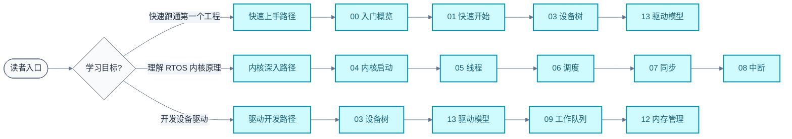

# Zephyr RTOS 学习笔记

> 从入门到内核源码深度解析的体系化学习笔记，结合官方文档与源码，按"入门与构建 → 内核核心 → 数据与驱动 → 进阶专题"四层渐进组织。

### 关键术语

| 缩写 | 全称 | 含义 |
|------|------|------|
| RTOS | Real-Time Operating System | 实时操作系统 |
| DTS | Devicetree Source | 设备树源文件 |
| DTB | Devicetree Blob | 设备树二进制 |
| ISR | Interrupt Service Routine | 中断服务例程 |
| SMP | Symmetric Multi-Processing | 对称多处理 |
| MMU | Memory Management Unit | 内存管理单元 |
| MPU | Memory Protection Unit | 内存保护单元 |
| HAL | Hardware Abstraction Layer | 硬件抽象层 |
| SoC | System on Chip | 片上系统 |
| SDK | Software Development Kit | 软件开发包 |
| Syscall | System Call | 系统调用 |
| IPI | Inter-Processor Interrupt | 核间中断 |
| W^X | Write XOR Execute | 不可同时可写可执行 |
| OTA | Over-The-Air | 空中升级 |

---

## 学习路线图

> **如何读这张图**：四色代表四层学习阶段——蓝色为基础入门与构建工具，绿色为内核核心机制（最难，也是 RTOS 精髓），黄色为数据与驱动实践，紫色/粉色/绿色为进阶专题三辑。横向箭头表示层内顺序，纵向箭头表示层间过渡。建议严格按箭头顺序学习，因为后文默认已掌握前文概念。

---

## 文档索引

| 序号 | 文档 | 概要 | 难度 | 篇幅 |
|------|------|------|------|------|
| 00 | [入门概览](./00-入门概览.md) | 系统架构、分层职责、核心组件速查 | ★☆☆ | 中 |
| 01 | [快速开始](./01-快速开始.md) | 环境搭建、West 工作区、Blinky 实跑 | ★☆☆ | 中 |
| 02 | [构建系统](./02-构建系统.md) | West/CMake/Kconfig/Snippets/Sysbuild | ★★☆ | 长 |
| 03 | [设备树详解](./03-设备树详解.md) | DTS 语法、Bindings、Phandles、宏 API | ★★☆ | 长 |
| 04 | [内核启动与初始化](./04-内核启动与初始化.md) | 启动序列、初始化级别、设备自动初始化 | ★★☆ | 中 |
| 05 | [线程与状态迁移](./05-线程与状态迁移.md) | 线程生命周期、状态机、优先级、栈 | ★★★ | 长 |
| 06 | [调度策略详解](./06-调度策略详解.md) | 协作/抢占/时间片/EDF/SMP 调度算法 | ★★★ | 长 |
| 07 | [同步机制详解](./07-同步机制详解.md) | 信号量/互斥锁/条件变量/事件/自旋锁 | ★★★ | 长 |
| 08 | [中断与时序](./08-中断与时序.md) | 中断管理、ISR 约束、poll、时钟、定时器 | ★★★ | 长 |
| 09 | [工作队列与延迟处理](./09-工作队列与延迟处理.md) | workqueue、ISR 顶半/底半模式 | ★★☆ | 中 |
| 10 | [数据传递机制](./10-数据传递机制.md) | FIFO/LIFO/Stack/Queue/Mbox/Pipe 对比 | ★★☆ | 长 |
| 11 | [核心数据结构](./11-核心数据结构.md) | 侵入式链表/红黑树/环形缓冲/无锁队列 | ★★★ | 长 |
| 12 | [内存管理](./12-内存管理.md) | k_heap/k_mem_slab/分页/虚拟内存/内存域 | ★★★ | 长 |
| 13 | [设备驱动模型](./13-设备驱动模型.md) | struct device、DEVICE_DT_DEFINE、MMIO | ★★★ | 长 |

### 进阶 I：内核深潜

| 序号 | 文档 | 概要 | 难度 | 篇幅 |
|------|------|------|------|------|
| 14 | [用户态与Syscall机制](./14-用户态与Syscall机制.md) | __syscall 注解、三类函数、内核对象权限表 | ★★★ | 长 |
| 15 | [内存域与MPU保护](./15-内存域与MPU保护.md) | k_mem_domain、W^X、MPU vs MMU、链接器段分组 | ★★★ | 长 |
| 16 | [SMP多核支持](./16-SMP多核支持.md) | irq_lock 局限、全局锁仿真、IPI、SMP 调度 | ★★★ | 长 |
| 17 | [Demand Paging按需分页](./17-Demand Paging按需分页.md) | page frame、缺页中断、驱逐算法、中转页安全 | ★★★ | 中 |
| 18 | [Poll事件多路复用](./18-Poll事件多路复用.md) | k_poll、signal 陷阱、三态机、单锁工程权衡 | ★★★ | 中 |
| 19 | [无锁数据结构深入](./19-无锁数据结构深入.md) | MPSC_PBUF 4 状态、两步生产/消费、内存序 | ★★★ | 长 |
| 20 | [Iterable Sections链接器魔法](./20-Iterable%20Sections链接器魔法.md) | 自注册模式、STRUCT_SECTION_FOREACH、__noasan | ★★★ | 长 |
| 21 | [Object Cores对象元数据](./21-Object%20Cores对象元数据.md) | k_obj_core、类型链表、raw/queried 统计框架 | ★★★ | 长 |
| 22 | [cbprintf打包格式化](./22-cbprintf打包格式化.md) | 回调式输出、打包/解包、NANO vs COMPLETE、printk | ★★★ | 长 |

### 进阶 II：可观测与交互

| 序号 | 文档 | 概要 | 难度 | 篇幅 |
|------|------|------|------|------|
| 23 | [Logging日志系统](./23-Logging日志系统.md) | frontend→link→backend、字典模式、多域链接 | ★★★ | 长 |
| 24 | [Shell命令行框架](./24-Shell命令行框架.md) | 多后端、命令注册、通配符、Tab 补全 | ★★★ | 长 |
| 25 | [Settings键值持久化](./25-Settings键值持久化.md) | FCB/NVS/ZMS 三后端、handler 注册、TF-M PSA | ★★★ | 长 |

### 进阶 III：产品化基础设施

| 序号 | 文档 | 概要 | 难度 | 篇幅 |
|------|------|------|------|------|
| 26 | [MCUboot与OTA升级](./26-MCUboot与OTA升级.md) | image trailer、swap/overwrite/RAM-load、SMP OTA | ★★★ | 长 |
| 27 | [RTIO异步IO框架](./27-RTIO异步IO框架.md) | SQE/CQE、io_uring 思想、批量 I/O、依赖图 | ★★★ | 中 |
| 28 | [电源管理PM](./28-电源管理PM.md) | policy 框架、设备运行时 PM、pm_stats | ★★★ | 长 |

---

## 三大学习路径

不同角色的读者可以按需选择路径：

> **如何读这张图**：根据学习目标选择对应路径，每条路径列出该角色最该读的 4-5 篇文档顺序。快速上手路径面向应用工程师，内核深入路径面向 RTOS 学习者，驱动开发路径面向 BSP 工程师。

---

## 参考资料

### 官方资源

- [Zephyr 官方文档](https://docs.zephyrproject.org/) — 最权威的参考，本笔记大量引用其结构与图示
- [Zephyr GitHub](https://github.com/zephyrproject-rtos/zephyr) — 源码仓库
- [Zephyr API 参考](https://docs.zephyrproject.org/apidoc/latest/) — 在线 API 文档
- [Zephyr Kconfig 参考](https://docs.zephyrproject.org/latest/kconfig.html) — 配置选项查询

### 本仓库内引用源

- 源码：[../zephyr-project/zephyr/](../zephyr-project/zephyr/) — Zephyr 主仓库（West manifest 仓库）
- 官方文档：[../zephyr-project/zephyr/doc/](../zephyr-project/zephyr/doc/) — RST 源文档与 SVG/PNG 图

### 规范

- [../CLAUDE.md](../CLAUDE.md) — 本仓库学习笔记写作规范，所有文档严格遵循
